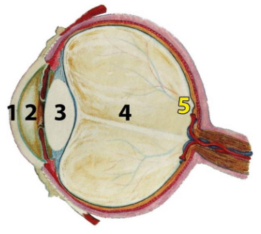
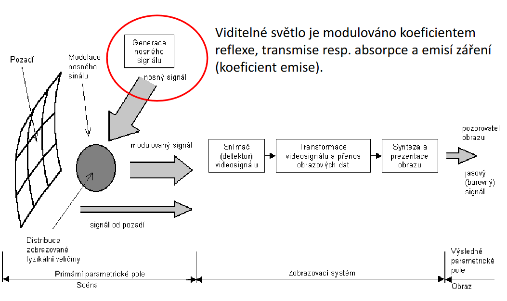

<style type="text/css">
body{
    font-size: 11pt;
}
</style>


# BIBMI - Biomedicínská Informatika
  

# 1. Bioinformatika

## Biologická data a jejich typy

Biologická data představují základní vstup pro bioinformatiku a zahrnují široké spektrum informací popisujících strukturu, funkci, variabilitu a chování živých organismů. Nejčastěji se setkáváme s:

- **Genomickými daty** (sekvence DNA a RNA)
- **Proteomickými daty** (informace o složení, množství a modifikacích proteinů)
- **Metabolickými daty** (údaje o metabolických drahách a produktech)
- **Fenotypovými daty** (popis znaků a vlastností organismu)

Správné zpracování těchto dat je klíčové pro pochopení biologických procesů, evoluce, chorob i pro biomedicínský výzkum.

## Transkripce, translace a replikace

### Transkripce

Transkripce je proces, během něhož je genetická informace uložená v DNA přepisována do molekuly RNA. Tento enzymaticky řízený proces zajišťuje **RNA polymeráza** a probíhá ve třech základních krocích:

- **Iniciace:** RNA polymeráza se naváže na specifickou oblast DNA zvanou promotor.
- **Elongace:** Postupné přidávání ribonukleotidů podle komplementarity s DNA.
- **Terminace:** Uvolnění hotové RNA po dosažení terminátorové sekvence.

Transkripce je klíčová pro regulaci genové exprese.

### Translace

Translace je proces, kterým se informace v mRNA překládá do pořadí aminokyselin v bílkovině. Probíhá na ribozomech ve třech krocích:

- **Iniciace:** Navázání malé ribozomální podjednotky na start kodon mRNA (AUG).
- **Elongace:** tRNA přináší aminokyseliny podle kodonů; vznikají peptidové vazby.
- **Terminace:** Uvolnění polypeptidu po dosažení stop kodonu (UAA, UAG, UGA).

### Replikace

Replikace je proces, kdy vzniká přesná kopie DNA před dělením buňky:

- **Iniciace:** Otevření dvoušroubovice DNA v místě originu replikace.
- **Elongace:** DNA polymeráza syntetizuje nové vlákno.
- **Terminace:** Oddělení dvou molekul DNA po dokončení kopírování.

<div style="page-break-after: always;"></div>

## Biologické databáze

Biologické databáze uchovávají, organizují a zpřístupňují rozsáhlé soubory dat (sekvenování genomů, analýza proteinů aj.). Mezi nejvýznamnější patří:

- **GenBank** (sekvence nukleových kyselin)
- **Protein Data Bank (PDB)** (3D struktury proteinů)
- **Ensembl** (anotované genomy)

## Sequence alignment (zarovnání sekvencí)

Zarovnání sekvencí je základní bioinformatická technika, která hledá shody/podobnosti mezi sekvencemi DNA, RNA nebo proteinů.

**Důvody pro zarovnání sekvencí:**
- Zjištění homologie (společného původu) či funkční podobnosti
- Identifikace důležitých oblastí (např. aktivní místa enzymů)
- Odhalení evolučních vztahů a mutací

**Typy zarovnání:**
- **Globální zarovnání** (Needleman-Wunsch): srovnává celé sekvence
- **Lokální zarovnání** (Smith-Waterman): hledá nejpodobnější úseky v rámci sekvencí

**Skórování zarovnání:**
- Skórovací matice (**BLOSUM**, **PAM**) a penalizace za mezery
- Různé matice pro různé evoluční vzdálenosti (např. BLOSUM62 pro blízkou homologii)

## BLAST a heuristické algoritmy pro vyhledávání podobných sekvencí

**BLAST** (Basic Local Alignment Search Tool) je nejrozšířenější nástroj pro rychlé vyhledávání podobných oblastí v databázích. Pracuje ve dvou fázích: rychlé nalezení krátkých identických/podobných úseků (slov), pak rozšíření a přesnější zarovnání.

- Varianty: **blastn** (DNA-DNA), **blastp** (protein-protein) aj.
- Statistické ukazatele: **E-value** (očekávaný počet náhodných shod), **p-value**
- Další: **FASTA** (podobný, někdy citlivější na vzdálenější homologii)

## Dotplot a vizuální porovnávání sekvencí

**Dotplot** je grafická metoda pro porovnání dvou sekvencí. Na osách jsou znaky obou sekvencí, v místech shody je tečka. Diagonály označují podobné úseky; lze odhalit inverze, duplikace, posuny.

<div style="page-break-after: always;"></div>

## Homologie, ortologie a paralogie

- **Homologie:** sekvence mají společného předka
    - **Ortologie:** geny vzniklé speciací (různé druhy, stejná funkce)
    - **Paralogie:** geny vzniklé duplikací v jednom organismu (mohou diverzifikovat)

Rozpoznání homologických vztahů je klíčové pro přenos funkční anotace a evoluční analýzy.

## Strukturní srovnávání a predikce struktury proteinů

### Strukturální srovnávání

Porovnávání 3D struktur proteinů může odhalit podobnosti nezjevné na úrovni sekvence a napomáhá objasnit evoluční a funkční vztahy.

### Predikce proteinové struktury

- **Homologní modelování:** modelování podle známé struktury podobného proteinu (templátu)
- **Ab initio modelování:** bez známého templátu, čistě na základě fyzikálně-chemických principů
- **Threading:** hledání nejvhodnějšího známého foldingu bez významné sekvenční podobnosti

Moderní přístupy (např. AlphaFold) využívají kombinace algoritmů a strojové učení.

## Substituční matice BLOSUM

**BLOSUM** (BLOcks SUbstitution Matrix): sada substitučních matic pro zarovnávání proteinů. Odvozeny z bloků evolučně diverzifikovaných sekvencí; umožňují hodnotit pravděpodobnost záměn aminokyselin při evoluci. Např. **BLOSUM62** je vhodná pro blízké příbuznosti.

## Predikce sekundární struktury proteinů

- **Sekundární struktura** = alfa-helixy, beta-listy, smyčky
- Metody predikce: **Chou-Fasman**, **GOR** – využívají pravděpodobnosti výskytu aminokyselin v daném typu struktury.

## Multiple Sequence Alignment (MSA)

**MSA** znamená zarovnání tří a více sekvencí současně. Pomáhá najít konzervované (důležité) oblasti pro evoluční studie, funkční anotace i predikci proteinových struktur.

- **Progresivní metody:** např. CLUSTAL
- **HMM metody:** využití skrytých Markovovských modelů

<div style="page-break-after: always;"></div>

# 2. Pravděpodobnost a matematická statistika

## Náhodná veličina: diskrétní a spojité rozdělení, distribuční funkce, pravděpodobnostní funkce, hustota

Náhodná veličina je proměnná, jejíž hodnota závisí na výsledku náhodného jevu.

Rozlišujeme dva typy:

- **Diskrétní náhodná veličina**  
  Nabývá jen určitých (napočitatelných) hodnot, např. počet vržených šestek při 10 hodech kostkou.

- **Spojitá náhodná veličina**  
  Může nabývat libovolných hodnot v intervalu, např. tělesná výška člověka.

### Pravděpodobnostní funkce (PMF) a hustota pravděpodobnosti (PDF)

- **Pravděpodobnostní funkce**  
  \( p(x) = P(X = x) \)  
  Je definovaná pro diskrétní veličiny. U každé hodnoty \( x \) říká, jaká je pravděpodobnost, že ji veličina nabude.

- **Hustota pravděpodobnosti**  
  \( f(x) \)  
  Používá se pro spojité veličiny. Pravděpodobnost, že veličina spadne do intervalu \([a, b]\), je  
  \( \int_a^b f(x) dx \).  
  Pravděpodobnost pro přesnou hodnotu je vždy nulová.

### Distribuční funkce

- **Distribuční funkce**  
  \( F(x) = P(X \leq x) \)  
  Udává kumulativní pravděpodobnost, že veličina je menší nebo rovna \( x \).

  - Pro diskrétní veličiny má tvar schodovité funkce (skoky odpovídají jednotlivým hodnotám).
  - Pro spojité veličiny je spojitá a plynule roste.

## Kvantily, střední hodnota, rozptyl

### Kvantily

- **Kvantil** je hodnota, která rozděluje uspořádaný soubor dat na zvolené části.
- **Medián** je 50% kvantil (polovina hodnot leží níže, polovina výše).
- **Kvartily** (Q1, Q2, Q3) dělí soubor na čtvrtiny, **percentily** na 100 částí.

### Střední hodnota (průměr, očekávaná hodnota)

- Pro diskrétní veličiny: \( E[X] = \sum x \cdot p(x) \)
- Pro spojité veličiny: \( E[X] = \int x f(x) dx \)
- Udává průměrnou (očekávanou) hodnotu při nekonečném opakování náhodného pokusu.

### Rozptyl

- Měří, jak moc jsou hodnoty rozptýleny kolem střední hodnoty.
- \( Var(X) = E[(X - E[X])^2] \)
- **Standardní odchylka** je odmocnina z rozptylu a má stejnou jednotku jako původní veličina.

## Bodové a intervalové odhady

### Bodový odhad

- Konkrétní číselná hodnota, kterou stanovíme na základě výběru jako odhad parametru populace (např. výběrový průměr jako odhad průměru celé populace).

### Intervalový odhad

- Rozsah hodnot, který s určitou pravděpodobností obsahuje skutečný parametr populace (například 95% interval spolehlivosti pro průměr).
- Zohledňuje nejistotu v odhadu, je praktičtější než bodový odhad.
- Interval se zužuje s větším počtem měření a s menší rozptýleností dat.

## Obecné principy testování statistických hypotéz

- Testování hypotéz je proces, kterým na základě vzorku dat rozhodujeme, zda nějaký předpoklad o populaci platí.

### Formulace hypotéz

- **Nulová hypotéza** (\( H_0 \)): většinou "není efekt", "data odpovídají předpokladu".
- **Alternativní hypotéza** (\( H_1 \)): existuje efekt, rozdíl apod.

### Postup testování

1. Výběr testu podle typu dat a hypotézy (např. t-test, z-test, chi-kvadrát test).
2. Stanovení hladiny významnosti (\( \alpha \)), často 0,05 (5 %).
3. Výpočet testové statistiky a p-hodnoty.
4. Rozhodnutí: Pokud \( p < \alpha \), zamítáme \( H_0 \).

- **Chyba I. druhu:** Pravděpodobnost, že zamítneme správnou \( H_0 \) (falešně pozitivní výsledek, velikost je \( \alpha \)).
- **Chyba II. druhu:** Pravděpodobnost, že nezamítneme nepravdivou \( H_0 \) (falešně negativní výsledek, velikost je \( \beta \)).
- **Síla testu:** \( 1 - \beta \), pravděpodobnost správného zamítnutí nepravdivé nulové hypotézy.

## Testy parametrů normálního rozdělení

- Testují vlastnosti normálně rozdělených populací, zejména střední hodnotu:

- **Z-test:** Pro velké výběry nebo pokud známe rozptyl populace.
- **T-test:** Pro malé výběry nebo neznámý rozptyl. Existují:
    - Jednovýběrový t-test (porovnání výběrového průměru s hypotetickou hodnotou).
    - Dvouvýběrový t-test (porovnání průměrů dvou skupin, nezávislých).
    - Párový t-test (porovnání hodnot na stejných subjektech před a po zásahu).

## Chi-kvadrát test dobré shody

- Testuje, zda pozorované četnosti odpovídají očekávaným.
- Používá se pro kategorická data, např. pro ověření, zda rozdělení krevních skupin v populaci odpovídá teoretickému rozdělení.

### Formulace hypotéz

- \( H_0 \): pozorované frekvence odpovídají očekávaným.
- \( H_1 \): neodpovídají.

### Výpočet statistiky

\[
\chi^2 = \sum_{i=1}^{n} \frac{(O_i - E_i)^2}{E_i}
\]

kde \( O_i \) je pozorovaná a \( E_i \) očekávaná četnost.

Porovnává se s kritickou hodnotou z chi-kvadrát rozdělení.

## Variabilita a normálnost dat

- **Variabilita:** měří rozptyl hodnot v datech – základní ukazatele jsou rozptyl, směrodatná odchylka, interkvartilové rozpětí (IQR).
- **Normálnost dat:** ověřuje se pomocí statistických testů (Shapiro-Wilk, Kolmogorov-Smirnov), případně graficky (histogram, Q-Q plot).
- Pro normální rozdělení je typická zvonovitá křivka; většina statistických testů předpokládá normalitu dat.

## Typy experimentálních a observačních studií

### Experimentální studie

- **Randomizovaná kontrolovaná studie (RCT):**
    - Účastníci jsou náhodně rozděleni do skupin, jedna dostává intervenci, druhá slouží jako kontrola. Minimalizuje vliv náhody a zkreslení.
- **Crossover studie:**
    - Každý účastník dostává postupně různé léčby; slouží k eliminaci individuálních rozdílů.

### Observační studie

- **Kohortové studie:**
    - Sledování skupiny lidí v čase, zjišťování výskytu určitého jevu (nemoci) podle různých faktorů.
    - **Prospektivní:** sledují se dopředu.
    - **Retrospektivní:** analyzují se již existující záznamy.
- **Případově-kontrolní studie:**
    - Porovnání skupiny s onemocněním (případy) a bez onemocnění (kontroly), hledání rozdílů v expozici rizikovým faktorům.

## Medicína založená na důkazech (Evidence Based Medicine, EBM)

EBM je systematický přístup, který spojuje:

- Nejlepší dostupné vědecké důkazy,
- klinické zkušenosti lékaře,
- preference a hodnoty pacienta.

### Kroky v EBM

1. **Formulace klinické otázky** (často podle PICO: pacient, intervence, komparátor, outcome/výsledek).
2. **Vyhledání důkazů** (PubMed, Cochrane atd.).
3. **Kritické zhodnocení důkazů** (například pomocí nástroje GRADE).
4. **Aplikace důkazů** do konkrétní klinické praxe s ohledem na individuální situaci pacienta.
5. **Hodnocení výsledků a zpětná vazba**.

<div style="page-break-after: always;"></div>

# 3. Aplikovaná zdravotnická informatika

## Data, informace a znalosti v medicíně

Ve zdravotnictví hraje zásadní roli rozlišování mezi daty, informacemi a znalostmi:

- **Data** jsou základní, nezpracovaná fakta – například naměřené hodnoty (teplota, krevní tlak) nebo laboratorní výsledky. Bez dalšího kontextu samy o sobě nic neříkají.
- **Informace** vznikají uspořádáním a interpretací dat. Například když se k naměřené hodnotě přidá čas a kontext (kdo byl měřen, v jakém stavu), dostáváme smysluplnou informaci.
- **Znalosti** představují porozumění informacím v širším kontextu, jejich propojení s vědeckými poznatky a zkušeností – umožňují rozhodování v konkrétních situacích, např. volbu správné léčby na základě předchozích případů a aktuálního vývoje medicíny.

## Doporučené lékařské postupy

- Systematicky vypracované dokumenty, které určují optimální způsoby diagnostiky, léčby a péče o pacienta při různých diagnózách.
- Jsou vytvářeny na základě aktuálních vědeckých důkazů, klinických studií i zkušeností odborníků.
- Cílem je standardizovat péči, zvýšit její kvalitu a bezpečnost, snížit riziko chyb a nejednotnosti mezi jednotlivými pracovišti.
- Uplatňování těchto postupů umožňuje poskytovat léčbu, která je ověřená a vysoce efektivní.

## Medicína založená na důkazech (Evidence Based Medicine, EBM)

- Přístup, který integruje nejlepší dostupné vědecké důkazy s klinickou zkušeností lékaře a preferencemi pacienta.
- EBM zahrnuje systematické vyhledávání, kritické hodnocení a aplikaci relevantních studií do praxe.
- Pomáhá lékařům činit rozhodnutí, která jsou podložena vědecky ověřenými poznatky a zároveň jsou přizpůsobena konkrétnímu pacientovi.

## Základy biomedicínské statistiky

Biomedicínská statistika je vědní disciplína, která umožňuje analyzovat, interpretovat a vyhodnocovat medicínská data:

- **Popisná statistika** sumarizuje data pomocí průměru, mediánu, rozptylu atd.
- **Testování hypotéz** (např. t-test, ANOVA) umožňuje zjišťovat rozdíly mezi skupinami.
- **Korelace a regrese** hledají vztahy a závislosti mezi proměnnými.
- Statistická analýza je základem pro rozhodování na základě dat a umožňuje vědecky hodnotit účinnost léčby, nové postupy či rizikové faktory.

## Počítačová bezpečnost a informační systémy ve zdravotnictví

Počítačová bezpečnost ve zdravotnictví zahrnuje ochranu zdravotnických dat i samotných informačních systémů před neoprávněným přístupem, zneužitím, ztrátou či kybernetickými útoky.

### Klíčové prvky bezpečnosti:

- **Autentifikace:** Ověření identity uživatele (například heslem, kartou, otiskem prstu).
- **Autorizace:** Nastavení práv a oprávnění uživatelů k různým datům a funkcím.
- **Šifrování:** Ochrana dat jak při přenosu, tak při ukládání (pomocí SSL/TLS, VPN apod.).
- **Zálohování:** Pravidelná tvorba záloh pro možnost obnovy v případě havárie nebo útoku.
- **Firewall, antivirus:** Ochrana před neoprávněným vstupem a škodlivým softwarem.
- **Bezpečnostní protokoly:** Standardizované způsoby bezpečné komunikace (HTTPS, SSL/TLS).

## Ochrana a zabezpečení dat

Ochrana dat ve zdravotnictví se zaměřuje na důvěrnost, integritu a dostupnost zdravotnických údajů:

- **Důvěrnost (Confidentiality):** Ochrana osobních údajů před neoprávněným přístupem, např. šifrováním a kontrolou přístupu.
- **Integrita (Integrity):** Zajištění, že data nebyla neoprávněně změněna nebo poškozena.
- **Dostupnost (Availability):** Zajištění, že data budou v případě potřeby rychle dostupná oprávněným osobám.

## Archivace dat

- **Cíl:** Dlouhodobé uchovávání lékařských záznamů a dalších důležitých dat.

**Aspekty:**

- **Formát:** Výběr vhodných formátů pro dlouhodobou čitelnost.
- **Bezpečnost:** Prevence neoprávněného přístupu.
- **Dostupnost:** Snadný přístup pro budoucí použití (léčba, výzkum, právní účely).

## Zdravotnický profesionalizmus a ochrana osobních údajů

Profesionalizmus ve zdravotnictví zahrnuje nejen odborné a etické chování zdravotníků, ale také respektování práv pacientů:

- Důležitým aspektem je ochrana osobních údajů pacientů (zejména citlivých zdravotních údajů).
- Platí zde přísné právní předpisy (například GDPR), které vyžadují správné nakládání s osobními daty, jejich zabezpečení a minimalizaci rizik zneužití.
- Každý zdravotník je povinen zachovávat mlčenlivost a chránit informace před třetími osobami.

## Standardizace a klasifikační systémy v medicíně

Aby bylo možné efektivně sdílet, analyzovat a porovnávat zdravotnická data, používají se standardy a klasifikační systémy:

- **ICD (International Classification of Diseases):** Mezinárodní klasifikace nemocí pro kódování diagnóz (aktuálně verze ICD-10).
- **ICF (International Classification of Functioning, Disability and Health):** Klasifikace funkčního stavu, disability a zdraví, užitečná pro popis funkčních omezení pacientů.
- **UMLS (Unified Medical Language System):** Integruje různé lékařské terminologie pro snazší komunikaci a vyhledávání.
- **MeSH (Medical Subject Headings):** Strukturovaný slovník pro indexování biomedicínské literatury.
- **SNOMED CT:** Rozsáhlý systém klinických termínů pro detailní popis diagnóz, procedur i zdravotních stavů.

## Elektronický zdravotní záznam (EHR)

**Elektronický zdravotní záznam (EHR, Electronic Health Record)** je digitální verze kompletní dokumentace o pacientovi:

- Obsahuje anamnézu, laboratorní výsledky, diagnózy, léčbu, medikaci, zprávy a další informace potřebné pro péči.
- Umožňuje snadné sdílení informací mezi různými zdravotnickými zařízeními.
- Přináší výhody jako zlepšení kvality péče (dostupnost úplných údajů), zvýšení efektivity a snížení administrativní zátěže a chyb.

## Standardy (OpenEHR, CEN, HL7)

Pro interoperabilitu (vzájemnou komunikaci systémů) a kvalitu dat se využívají mezinárodní standardy:

- **OpenEHR:** Platforma s otevřeným zdrojovým kódem pro EHR, definice archetypů pro klinická data.
- **CEN:** Evropský výbor pro normalizaci, vyvíjí standardy pro zdravotnické IT.
- **HL7 (Health Level Seven):** Globální standard pro výměnu zdravotních informací, definice zpráv a struktury dat.

**Příklad HL7 zprávy:**

```
MSH|^&|EPIC|EPICADT|iFW|SMSADT|199912271408|CHARRIS|ADT^A04|1817457|D|2.5|
PID||0493575^^^2^ID 1|454721||DOE^JOHN^^^^|DOE^JOHN^^^^|19480203|M||B|254 MYSTREET AVE^^MYTOWN^OH^44123^USA||(216)123-4567|||M|NON|4000034031129086|
NK1||ROE^MARIE^^^^|SPO||(216)123-4567||EC|||||||||||||||||||||||||||
PV1||O|168219C~PMA^^^^^^^^^||||277^ALLEN MYLASTNAME^BONNIE^^^^|||||||||| ||2688684|||||||||||||||||||||||||199912271408||||||002376853
```

**HL7 segmenty v tomto příkladu obsahují následující informace:**

- **MSH (Message Header):** Obsahuje informace o samotné zprávě – odesílatel, příjemce, typ zprávy, datum a čas odeslání.
- **PID (Patient Information):** Demografické údaje o pacientovi, jako je jméno, identifikátor a adresa.
- **NK1 (Next of Kin):** Kontaktní údaje na nejbližší příbuzné pacienta.
- **PV1 (Patient Visit):** Informace o hospitalizaci pacienta, například přiřazené umístění a doporučující lékař.

## Systémy pro podporu rozhodování

Systémy na podporu rozhodování (DSS) v medicíně poskytují lékařům nástroje k zlepšení rozhodování. DSS mohou zahrnovat:

- **Klinické algoritmy:** Automatizovaná doporučení na základě údajů o pacientovi.
- **Upozornění a výstrahy:** Upozornění na možné lékové interakce nebo alergie.
- **Analýza údajů:** Pokročilá analýza k identifikaci vzorů a trendů v datech pacientů.

## Medicínské informační zdroje

Mezi lékařské informační zdroje patří databáze, knihovny a online nástroje, které poskytují přístup k vědeckým článkům, klinickým studiím a dalším relevantním informacím:

- **PubMed:** Databáze vědeckých článků z biomedicíny (MEDLINE).
- **Cochrane Library:** Systematické přehledy a metaanalýzy.
- Další specializované databáze (Embase, Scopus atd.).

## Kvalita zdravotnických informací na internetu

Kvalita zdravotních informací na internetu je klíčová pro poskytování správných informací pro pacienty a zdravotnické pracovníky. Hodnocení kvality zahrnuje:

- **Přesnost a spolehlivost:** Informace by měly být vědecky ověřené a aktuální.
- **Autentičnost zdrojů:** Informace by měly pocházet z důvěryhodných a odborných zdrojů.
- **Čitelnost a srozumitelnost:** Informace by měly být prezentovány jasným a srozumitelným způsobem.

<div style="page-break-after: always;"></div>

# 4. Biologické signály

## Vlastnosti biologických signálů

Biologické signály jsou měřitelné fyziologické projevy živých organismů, které mají nejčastěji elektrický, ale i mechanický či chemický charakter. Tyto signály vznikají jako důsledek aktivit buněk, tkání nebo orgánů a slouží jako cenný zdroj informací pro diagnostiku a sledování zdravotního stavu.

Mezi základní vlastnosti biologických signálů patří:

- **Amplituda** – maximální hodnota signálu, která vypovídá o síle sledovaného jevu (např. napětí u EKG).
- **Frekvence** – udává, kolikrát za sekundu se signál opakuje (Hz), umožňuje rozlišovat typy aktivit (např. srdeční frekvence).
- **Časové trvání** – délka trvání jednotlivé události v signálu (např. QRS komplex u EKG).
- **Dynamika** – rychlost změn a variabilita signálu v čase.
- **Periodicita** – pravidelnost výskytu opakujících se složek signálu.

## Způsoby vzniku, snímání a základní parametry biosignálů

### Vznik biosignálů

Biosignály mohou vznikat několika způsoby:

- **Elektrofysiologické** – elektrická aktivita buněk, například akční potenciály neuronů, svalových vláken či srdečních buněk.
- **Mechanické** – například pohyby svalů, vibrace, srdeční zvuky.
- **Chemické** – změny koncentrací iontů nebo metabolitů.

### Snímání biosignálů

- **Elektrody** – nejběžnější způsob snímání elektrických biosignálů; existují povrchové (na kůži), jehlové (do svalu) či intramuskulární.
- **Senzory** – piezoelektrické (měření tlaku/pohybu), optické (měření světla), chemické (detekce koncentrace látek).
- **Zobrazovací metody** – MRI, CT, ultrazvuk pro vizualizaci vnitřních struktur a funkcí.

### Základní parametry biosignálů pro diagnostiku

- **Amplituda** – síla signálu, důležitá např. pro posouzení síly srdeční kontrakce.
- **Frekvence** – umožňuje rozlišovat různé typy fyziologických dějů (např. EEG pásma).
- **Latence** – doba mezi podnětem a reakcí (např. při nervovém přenosu).
- **Rychlost vedení** – zejména u nervových a svalových signálů (hodnotí rychlost přenosu informace).

## Signály srdce, mozku, svalů a nervového systému

### Signály srdce (EKG)

**Elektrokardiogram (EKG)** zaznamenává elektrickou aktivitu srdce pomocí elektrod umístěných na těle.

- **SA uzel** generuje pravidelné impulsy, které se šíří srdeční svalovinou.
- Standardní 12-svodové EKG poskytuje informace o elektrické aktivitě srdce z různých směrů.
- Klíčové části záznamu:
    - **Vlna P:** Depolarizace síní
    - **QRS komplex:** Depolarizace komor
    - **Vlna T:** Repolarizace komor
    - Intervaly (PR, QT) a segmenty (ST) umožňují detailní diagnostiku.

### Signály mozku (EEG)

**Elektroencefalogram (EEG)** zachycuje elektrickou aktivitu mozku, zejména v mozkové kůře.

- EEG snímá slabé elektrické potenciály vznikající synchronní aktivitou neuronů.
- Používají se systémy umístění elektrod (např. 10-20 systém).
- Základní frekvenční pásma EEG:
    - **Delta (0,5–4 Hz):** Hluboký spánek
    - **Theta (4–8 Hz):** Lehký spánek, relaxace
    - **Alfa (8–13 Hz):** Klid, relaxace
    - **Beta (13–30 Hz):** Aktivní myšlení
    - **Gama (>30 Hz):** Složitá kognice
- Další sledované parametry jsou amplituda a synchronizace neuronální aktivity.

### Signály svalů (EMG)

**Elektromyogram (EMG)** zaznamenává elektrickou aktivitu svalů při kontrakci.

- Při aktivaci svalu vznikají elektrické potenciály, které lze snímat povrchově nebo jehlovými elektrodami.
- Sleduje se zejména amplituda, frekvence, tvar a průběh motorických jednotek.

### Signály nervového systému (ENG)

**Elektroneurografie (ENG)** měří elektrické impulsy v periferních nervech.

- Snímání probíhá povrchovými elektrodami.
- Hodnotí se rychlost vedení, amplituda akčního potenciálu, latence a refrakterní období.

## Metody a algoritmy zpracování a vyhodnocování biosignálů

### Předzpracování signálů

- **Filtrace:** Odstraňování nežádoucích složek (šum, artefakty), např. pomocí dolních, horních a pásmových filtrů.
- **Korekce artefaktů:** Např. pomocí analýzy nezávislých komponent (ICA) lze oddělit rušivé signály od užitečné složky.
- **Normalizace a detekce chyb:** Korekce na základě referenčních kanálů, detekce a odstranění chybějících nebo chybných dat.

### Analýza v časové a frekvenční oblasti

- **Časová analýza:** Statistické výpočty (průměr, směrodatná odchylka, RMS), detekce vrcholů a charakteristických rysů (např. QRS komplex u EKG).
- **Frekvenční analýza:** Převod signálu z časové do frekvenční oblasti pomocí Fourierovy transformace, která umožňuje určit dominantní frekvence (např. spektrální obsah EEG)

### Nestacionarita EEG

EEG je typický příklad **nestacionárního signálu** – jeho statistické vlastnosti se v čase mění. Pro jeho analýzu jsou vhodné metody, které umí popsat časově-frekvenční dynamiku, např. vlnková transformace nebo krátkodobá Fourierova transformace (STFT).

## Frekvenční rozsahy a pásma biosignálů

Biologické signály se vyskytují v různých frekvenčních rozsazích:

- **Nízké frekvence (0–0,5 Hz):** Dlouhodobé trendy, stacionární složky.
- **Střední frekvence (0,5–40 Hz):** Například většina složek EKG, EEG (alfa, beta pásma).
- **Vysoké frekvence (40 Hz až jednotky kHz):** Svalová aktivita, např. EMG (5–1000 Hz).

## Převod biosignálu do počítače, vzorkování a kvantizace

Aby bylo možné biosignály zpracovávat na počítači, je třeba je **digitalizovat**:

- **A/D převodník** (analogově-digitální převodník) převede spojitý signál na diskrétní řadu čísel.
- **Vzorkovací frekvence** musí být dle **Nyquistova teorému** nejméně dvojnásobek maximální frekvence v signálu – jinak vznikne **aliasing** (falešné složky, zkreslení signálu).
- **Kvantizace** znamená převod spojité amplitudy signálu na diskrétní úrovně – omezená přesnost vede ke **kvantizační chybě**.
- Nedostatečná vzorkovací frekvence či hrubá kvantizace může výrazně zhoršit kvalitu zaznamenaných dat a ovlivnit další analýzu.

## Spektrální analýza biosignálů

Spektrální analýza umožňuje studovat frekvenční složení signálu a identifikovat důležité rytmy či patologie.

- **Neparametrické metody:**
    - **Fourierova transformace:** Převod signálu na spektrum bez předpokladu modelu.
    - **Periodogram:** Odhad výkonového spektra, vizualizuje rozložení energie do frekvencí.
- **Parametrické metody:**
    - Např. **AR (autoregresní) modely** – signál je popsán soustavou rovnic, umožňují přesnější odhad spektra v krátkých úsecích nebo u šumových signálů.
- **FFT (Fast Fourier Transform):** Rychlý algoritmus pro výpočet diskrétní Fourierovy transformace.
- Praktické problémy: Omezená délka záznamu, spektrální únik (leakage), rušení.

## Křížové spektrum, koherence a fáze

Při analýze vícekanálových biosignálů (například EEG z více elektrod):

- **Křížové spektrum:** Popisuje vztah mezi dvěma signály ve frekvenční oblasti.
- **Koherence:** Míra synchronizace mezi dvěma signály v daném frekvenčním pásmu.
- **Fáze:** Informace o časovém zpoždění mezi signály – důležité například pro zkoumání komunikace mezi oblastmi mozku.

## Filtrace a odstranění šumu

K odstranění šumu v biosignálech se používají digitální filtry:

- **FIR (Finite Impulse Response):** Filtry s konečnou impulzní odezvou – mají předvídatelné chování a jsou vždy stabilní.
- **IIR (Infinite Impulse Response):** Filtry s nekonečnou impulzní odezvou – umožňují dosáhnout vyšší selektivity, ale mohou být méně stabilní.
- **Adaptivní filtry, vlnková denoizace:** Umožňují pokročilé odstranění rušení při zachování důležitých složek signálu.

## Vizualizace výsledků analýzy

Vizualizace pomáhá prezentovat a interpretovat výsledky:

- **Spektrogramy:** Zobrazují, jak se frekvenční spektrum mění v čase.
- **CSA (Condensed Spectral Array):** Zobrazuje dynamiku změn výkonu v různých frekvenčních pásmech.
- **Topografické mapování (brain mapping):** Vizualizace prostorového rozložení signálů (zejména EEG) na povrchu hlavy pomocí barevných map.

### Princip brain mappingu, interpolace a mapování parametrů

- **Brain mapping:** Barevné mapy znázorňují rozložení amplitudy nebo frekvence na povrchu mozku.
- **Interpolace:** K vyhlazení a doplnění hodnot mezi elektrodami se používají matematické metody (např. splajnová interpolace).
- **Mapování amplitudy a frekvence:** Umožňuje lokalizovat oblasti s patologickou nebo charakteristickou aktivitou (diagnostika epilepsie, demence aj.).

<div style="page-break-after: always;"></div>

# 5. Zpracování obrazových dat

## Zrakový orgán, jasová a kontrastní citlivost oka

Lidské oko je smyslový orgán, který umožňuje vnímání světla a barev. Hlavními částmi oka jsou rohovka, čočka, sítnice a zrakový nerv. Na sítnici jsou fotoreceptory: **tyčinky** (zajišťují vidění za šera, nerozeznávají barvy) a **čípky** (zajišťují barevné vidění a ostrost). 

1. **Rohovka**
2. **Přední komora**
3. **Vlastní čočka**
4. **Sklivec**
5. **Sítnice**



**Jasová citlivost oka** popisuje schopnost oka detekovat různé úrovně osvětlení, nejcitlivější je při středním jasu. Tento fenomén je důležitý pro kalibraci obrazových zařízení a pro design osvětlení tak, aby odpovídal lidskému vnímání.

**Kontrastní citlivost oka** vyjadřuje schopnost rozlišit objekty s různou úrovní jasu – maximální je při středních prostorových frekvencích a klesá při extrémně nízkých či vysokých frekvencích. Tato citlivost není konstantní přes celé viditelné spektrum a závisí na různých faktorech, včetně úrovně osvětlení a vzdálenosti objektu.

## Prostorová a časová rozlišovací schopnost oka

**Prostorová rozlišovací schopnost oka** znamená schopnost rozlišit jemné detaily a blízké objekty v obraze, což je dáno hustotou fotoreceptorů (zejména v oblasti makuly).  
**Časová rozlišovací schopnost** popisuje, jak rychle dokáže oko zachytit změny v čase – lidské oko dokáže vnímat plynulý pohyb při cca 24 snímcích za sekundu a vyšších rychlostech (televize, video).

## Obecné schéma procesu zobrazení

Proces zobrazení zahrnuje několik kroků:

1. **Snímání obrazu** – světlo ze scény je zachyceno snímačem (kamerou, skenerem).
2. **Digitalizace** – převod analogového signálu na digitální (pomocí vzorkování a kvantizace).
3. **Zpracování obrazu** – různé algoritmy zlepšují kvalitu, detekují objekty či analyzují obraz.
4. **Zobrazení** – výsledek je vizualizován na monitoru či jiném zařízení.



## Sběr obrazových dat, vzorkování a kvantizace

Sběr obrazových dat je proces, jehož cílem je převést vizuální scénu do formy, kterou lze dále zpracovávat počítačem. Začíná to snímáním obrazu pomocí zařízení jako jsou kamery, skenery nebo čidla. Výsledkem může být buď analogový obraz (spojitý signál), nebo digitální obraz (diskrétní mřížka pixelů).

Efektivní sběr obrazových dat závisí na kvalitě optiky, vlastnostech použitého senzoru (např. CCD, CMOS), kvalitě osvětlení a stabilizaci obrazu. Důležitou roli hraje i následné zpracování signálu.

### Co je to pixel?

**Pixel** (zkratka z *picture element*) je základní jednotka digitálního obrazu. Každý pixel představuje malou část obrazu a nese informaci o barvě a/nebo jasu v daném místě.

### Vzorkování (Sampling Rate)

Vzorkování je první krok při převodu analogového obrazu na digitální. Znamená to, že v pravidelných intervalech „odebíráme vzorky“ hodnoty intenzity světla nebo barvy po celé ploše obrazu.  
Podle Shannonova teorému je nutné vzorkovat alespoň dvojnásobkem nejvyšší frekvence detailu v obraze, aby nedocházelo ke zkreslení (aliasingu).

### Kvantizace (Quantization)

Po vzorkování následuje kvantizace – převod spojitých hodnot jasů nebo barev na omezený počet diskrétních úrovní, např. 256 odstínů šedi při 8 bitech na pixel.

### Artefakty při vzorkování a kvantizaci

- **Nedostatečné vzorkování** způsobuje **aliasing** – vznik falešných vzorů, „klikaté“ okraje, ztráta detailů.
- **Hrubá kvantizace** způsobuje **pásmování** (banding) – místo plynulých přechodů jsou vidět skoky mezi odstíny.

## Základní úlohy zpracování obrazu

### 1. Zlepšení kvality obrazu (image enhancement)

Cílem je **vylepšit vizuální vlastnosti obrazu**:

- **Odstranění šumu** (průměrování, mediánová filtrace)
- **Úprava kontrastu a jasu** (ekvalizace histogramu, gamma korekce)
- **Zaostření (ostření hran)** (zvýraznění hran a detailů)

### 2. Segmentace a extrakce objektů

- **Segmentace**: rozdělení obrazu na oblasti/objekty se společnými vlastnostmi
- **Extrakce objektů**: oddělení objektů od pozadí (např. prahování, detekce hran, region-growing, k-means, watershed)

### 3. Komprese obrazu (image compression)

- **Bezeztrátová komprese** (PNG, GIF, RLE, Huffman)
- **Ztrátová komprese** (JPEG)
- Komprese je nutná pro ukládání, přenos videa, práci v omezeném úložišti

### 4. Rozpoznávání vzorů (pattern recognition)

- **Automatická identifikace objektů, tvarů či struktur**
- Metody: šablonování, detekce hran, extrakce příznaků, strojové učení, deep learning

## Lineární systémy, impulzní odezva, prostorová invariance

### Lineární systém

Splňuje principy **superpozice** (součet vstupů → součet výstupů) a **homogenity** (násobení vstupu konstantou → výstup násoben konstantou).  
Základ většiny matematických operací při zpracování signálů a obrazů.

### Impulzní odezva

Výstup systému na **Diracův impulz** (teoretický bodový podnět).  
Umožňuje předpovědět chování systému pro jakýkoliv vstup.

### Prostorová invariance

Systém je **prostorově invariantní**, pokud jeho chování je stejné kdekoliv v obraze – umožňuje efektivní aplikaci operací (konvoluce) v celém obraze.

## Konvoluce a Korelace

### Konvoluce

- Filtr (kernel) „klouže“ po obraze, v každé pozici vypočítá vážený součet pixelů a filtru.
- Při konvoluci se filtr otáčí kolem středu na obou osách.
- Použití: rozmazání, ostření, detekce hran.

### Korelace

- Podobné konvoluci, ale filtr se **neotáčí**.
- Použití: detekce vzorů, měření podobnosti.
- Pro symetrické filtry je výsledek shodný.

## Princip barevného zobrazení, barevné modely

- **RGB:** Aditivní model (monitory, kamery)
- **CMY(K):** Subtraktivní (tisk)
- **HSV/HLS:** Odstín, sytost, světlost
- **Barevná hloubka:** Počet barev v obraze, běžně 24 bitů (True Color)

## Snímací režimy

- **Čárová grafika:** pouze čáry
- **Polotóny:** simulace odstínů pomocí teček (tisk)
- **Šedotónový režim:** různé úrovně šedi
- **Barevné režimy:** informace o barvě v každém pixelu

## Bodové, lokální a globální operace nad obrazem

- **Bodové operace:** mění každý pixel samostatně (jas)
- **Lokální operace:** používají okolí pixelu (filtrace, vyhlazení)
- **Globální operace:** působí na celý obraz (ekvalizace histogramu)

## Prahování a adaptivní prahování

- **Prahování:** segmentace na základě prahu (objekt vs. pozadí)
- **Adaptivní prahování:** různé prahy v různých částech obrazu

## Úprava kontrastu, ekvalizace histogramu

- **Úprava kontrastu:** zvýraznění rozdílů světlé/tmavé
- **Ekvalizace histogramu:** rozložení jasových hodnot, zvýraznění detailů

## Logaritmický a exponenciální operátor

- **Logaritmická transformace:** zvýraznění tmavých oblastí, stlačení světlých
- **Exponenciální operace:** zvýraznění světlých oblastí

## Vyhlazovací filtry, zaostření, mediánová filtrace

- **Vyhlazovací filtry:** průměrovací, gaussovské – rozmazání, odstranění šumu
- **Zaostřovací filtry:** zvýraznění detailů, ostrosti
- **Mediánová filtrace:** nahrazuje pixel mediánem okolí, odstranění „sůl a pepř“ šumu

## Fourierova transformace, filtrace ve frekvenční oblasti, DCT

### Fourierova transformace (DFT)

- Převod obrazu do frekvenční domény (analýza složek, kde je šum, kde detaily)
- **Nízké frekvence:** velké oblasti, plynulé přechody
- **Vysoké frekvence:** detaily, hrany, šum

### Filtrace ve frekvenční oblasti

- Dolní propust: vyhlazení, odstranění šumu
- Horní propust: zvýraznění hran, detailů
- Postup: DFT → filtr → inverzní DFT

### DCT

- Kosinová transformace (JPEG komprese, bloky 8x8 pixelů)
- Efektivní pro kompresi a potlačení detailů, které oko nevnímá

## Detekce hran, segmentace, Houghova transformace

- **Detekce hran:** Sobel, Prewitt, Canny
- **Segmentace:** rozdělení obrazu na oblasti s podobnými vlastnostmi
- **Houghova transformace:** detekce přímek, kružnic

## Metody komprese obrazu

- **Jednoduché metody:** RLE
- **Statistické:** Huffman
- **Slovníkové:** LZW
- **Transformační:** JPEG, DCT, wavelet

## Matematická morfologie (eroze, dilatace, otevření, uzavření)

### Základní princip

- Práce s geometrickými strukturami v obrazu pomocí **strukturního elementu**

### Eroze

- Zmenšuje světlé oblasti, odstraňuje malé detaily a šum

### Dilatace

- Rozšiřuje světlé oblasti, spojuje objekty, vyplňuje dírky

### Otevření a uzavření

- **Otevření:** eroze → dilatace (odstranění šumu)
- **Uzavření:** dilatace → eroze (vyplnění děr, spojení fragmentů)

### Praktické příklady

- Odstranění šumu, spojení fragmentů, vyplnění děr, detekce tvarů, ztenčení objektů

<div style="page-break-after: always;"></div>

# 6. Zpracování obrazových dat

## Zrakový orgán, jasová a kontrastní citlivost oka

Lidské oko je smyslový orgán, který umožňuje vnímání světla a barev. Hlavními částmi oka jsou rohovka, čočka, sítnice a zrakový nerv. Na sítnici jsou fotoreceptory: **tyčinky** (zajišťují vidění za šera, nerozeznávají barvy) a **čípky** (zajišťují barevné vidění a ostrost). 

1. **Rohovka**
2. **Přední komora**
3. **Vlastní čočka**
4. **Sklivec**
5. **Sítnice**


**Jasová citlivost oka** popisuje schopnost oka detekovat různé úrovně osvětlení, nejcitlivější je při středním jasu. Tento fenomén je důležitý pro kalibraci obrazových zařízení a pro design osvětlení tak, aby odpovídal lidskému vnímání.

**Kontrastní citlivost oka** vyjadřuje schopnost rozlišit objekty s různou úrovní jasu – maximální je při středních prostorových frekvencích a klesá při extrémně nízkých či vysokých frekvencích. Tato citlivost není konstantní přes celé viditelné spektrum a závisí na různých faktorech, včetně úrovně osvětlení a vzdálenosti objektu.

## Prostorová a časová rozlišovací schopnost oka

**Prostorová rozlišovací schopnost oka** znamená schopnost rozlišit jemné detaily a blízké objekty v obraze, což je dáno hustotou fotoreceptorů (zejména v oblasti makuly).  
**Časová rozlišovací schopnost** popisuje, jak rychle dokáže oko zachytit změny v čase – lidské oko dokáže vnímat plynulý pohyb při cca 24 snímcích za sekundu a vyšších rychlostech (televize, video).

## Obecné schéma procesu zobrazení

Proces zobrazení zahrnuje několik kroků:

1. **Snímání obrazu** – světlo ze scény je zachyceno snímačem (kamerou, skenerem).
2. **Digitalizace** – převod analogového signálu na digitální (pomocí vzorkování a kvantizace).
3. **Zpracování obrazu** – různé algoritmy zlepšují kvalitu, detekují objekty či analyzují obraz.
4. **Zobrazení** – výsledek je vizualizován na monitoru či jiném zařízení.


## Sběr obrazových dat, vzorkování a kvantizace

Sběr obrazových dat je proces, jehož cílem je převést vizuální scénu do formy, kterou lze dále zpracovávat počítačem. Začíná to snímáním obrazu pomocí zařízení jako jsou kamery, skenery nebo čidla. Výsledkem může být buď analogový obraz (spojitý signál), nebo digitální obraz (diskrétní mřížka pixelů).

Efektivní sběr obrazových dat závisí na kvalitě optiky, vlastnostech použitého senzoru (např. CCD, CMOS), kvalitě osvětlení a stabilizaci obrazu. Důležitou roli hraje i následné zpracování signálu.

### Co je to pixel?

**Pixel** (zkratka z *picture element*) je základní jednotka digitálního obrazu. Každý pixel představuje malou část obrazu a nese informaci o barvě a/nebo jasu v daném místě.

### Vzorkování (Sampling Rate)

Vzorkování je první krok při převodu analogového obrazu na digitální. Znamená to, že v pravidelných intervalech „odebíráme vzorky“ hodnoty intenzity světla nebo barvy po celé ploše obrazu.  
Podle Shannonova teorému je nutné vzorkovat alespoň dvojnásobkem nejvyšší frekvence detailu v obraze, aby nedocházelo ke zkreslení (aliasingu).

### Kvantizace (Quantization)

Po vzorkování následuje kvantizace – převod spojitých hodnot jasů nebo barev na omezený počet diskrétních úrovní, např. 256 odstínů šedi při 8 bitech na pixel.

### Artefakty při vzorkování a kvantizaci

- **Nedostatečné vzorkování** způsobuje **aliasing** – vznik falešných vzorů, „klikaté“ okraje, ztráta detailů.
- **Hrubá kvantizace** způsobuje **pásmování** (banding) – místo plynulých přechodů jsou vidět skoky mezi odstíny.

## Základní úlohy zpracování obrazu

### 1. Zlepšení kvality obrazu (image enhancement)

Cílem je **vylepšit vizuální vlastnosti obrazu**:

- **Odstranění šumu** (průměrování, mediánová filtrace)
- **Úprava kontrastu a jasu** (ekvalizace histogramu, gamma korekce)
- **Zaostření (ostření hran)** (zvýraznění hran a detailů)

### 2. Segmentace a extrakce objektů

- **Segmentace**: rozdělení obrazu na oblasti/objekty se společnými vlastnostmi
- **Extrakce objektů**: oddělení objektů od pozadí (např. prahování, detekce hran, region-growing, k-means, watershed)

### 3. Komprese obrazu (image compression)

- **Bezeztrátová komprese** (PNG, GIF, RLE, Huffman)
- **Ztrátová komprese** (JPEG)
- Komprese je nutná pro ukládání, přenos videa, práci v omezeném úložišti

### 4. Rozpoznávání vzorů (pattern recognition)

- **Automatická identifikace objektů, tvarů či struktur**
- Metody: šablonování, detekce hran, extrakce příznaků, strojové učení, deep learning

## Lineární systémy, impulzní odezva, prostorová invariance

### Lineární systém

Splňuje principy **superpozice** (součet vstupů → součet výstupů) a **homogenity** (násobení vstupu konstantou → výstup násoben konstantou).  
Základ většiny matematických operací při zpracování signálů a obrazů.

### Impulzní odezva

Výstup systému na **Diracův impulz** (teoretický bodový podnět).  
Umožňuje předpovědět chování systému pro jakýkoliv vstup.

### Prostorová invariance

Systém je **prostorově invariantní**, pokud jeho chování je stejné kdekoliv v obraze – umožňuje efektivní aplikaci operací (konvoluce) v celém obraze.

## Konvoluce a Korelace

### Konvoluce

- Filtr (kernel) „klouže“ po obraze, v každé pozici vypočítá vážený součet pixelů a filtru.
- Při konvoluci se filtr otáčí kolem středu na obou osách.
- Použití: rozmazání, ostření, detekce hran.

### Korelace

- Podobné konvoluci, ale filtr se **neotáčí**.
- Použití: detekce vzorů, měření podobnosti.
- Pro symetrické filtry je výsledek shodný.

## Princip barevného zobrazení, barevné modely

- **RGB:** Aditivní model (monitory, kamery)
- **CMY(K):** Subtraktivní (tisk)
- **HSV/HLS:** Odstín, sytost, světlost
- **Barevná hloubka:** Počet barev v obraze, běžně 24 bitů (True Color)

## Snímací režimy

- **Čárová grafika:** pouze čáry
- **Polotóny:** simulace odstínů pomocí teček (tisk)
- **Šedotónový režim:** různé úrovně šedi
- **Barevné režimy:** informace o barvě v každém pixelu

## Bodové, lokální a globální operace nad obrazem

- **Bodové operace:** mění každý pixel samostatně (jas)
- **Lokální operace:** používají okolí pixelu (filtrace, vyhlazení)
- **Globální operace:** působí na celý obraz (ekvalizace histogramu)

## Prahování a adaptivní prahování

- **Prahování:** segmentace na základě prahu (objekt vs. pozadí)
- **Adaptivní prahování:** různé prahy v různých částech obrazu

## Úprava kontrastu, ekvalizace histogramu

- **Úprava kontrastu:** zvýraznění rozdílů světlé/tmavé
- **Ekvalizace histogramu:** rozložení jasových hodnot, zvýraznění detailů

## Logaritmický a exponenciální operátor

- **Logaritmická transformace:** zvýraznění tmavých oblastí, stlačení světlých
- **Exponenciální operace:** zvýraznění světlých oblastí

## Vyhlazovací filtry, zaostření, mediánová filtrace

- **Vyhlazovací filtry:** průměrovací, gaussovské – rozmazání, odstranění šumu
- **Zaostřovací filtry:** zvýraznění detailů, ostrosti
- **Mediánová filtrace:** nahrazuje pixel mediánem okolí, odstranění „sůl a pepř“ šumu

## Fourierova transformace, filtrace ve frekvenční oblasti, DCT

### Fourierova transformace (DFT)

- Převod obrazu do frekvenční domény (analýza složek, kde je šum, kde detaily)
- **Nízké frekvence:** velké oblasti, plynulé přechody
- **Vysoké frekvence:** detaily, hrany, šum

### Filtrace ve frekvenční oblasti

- Dolní propust: vyhlazení, odstranění šumu
- Horní propust: zvýraznění hran, detailů
- Postup: DFT → filtr → inverzní DFT

### DCT

- Kosinová transformace (JPEG komprese, bloky 8x8 pixelů)
- Efektivní pro kompresi a potlačení detailů, které oko nevnímá

## Detekce hran, segmentace, Houghova transformace

- **Detekce hran:** Sobel, Prewitt, Canny
- **Segmentace:** rozdělení obrazu na oblasti s podobnými vlastnostmi
- **Houghova transformace:** detekce přímek, kružnic

## Metody komprese obrazu

- **Jednoduché metody:** RLE
- **Statistické:** Huffman
- **Slovníkové:** LZW
- **Transformační:** JPEG, DCT, wavelet

## Matematická morfologie (eroze, dilatace, otevření, uzavření)

### Základní princip

- Práce s geometrickými strukturami v obrazu pomocí **strukturního elementu**

### Eroze

- Zmenšuje světlé oblasti, odstraňuje malé detaily a šum

### Dilatace

- Rozšiřuje světlé oblasti, spojuje objekty, vyplňuje dírky

### Otevření a uzavření

- **Otevření:** eroze → dilatace (odstranění šumu)
- **Uzavření:** dilatace → eroze (vyplnění děr, spojení fragmentů)

### Praktické příklady

- Odstranění šumu, spojení fragmentů, vyplnění děr, detekce tvarů, ztenčení objektů

<div style="page-break-after: always;"></div>

# 7. Objektově orientované programování

## Základy objektového programování (zapouzdření, dědičnost, polymorfismus)

**Objektově orientované programování (OOP)** je přístup k návrhu softwaru, kde je systém rozdělen do objektů. Každý objekt v sobě kombinuje data (atributy) a funkce (metody), které s těmito daty pracují. OOP umožňuje lepší organizaci kódu, opakované využití a snadnější údržbu složitých aplikací.

### Zapouzdření (Encapsulation)

Zapouzdření znamená skrytí vnitřní implementace objektu před okolím a zpřístupnění pouze jasně definovaného rozhraní. Data objektu jsou obvykle privátní (private) a jsou přístupná či měnitelná jen prostřednictvím veřejných metod (gettery/settery). Tím se zvyšuje bezpečnost a modularita – interní změny neovlivní ostatní části systému.

### Dědičnost (Inheritance)

Dědičnost umožňuje, aby nová třída (potomek) převzala (zdědila) vlastnosti a metody jiné třídy (rodiče). Potomek může chování předka rozšiřovat nebo upravovat. To podporuje opětovné použití kódu – například všechny třídy „Zvíře“ mohou dědit ze společné třídy „Organismus“.

### Polymorfismus (Polymorphism)

Polymorfismus znamená, že objekty různých tříd mohou sdílet stejné rozhraní (například metodu `vypiš()`), ale chovat se odlišně podle svého konkrétního typu. Polymorfismus může být statický (přetížení metod – stejný název, různé parametry) nebo dynamický (přepsání metod – potomek poskytuje vlastní implementaci metody z předka).

---

## Virtuální stroj (.NET Framework)

**Virtuální stroj** je softwarová vrstva, která umožňuje spouštění programů nezávisle na konkrétním hardwaru nebo operačním systému. V případě .NET Frameworku se programy nejprve přeloží do mezijazyka CIL (Common Intermediate Language) a ten je následně vykonáván tzv. CLR (Common Language Runtime), což je právě virtuální stroj.

**Hlavní výhody tohoto přístupu jsou:**

- **Přenositelnost:** Kód lze spustit na různých platformách bez úprav.
- **Bezpečnost:** CLR zajišťuje správu paměti a chrání před neautorizovaným přístupem.
- **Interoperabilita:** .NET Framework podporuje více jazyků (např. C#, Visual Basic .NET, F#), které se všechny překládají do CIL.
- **Bohatá knihovna tříd:** Vývojáři mohou využívat široké spektrum funkcí bez nutnosti vše psát od začátku.

---

## Ukládání dat v paměti (halda, zásobník)

Při běhu programu se data ukládají do dvou hlavních částí paměti:

### Zásobník (Stack)

Zásobník je rychlá paměťová oblast, kde se ukládají lokální proměnné, parametry funkcí a návratové adresy. Pracuje metodou LIFO (Last In, First Out), což umožňuje velmi rychlé přidávání a odebírání dat. Životnost dat na zásobníku je omezena na dobu trvání funkce/metody.

### Halda (Heap)

Halda je paměťová oblast určená pro dynamickou alokaci objektů, které mohou žít nezávisle na rámci funkcí. Objekty na haldě vytváříme většinou pomocí klíčového slova `new`. Přístup k datům na haldě je pomalejší a jejich životnost řídí správce paměti (garbage collector).

---

## Garbage Collector

**Garbage Collector (GC)** je automatický mechanismus pro správu paměti v prostředí .NET Framework (a podobných virtuálních strojích). Jeho hlavní úlohou je sledovat, které objekty na haldě již nejsou využívané (tj. neexistuje na ně žádná reference), a tuto paměť automaticky uvolnit.

**Princip:**  
Programátor nemusí explicitně uvolňovat objekty – GC v pravidelných intervalech prochází paměť, hledá „osiřelé“ objekty (bez referencí) a uvolňuje je.

**Výhoda:**  
Minimalizuje riziko „memory leaků“ (úniků paměti) a zjednodušuje správu paměti.

**Nevýhoda:**  
Nelze přesně ovlivnit, kdy bude paměť uvolněna (GC není deterministický), což může v některých případech způsobit krátké pauzy v běhu programu.

**Moderní garbage collectory** (např. v .NET) používají tzv. „generační“ přístup – rozdělují objekty do několika generací podle délky života, což zefektivňuje samotný proces sběru a minimalizuje výkonnostní dopady na běžící aplikaci.


<div style="page-break-after: always;"></div>

# 7. Modelování a simulace

**Modelování** je proces vytváření zjednodušeného obrazu reálného systému s cílem jej lépe pochopit, analyzovat nebo předvídat jeho chování.

**Simulace** je metoda, jak tento model použít k předpovědi vývoje systému v čase – tedy k testování hypotéz, analýze scénářů nebo podpoře rozhodování v situacích, kde není možné nebo vhodné zkoumat reálný systém přímo. Modelování a simulace jsou široce využívány ve vědě, technice, ekonomii i medicíně.

## Spojité a diskrétní modely

**Spojité modely** popisují systémy, jejichž stav se mění plynule v čase, obvykle pomocí diferenciálních rovnic. Typicky se používají pro fyzikální, chemické či biologické procesy, kde jsou veličiny, jako je koncentrace nebo rychlost, spojité.

- **Příklad:** Elektrické obvody, proudění tekutin, růst populace v čase bez skokových změn.
- **Výhoda:** Umožňují přesný popis kontinuálních jevů.
- **Nevýhoda:** Analytické řešení může být složité nebo nemožné, často je nutné použít numerické simulace.

**Diskrétní modely** pracují se systémy, jejichž stav se mění v oddělených časových okamžicích (v krocích) nebo v důsledku jednotlivých událostí. Stav systému je popsán diskrétními hodnotami (např. počet jedinců, vozidel, zákazníků).

- **Příklad:** Simulace dopravy, front v obchodě, modely populační dynamiky s diskrétními generacemi.
- **Výhoda:** Přirozeně popisují systémy, kde změny nastávají v určitých bodech (např. narození, úmrtí).
- **Nevýhoda:** Hůře se s nimi popisují procesy, které jsou ve skutečnosti spojité.

## Pozorování a experiment

**Pozorování** znamená sledování a zaznamenávání chování systému v jeho přirozeném prostředí bez aktivního zásahu do jeho chodu. Umožňuje pochopit základní vlastnosti systému a často slouží jako podklad pro návrh modelu.

- **Příklad:** Sledování migrace zvířat ve volné přírodě, monitorování vývoje nemocnosti v populaci.

**Experiment** spočívá v aktivním zásahu do systému, kdy výzkumník mění jednu nebo více proměnných a sleduje, jak tyto změny ovlivní chování systému. Experimenty lze provádět v laboratoři nebo v simulovaném prostředí.

- **Příklad:** Testování účinku nové léčivé látky na skupinu pacientů, měření účinku různých opatření na šíření infekce.

## Metodika vytváření modelu a způsoby popisu modelů

**Metodika vytváření modelu** je strukturovaný proces, který zahrnuje několik kroků:

1. **Definice problému:** Jasně stanovit, co chceme modelem zkoumat a jaký je cíl modelování.
2. **Sběr a analýza dat:** Získání informací o reálném systému.
3. **Formulace konceptuálního modelu:** Návrh základní struktury modelu, vztahů mezi proměnnými a procesy.
4. **Matematická formulace:** Vyjádření modelu pomocí rovnic, grafů či algoritmů.
5. **Implementace modelu:** Realizace modelu ve formě počítačového programu či simulačního prostředí.
6. **Validace a verifikace:** Ověření, zda model odpovídá reálnému systému a správně počítá.
7. **Analýza a interpretace výsledků:** Použití modelu k odpovědi na původní otázky nebo k optimalizaci systému.

**Způsoby popisu modelů** zahrnují:

- **Matematické modely:** Rovnice, algoritmy, statistické vztahy.
- **Grafické modely:** Schémata, diagramy toků, grafy závislostí.
- **Simulační modely:** Algoritmy, které opakovaně simulují běh systému v čase.
- **Symbolické dynamické popisy:** Například pomocí Petriho sítí nebo stavových diagramů.

## Kompartmentové modely

Kompartmentové modely jsou specifickým typem matematických modelů používaných k popisu dynamiky systému rozdělených do diskrétních částí (kompartmentů).

Přenosy mezi kompartmenty představují tok sledované veličiny mezi kompartmenty.

Model může rovněž může obsahovat vnější příjem (injekce) a výstupy (vylučování).

## Příklady použití kompartmentových modelů v biologii a medicíně

**Kompartmentové modely** jsou hojně používány v:

- **Epidemiologii:** Popis šíření infekčních onemocnění (např. model SIR rozděluje populaci na náchylné, infikované a uzdravené).
- **Farmakokinetice:** Sledování pohybu léčiva v těle, např. dvoukompartmentový model (centrální a periferní kompartment).
- **Ekologii:** Modelování migrace jedinců mezi různými oblastmi nebo populačních změn v závislosti na přechodech mezi stádiemi života.

## Spojité a diskrétní modely jednodruhových populací, Malthusův model, model kooperace a kompetice

### Spojité modely jednodruhových populací

Nejjednodušší je **Malthusův model**, kde velikost populace roste exponenciálně:

$\frac{dN}{dt} = rN$

kde $N$ je počet jedinců, $r$ je míra růstu. Tento model však nerespektuje omezené zdroje.

**Logistický model** zavádí omezenou nosnou kapacitu prostředí:

$\frac{dN}{dt} = rN\left(1 - \frac{N}{K}\right)$

kde $K$ je maximální možná velikost populace.

### Diskrétní modely jednodruhových populací

U druhů s diskrétními generacemi (např. hmyz s roční generací) se používají rekurentní rovnice:

$N_{t+1} = rN_t$

nebo obdobné modifikace včetně logistické regulace.

### Modely kooperace a kompetice

- **Kooperace:** Jednotlivci spolupracují, což může vést ke zvýšení míry přežití a růstu populace.
- **Kompetice:** Jedinci nebo druhy soupeří o omezené zdroje, což omezuje růst populace.

## Modely dvoudruhových populací

Dvoudruhové modely se zaměřují na interakci mezi dvěma různými populacemi, například konkurence o zdroj nebo vztah dravec–kořist.

- **Model konkurence:** Oba druhy soupeří o stejný omezený zdroj. Model je rozšířením logistické rovnice a zahrnuje vzájemné ovlivňování růstu obou populací.

## Model dravec–kořist (model Lotky–Volterry)

Model Lotky–Volterry je klasickým příkladem nelineárního systému dvou diferenciálních rovnic pro vztah dravců a kořisti:

$\frac{dN}{dt} = rN - aNP$ 

$\frac{dP}{dt} = baNP - mP$

kde $N$ je počet kořisti, $P$ počet dravců, $r$ je růst kořisti, $a$ je míra predace, $b$ je účinnost využití kořisti, $m$ je úmrtnost dravců.

Model zachycuje cyklické výkyvy obou populací – když je mnoho kořisti, roste počet dravců, což vede k poklesu kořisti, následně i dravců, což umožní obnovu kořisti atd.

## Epidemiologické modely

**Epidemiologické modely** popisují, jak se infekční nemoc šíří v populaci. Nejčastěji rozdělují populaci do skupin (tzv. „kompartmentů“) a sledují, jak mezi nimi nemoc přechází.

### Model SIR (Kermack–McKendrickův model)

**SIR model** dělí populaci na tři skupiny:

- **S (Susceptible, náchylní)** – zdraví lidé, kteří se mohou nakazit
- **I (Infected, nakažení)** – aktuálně nemocní, kteří mohou šířit nemoc
- **R (Recovered, uzdravení)** – lidé, kteří se uzdravili a jsou imunní

**Přechody:**

Z náchylných (S) se po setkání s nakaženým (I) mohou stát nakažení. Z nakažených (I) se po čase stávají uzdravení (R).

**Typické použití:** Šíření chřipky nebo jiných nemocí s imunitou po uzdravení.

### Další varianty epidemiologických modelů

**SI model:**

Lidé jsou buď náchylní (S), nebo nakažení (I). Jakmile se jednou nakazí, zůstávají nakažení navždy (např. u některých chronických infekcí).

**SIS model:**

Nakažený člověk se může uzdravit a stát se znovu náchylným, tj. po uzdravení není imunní, ale může se opakovaně nakazit. (Typické pro nemoci bez trvalé imunity, např. některé bakteriální infekce.)

**SIR s přenašeči:**

Do modelu je přidána skupina „přenašeči“ (např. komáři u malárie), kteří nemoc šíří, ale sami nejsou nemocní.

**SIR s vakcinací:**

Přidává účinek očkování – očkovaní lidé přecházejí rovnou do skupiny imunních (R), takže se nemohou nakazit ani nemoc šířit.

## Modely farmakokinetiky a dávkování léčiv

**Farmakokinetika** zkoumá, co se děje s lékem v těle – jak rychle a kam se rozptyluje, jak je odbouráván a vylučován.

### Základní modely

**Jednokompartementový model:**

Představuje tělo jako jeden „kompartment“ (prostředí), ve kterém se lék rychle a rovnoměrně rozptýlí.

Po podání dávky koncentrace léku v těle klesá postupně v důsledku odbourávání (např. v játrech) a vylučování (močí).

**Použití:** Jednoduché léky s rychlou distribucí (některá antibiotika).

**Dvoukompartementový model:**

Tělo je rozděleno na „centrální kompartment“ (např. krevní oběh) a „periferní kompartment“ (tkáně).

Lék se nejprve dostane do krve, odkud se postupně dostává do tkání, a pak se z těla odbourává a vylučuje.

**Použití:** Léky, které se v těle šíří pomaleji nebo mají tendenci se ukládat v určitých tkáních (např. některá anestetika).

**Proč modely potřebujeme?**

Pomáhají určit optimální dávkování léku – kdy a kolik léku podat, aby byl účinný, ale neškodil (například zabránění předávkování nebo naopak nedostatečnému účinku).

<div style="page-break-after: always;"></div>

# 8. Počítačové sítě

## Architektura počítačových sítí

Architektura počítačových sítí zahrnuje hardware, software a síťové protokoly, které společně umožňují propojení a komunikaci mezi zařízeními. Typická síť se skládá z klientských počítačů, serverů, síťových zařízení (routery, switche, přístupové body) a komunikačních protokolů, které určují pravidla předávání dat. Síťová architektura definuje také topologii propojení (např. hvězdicová, sběrnicová, kruhová) a rozdělení funkcí mezi jednotlivé vrstvy.

## Referenční model ISO/OSI

Referenční model **ISO/OSI** (Open Systems Interconnection) je teoretický rámec, který rozděluje komunikaci v síti do sedmi vrstev, z nichž každá má přesně vymezené úkoly:

1. **Fyzická vrstva:** Přenos jednotlivých bitů po fyzickém médiu (kabely, optika).
2. **Linková vrstva:** Přenos rámců mezi sousedními zařízeními, zajištění detekce chyb a řízení přístupu k médiu (MAC adresy, Ethernet).
3. **Síťová vrstva:** Směrování paketů mezi různými sítěmi (IP, ICMP, ARP).
4. **Transportní vrstva:** Zajišťuje spolehlivý přenos dat mezi koncovými body (TCP, UDP).
5. **Relační vrstva:** Správa relací a spojení mezi aplikacemi.
6. **Prezentační vrstva:** Převod a šifrování dat do formátu srozumitelného pro aplikace.
7. **Aplikační vrstva:** Síťové aplikace a jejich protokoly (HTTP, FTP, SMTP).

Model slouží jako referenční rámec pro návrh a pochopení síťových technologií.

## Síťový model TCP/IP

**TCP/IP model** je praktičtější a dnes používaný standard, který rozděluje komunikaci do čtyř vrstev:

1. **Síťový přístup (Network Access):** Fyzická a linková vrstva OSI (Ethernet, WiFi, MAC).
2. **Internetová vrstva:** Zajišťuje směrování (IP, ICMP, ARP).
3. **Transportní vrstva:** Spolehlivý i nespolehlivý přenos mezi aplikacemi (TCP, UDP).
4. **Aplikační vrstva:** Protokoly pro konkrétní aplikace (HTTP, FTP, DNS, SMTP).

TCP/IP model je základem internetu a většiny moderních sítí.

## Fyzická vrstva (metalické, optické spoje, hub)

**Fyzická vrstva** řeší fyzické propojení zařízení. Nejčastější přenosová média:

- **Metalické kabely:** UTP (běžné ethernetové sítě), STP (stíněné pro vyšší rušení), koaxiální kabely (dříve pro starší ethernet, dnes spíše TV).
- **Optické kabely:** Pro vysokorychlostní a dlouhé spoje; dělí se na jednovidové (single-mode, dlouhé vzdálenosti) a vícevidové (multi-mode, kratší).
- **Hub:** Základní síťové zařízení, které rozesílá signál na všechny porty bez ohledu na cílovou adresu (nevytváří oddělené kolizní domény, dnes již nahrazeno switchem).

## Adresování na linkové vrstvě (switch, MAC)

**Adresování na linkové vrstvě** je založeno na **MAC adresách**, což jsou unikátní 48bitové identifikátory síťových zařízení.

- **Switch** je inteligentní zařízení, které směruje rámce jen na konkrétní port podle MAC adresy, čímž snižuje provoz a zlepšuje výkon sítě.
- MAC adresa je vypálena výrobcem do síťového zařízení (NIC) a slouží k jednoznačné identifikaci v rámci místní sítě.

## Ethernet

**Ethernet** je nejrozšířenější technologie pro lokální sítě (LAN). Ethernetový rámec obsahuje cílovou a zdrojovou MAC adresu, typ protokolu, data a kontrolní součet (FCS).

Technologie Ethernet zahrnuje různé rychlosti (např. 10Base-T – 10 Mbps, 100Base-TX – 100 Mbps, 1000Base-T – 1 Gbps). Dnes se často používá i gigabitový Ethernet a vyšší.

## Protokol IP – sítě a podsítě (maska, brána, router)

**IP protokol** je základní protokol síťové vrstvy, slouží k adresování a směrování datových paketů mezi sítěmi.

**Síťová maska** určuje, která část IP adresy identifikuje síť a která hosta (např. 255.255.255.0).

**Brána (gateway)** je zařízení (typicky router), které propojuje místní síť s jinými sítěmi nebo internetem.

**Router** směruje pakety mezi sítěmi na základě IP adres a směrovacích tabulek.

## IPv4

**IPv4** využívá 32bitové adresy (např. 192.168.0.1) a poskytuje cca 4 miliardy unikátních adres.

Adresy jsou rozděleny do tříd (A, B, C, D – multicast, E – rezervované).

Kvůli nedostatku adres se využívá NAT a vznikl nový standard IPv6.

## IPv6

**IPv6** používá 128bitové adresy (např. 2001:0db8:85a3:0000:0000:8a2e:0370:7334), což umožňuje obrovský počet unikátních adres a řeší omezení IPv4.

Navíc podporuje nové mechanismy (automatickou konfiguraci, zabudované zabezpečení, multicast), zjednodušuje směrování a odstranil potřebu NAT.

## Multicast a unicast

**Unicast** je přenos od jednoho odesílatele k jednomu příjemci (běžné přenosy v síti).

**Multicast** umožňuje odeslat data skupině vybraných příjemců současně (například IPTV, videokonference).

## ICMP protokol

**ICMP (Internet Control Message Protocol)** slouží pro diagnostiku a hlášení chyb v síti. Pomáhá například při zjišťování dostupnosti hostu (ping), trasování cesty (traceroute), hlášení nedoručitelných paketů apod.

## ARP protokol

**ARP (Address Resolution Protocol)** překládá IP adresy na MAC adresy v místní síti. Když zařízení potřebuje znát MAC adresu odpovídající IP adrese, vyšle ARP požadavek; zařízení s danou IP adresou odpoví svou MAC adresou.

## Směrování v sítích (statické, dynamické, RIP a OSPF protokol)

**Směrování** je proces výběru cesty, kudy budou data přenášena přes síť:

- **Statické směrování:** Ruční nastavení cest; vhodné pro malé sítě.
- **Dynamické směrování:** Automatické učení a aktualizace tras pomocí směrovacích protokolů.
    - **RIP (Routing Information Protocol):** Jednoduchý, používá počet skoků jako metriku, max. 15 skoků.
    - **OSPF (Open Shortest Path First):** Vhodný pro větší sítě, rychlá konvergence, pracuje na bázi stavu spojení.

## Přidělování adres – DHCP

**DHCP (Dynamic Host Configuration Protocol)** umožňuje automatické přidělování IP adres, síťových masek, bran a DNS serverů zařízení v síti. Zjednodušuje správu a minimalizuje ruční konfiguraci.

## Protokoly UDP a TCP

**UDP (User Datagram Protocol):** Rychlý, nespolehlivý, nespojovaný protokol. Vhodný pro aplikace, kde je důležitá rychlost a nevadí ztráta paketů (streamování, VoIP, online hry).

**TCP (Transmission Control Protocol):** Spolehlivý, spojovaný protokol. Poskytuje řízení toku, opětovné odesílání ztracených paketů a zajišťuje pořadí doručení. Používá se tam, kde je vyžadována spolehlivost (web, e-mail, přenos souborů).

## NAT

**NAT (Network Address Translation)** umožňuje překlad soukromých IP adres (vnitřní síť) na veřejnou IP adresu (internet). Umožňuje sdílení jedné veřejné adresy více zařízeními a zvyšuje bezpečnost sítě před vnějším přístupem.

## Transportní vrstva a porty

**Transportní vrstva** zajišťuje přenos dat mezi aplikacemi na různých zařízeních.

**Porty:** 16bitové identifikátory procesu (např. HTTP – 80, HTTPS – 443, FTP – 21).

- Porty jsou rozděleny na: známé (0–1023), registrované (1024–49151) a dynamické (49152–65535).
- TCP používá porty pro vytvoření spojení, UDP pro rychlý přenos.

## Streamovaný a datagramový přenos dat

**Streamovaný přenos (TCP):** Data proudí spojitě mezi dvěma body, zajišťuje spolehlivost a správné pořadí.

**Datagramový přenos (UDP):** Každý datagram je samostatná jednotka, přenos je rychlý, ale bez záruky doručení nebo pořadí.

## DNS

**DNS (Domain Name System)** překládá doménová jména (např. www.google.com) na IP adresy. Je to hierarchický systém, který zajišťuje snadné vyhledávání a komunikaci v síti.

## DNSSEC

**DNSSEC (DNS Security Extensions)** rozšiřuje DNS o ověřování pravosti a integrity odpovědí pomocí digitálních podpisů, čímž zabraňuje podvržení a útokům typu DNS spoofing.

## VPN

**VPN (Virtual Private Network)** umožňuje bezpečnou, šifrovanou komunikaci mezi zařízeními nebo sítěmi přes veřejný internet. Typy VPN:

- **Site-to-Site:** Propojuje dvě celé sítě.
- **Client-to-Site:** Umožňuje vzdálenému zařízení připojit se do sítě.

Nejčastější protokoly: **IPSec**, **L2TP**, **OpenVPN**.

## Bezdrátové technologie (WiFi router, architektura bezdrátové sítě, Bluetooth)

**WiFi router:** Přístupový bod pro bezdrátovou síť, často v domácnosti či kanceláři, používá standardy IEEE 802.11.

**Architektura bezdrátové sítě:** Infrastrukturní (přes AP/router) nebo ad-hoc (přímé propojení zařízení).

**Bluetooth:** Technologie pro krátké vzdálenosti, používána např. pro sluchátka, klávesnice, myši, IoT zařízení.

## Protokoly aplikací v sítích (ftp, http, https)

- **FTP (File Transfer Protocol):** Přenos souborů mezi klientem a serverem, port 21.
- **HTTP (Hypertext Transfer Protocol):** Protokol pro přenos webových stránek, port 80.
- **HTTPS:** Šifrovaný HTTP s použitím SSL/TLS, port 443; zajišťuje bezpečný přenos dat na webu.

## Bezpečnost na sítích

Zabezpečení počítačových sítí je zásadní pro ochranu dat a systémů před útoky a zneužitím:

- **Firewall:** Filtruje síťový provoz na základě pravidel, zabraňuje neoprávněnému přístupu.
- **Proxy server:** Zprostředkovatel mezi klientem a serverem, zvyšuje bezpečnost a anonymitu.
- **DoS útoky (Denial of Service):** Cílené přetížení služby nebo sítě, která se stává nedostupnou pro legitimní uživatele.
- **Zabezpečení DNS:** Implementace DNSSEC, ochrana před podvržením.
- **Možnosti anonymizace:** VPN, proxy, Tor (směrování přes více uzlů, vysoká anonymita); tyto technologie skrývají skutečnou IP adresu uživatele a chrání soukromí.

<div style="page-break-after: always;"></div>

# 9. Softwarové inženýrství

## Pokročilé VCS – GIT

**Systémy správy verzí (VCS, Version Control System)**  
jsou základním nástrojem v moderním softwarovém vývoji. Umožňují evidovat historii změn zdrojového kódu, vracet se ke starším verzím a podporují týmovou spolupráci.

**GIT**  
je dnes nejrozšířenější distribuovaný systém správy verzí. Každý uživatel má svou plnou kopii repozitáře včetně historie, což umožňuje rychlou a flexibilní práci offline, efektivní větvení a slučování větví (branching/merging) a minimalizaci rizika ztráty dat.

Na rozdíl od centralizovaných systémů jako  
**SVN (Subversion)**  
kde existuje jediný centrální repozitář, u GITu se pracuje s větší autonomií a bez závislosti na stálém připojení k serveru.

## Testování software

**Testování softwaru** je proces ověřování, že aplikace nebo systém odpovídají požadavkům a fungují správně v různých situacích. Cílem je odhalit chyby co nejdříve, minimalizovat rizika a zajistit vysokou kvalitu výsledného produktu.

Hlavní typy testů zahrnují:

- **Unit testy:** Testování izolovaných částí kódu (funkcí, metod).
- **Integrační testy:** Ověření správné spolupráce mezi komponentami.
- **Systémové testy:** Testování celého systému jako celku.
- **Akceptační testy:** Testy z pohledu uživatele, zda splňuje očekávání.
- **Výkonové a zátěžové testy:** Měření rychlosti a stability při zátěži.
- **Bezpečnostní testy:** Ověření odolnosti vůči hrozbám (penetrace, zranitelnosti).

V moderním vývoji se často využívá **automatizované testování**, kdy jsou testy pravidelně spouštěny například v rámci CI/CD pipeline.

## Principy tvorby software formou open source

**Open source** představuje filozofii vývoje, kde je zdrojový kód veřejně dostupný, každý jej může studovat, měnit a sdílet.

Klíčové principy open source vývoje jsou:

- **Transparentnost:** Každý má přístup ke zdrojovému kódu a může sledovat jeho vývoj.
- **Svoboda úprav:** Kdokoliv může kód přizpůsobit svým potřebám.
- **Otevřená spolupráce:** Na vývoji se podílí široká komunita, což urychluje inovace a zvyšuje kvalitu.
- **Licenční podmínky:** Projekt musí mít jasně danou open source licenci (např. GPL, MIT), která stanovuje pravidla použití a šíření.
- **Veřejná diskuse:** Vývoj, návrhy a změny se projednávají otevřeně, často ve formě issue trackerů, diskusních fór a mailing listů.
- **Kódové recenze:** Komunita má možnost navržené změny prohlížet a komentovat.
- **Pravidelná vydání:** Nové verze jsou zveřejňovány průběžně, uživatelé mají k dispozici aktuální i historické verze.
- **Inkluzivita:** Projekt je otevřený novým přispěvatelům bez ohledu na jejich původ či úroveň zkušeností.
- **Zpětná vazba:** Aktivní přijímání zpětné vazby od uživatelů i vývojářů.

## Návrh a vývoj softwaru

Proces vývoje softwaru zahrnuje řadu aktivit, od počátečního sběru požadavků až po nasazení a údržbu systému.

**Návrh softwaru** zahrnuje analýzu potřeb, modelování systémové architektury, návrh komponent, uživatelského rozhraní a datových struktur.

Ve vývoji se často uplatňují agilní metodiky (např. Scrum, Kanban), které kladou důraz na iterativní postup, rychlé reakce na změny a úzkou spolupráci s uživateli.

Kromě toho se často využívají nástroje pro správu požadavků (Jira, Trello), diagramy UML pro vizualizaci systému a automatizace sestavování a testování v CI/CD.

## Continuous integration/continuous delivery

**Continuous Integration (CI)** znamená pravidelné začleňování změn kódu do sdíleného repozitáře, kde se změny ihned automaticky sestavují a testují. Cílem je rychle odhalit chyby, zamezit konfliktům a zvýšit kvalitu výsledného softwaru.

**Continuous Delivery/Deployment (CD)** posouvá tento princip dále – po úspěšném otestování lze změny automaticky nebo poloautomaticky nasadit až do produkčního prostředí.

Hlavní přínosy CI/CD:

- **Automatizace buildů a testů** – každý commit automaticky spustí sestavení a testování.
- **Automatizované nasazení** – možnost rychlého a bezpečného nasazení nových verzí.
- **Rychlá zpětná vazba** – chyby jsou detekovány v rané fázi, snazší rollback.
- **Zvýšená produktivita a kvalita** – vývojáři mohou rychle iterovat a vydávat nové funkce.

## Architektura a realizace nemocničních informačních systémů

**Nemocniční informační systémy (NIS)** jsou komplexní softwarové platformy určené pro správu zdravotnické dokumentace, plánování léčby, komunikaci mezi odděleními a správu administrativy v nemocnicích.

Klíčové aspekty architektury a realizace:

- **Modularita:** Systém je rozdělen do modulů (evidence pacientů, lékařské záznamy, laboratorní data, účetnictví aj.), což usnadňuje údržbu a rozšiřitelnost.
- **Integrace:** NIS se musí propojit s dalšími systémy (například laboratorními analyzátory, dalšími IS, elektronickými zdravotními záznamy, PACS).
- **Bezpečnost:** Data pacientů musí být chráněna před neoprávněným přístupem (šifrování, auditní záznamy, řízení přístupu dle rolí).
- **Uživatelská přívětivost:** Různorodí uživatelé (lékaři, sestry, administrativní pracovníci) musí být schopni systém efektivně ovládat, rozhraní by mělo být intuitivní.
- **Dostupnost a zálohování:** Data musejí být dostupná 24/7, systém musí mít zálohování a obnovu v případě havárie.
- **Podpora zdravotnických procesů:** Sledování pacientů, elektronická dokumentace, upozornění na důležité události.

## Analýza požadavků

**Analýza požadavků** je zásadní fází vývoje softwaru, kde se zjišťují, upřesňují a validují potřeby zadavatele, uživatelů i dalších zainteresovaných stran.

Základní kroky:

- **Identifikace stakeholderů:** Určení všech osob a skupin, které budou ovlivněny systémem.
- **Sběr požadavků:** Rozhovory, workshopy, analýza stávajících procesů.
- **Rozdělení požadavků:** Na funkční (co má systém dělat) a nefunkční (jak to má dělat, např. rychlost, bezpečnost).
- **Prioritizace:** Stanovení, které požadavky mají nejvyšší prioritu.
- **Prototypování:** Tvorba návrhů rozhraní a funkčnosti, získání zpětné vazby.
- **Validace a verifikace:** Ověření, že požadavky odpovídají skutečným potřebám.
- **Sledování změn:** Požadavky je nutné průběžně aktualizovat, spravovat a dokumentovat.

## Design architektury

**Návrh architektury** určuje základní stavební bloky systému, jejich strukturu a vzájemné vztahy.

Zásady návrhu architektury:

- **Výběr architektonického stylu:** Např. monolit, mikroslužby, klient-server, vícevrstvá architektura.
- **Modularita:** Rozdělení systému do modulů/komponent s jasně definovanými rozhraními.
- **Správa dat:** Návrh datových modelů, databází, uložení a integrace dat.
- **Bezpečnost:** Ochrana citlivých dat, autentizace, oprávnění, šifrování.
- **Škálovatelnost:** Systém musí být připraven růst (více uživatelů, více dat).
- **Rozhraní (API):** Definice způsobů komunikace s jinými systémy.
- **Dokumentace:** Architektura musí být srozumitelně popsána pro další vývojáře a správce.

## Design komponent systému

**Návrh komponent systému** se zaměřuje na rozdělení systému do jednotlivých částí, které mají konkrétní odpovědnost (funkcionalitu).

- **Identifikace komponent:** Stanovení hlavních logických částí systému.
- **Definice rozhraní:** Specifikace způsobu komunikace mezi komponentami.
- **Datové toky:** Jak data proudí systémem, případné transformace dat.
- **Vrstevní struktura:** Rozdělení na vrstvy (prezentační, aplikační, datová).
- **Závislosti:** Určení vztahů a vazeb mezi komponentami, minimalizace provázanosti.
- **Škálovatelnost a testovatelnost:** Komponenty mají být nezávislé, snadno rozšiřitelné a dobře testovatelné.
- **Bezpečnost:** Zajištění, že jednotlivé komponenty budou správně řídit přístup k datům a funkcím.
- **Dokumentace:** Každá komponenta by měla mít jasný popis své funkce a rozhraní (např. pomocí UML diagramů).

## Testování a nasazení

**Testování a nasazení** uzavírají životní cyklus vývoje softwaru a zajišťují, že aplikace je připravena na ostré nasazení.

### Testování zahrnuje:

- **Jednotkové (unit) testy:** Testují izolované části kódu.
- **Integrační testy:** Prověřují spolupráci mezi komponentami.
- **Systémové a akceptační testy:** Ověřují správné fungování celého systému a splnění požadavků.
- **Výkonové a bezpečnostní testy:** Zajišťují stabilitu při zátěži a odolnost vůči hrozbám.
- **Automatizované testy:** Zrychlují vývoj a snižují počet regresních chyb.

### Nasazení zahrnuje:

- **Přípravu:** Zálohování dat, kontrolu prostředí, nastavení konfigurací.
- **Automatizované nasazení:** Minimalizuje chyby a zrychluje přechod do produkce.
- **Monitorování:** Sledování funkčnosti, výkonu a chování systému po nasazení.
- **Rollback plán:** Možnost rychlého návratu k předchozí verzi v případě problémů.
- **Komunikace:** Informování uživatelů a správců o změnách a nových funkcích.
- **Optimalizace:** Sběr zpětné vazby, odstraňování chyb a další rozvoj systému.

<div style="page-break-after: always;"></div>

# 10. Návrh a vývoj mobilních aplikací

## Vývojové platformy (iOS, Android, cross-platform)

Operační systémy iOS a Android jsou dvě hlavní platformy pro vývoj mobilních aplikací, které mají svá vlastní vývojová prostředí, nástroje a ekosystémy. Existují také multiplatformové vývojové nástroje, které umožňují vytvářet aplikace pro více platforem současně.

### iOS

- Vývoj v Xcode, programování ve Swiftu nebo Objective-C.
- Distribuce přes App Store, aplikace jsou schvalovány Applem.
- **Výhody:** Stabilita, dlouhá podpora zařízení, rychlé aktualizace, silné zabezpečení.
- **Nevýhoda:** Uzavřený ekosystém (jen Apple zařízení).

### Android OS

- Vývoj v Android Studio, jazyky Java nebo Kotlin.
- Otevřený systém, možnost publikace bez schvalování, obrovská rozmanitost zařízení.
- **Výhody:** Největší podíl na trhu, široká přizpůsobitelnost.
- **Nevýhoda:** Fragmentace zařízení (různé verze Androidu, různé parametry HW).

### Cross-platform

- Frameworky: Flutter (Dart), React Native (JavaScript/TypeScript), Xamarin (C#), Unity (hlavně pro hry).
- Jeden kód lze spustit na iOS i Androidu, což šetří čas a náklady.
- **Nevýhoda:** Ne vždy plný přístup k nativním funkcím, případně složitější optimalizace a horší výkon v porovnání s nativním vývojem.

## Vývojové prostředí, historie a trendy

**iOS**

- První verze vydána v roce 2007 s iPhonem.
- Od té doby rychlý vývoj – přidán App Store, multitasking, podpora nových zařízení (iPad, Watch).
- **Současnost:** Moderní iOS nabízí pokročilé funkce (např. ARKit pro rozšířenou realitu), vysokou bezpečnost a pravidelné aktualizace pro většinu zařízení.

**Android**

- První verze v roce 2008.
- Postupně přibývaly nové funkce, lepší rozhraní, podpora různých velikostí obrazovek, bezpečnostní prvky.
- **Současnost:** Android běží na nejširší škále zařízení (telefony, tablety, TV, automobily) a podporuje i více výrobců současně.

**Cross-platform vývoj**

- V minulosti se aplikace vyvíjely vždy odděleně pro každou platformu.
- Dnes se běžně používají multiplatformní frameworky (Flutter, React Native), které šetří čas i náklady při vývoji aplikací pro více systémů najednou.
- Přesto v některých případech zůstává výhodnější nativní vývoj (např. pro maximální výkon nebo specifické funkce dané platformy).

## Základy programování v Javě (pro Android)

- Java je objektově orientovaný jazyk, určený pro robustní a přenositelné aplikace.
- **Třídy a objekty:** Třída je předloha, objekt je konkrétní instance třídy.
- **Dědičnost:** Umožňuje tvořit hierarchie tříd a sdílet společnou funkcionalitu.
- **Polymorfismus:** Objekty různých tříd mohou být zpracovávány stejným rozhraním.
- **Výjimky:** Konstrukce try-catch-finally pro zpracování chyb.
- Znalost Javy je základem pro porozumění Androidu (Kotlin je moderní alternativou, syntaxe je podobná).

## Úvod do vývojového prostředí Android Studio (LogCat, ADB)

- **Android Studio** je oficiální IDE pro vývoj aplikací na Android.
- **LogCat:** Zobrazuje logy a výstupy běžících aplikací – důležité pro ladění a diagnostiku chyb.
- **ADB (Android Debug Bridge):** Nástroj pro komunikaci s fyzickým nebo emulovaným zařízením. Umožňuje instalaci aplikací, spouštění příkazů, získávání logů a ladění.

## Android SDK

- Android SDK (Software Development Kit) obsahuje všechny nástroje potřebné pro vývoj aplikací pro Android včetně knihoven, rozhraní API a nástrojů pro ladění.
- Obsahuje také emulátory pro testování aplikací na různých verzích systému Android.

## Senzory (WIFI, BT, GPS, GSM, kompas, gyroskop, akcelerometr)

Umožňují interaktivní a kontextové aplikace:

- **WIFI:** Umožňuje připojení k bezdrátovým sítím. API pro správu připojení, skenování dostupných sítí atd.
- **Bluetooth:** Umožňuje bezdrátovou komunikaci s jinými zařízeními. Podpora různých profilů jako klasického Bluetooth a Bluetooth Low Energy (BLE).
- **GPS:** Umožňuje určování polohy pomocí satelitů. API pro získání aktuální polohy, sledování polohy atd.
- **GSM:** Umožňuje komunikaci prostřednictvím mobilních sítí. API pro správu telefonních hovorů, posílání SMS atd.
- **Kompas:** Umožňuje určení směru. Na určení směru vzhledem k magnetickému poli Země používá magnetometr.
- **Gyroskop:** Měří orientaci a úhlovou rychlost. Používá se pro zjišťování otáčení a naklonění zařízení.
- **Akcelerometr:** Měří zrychlení a dokáže rozpoznat pohyb a otřesy. Používá se pro detekci pádů, změn orientace zařízení atd.

## Android – struktura projektu (Manifest, kód, zdroje/resources, Gradle build toolkit)

Struktura projektu Android zahrnuje několik klíčových komponent:

- **Manifest:** Soubor AndroidManifest.xml obsahuje důležité informace o aplikaci, například oprávnění, aktivity a služby.
- **Kód:** Obsahuje zdrojový kód aplikace, obvykle v průčincích java nebo kotlin. Hlavní soubory jsou třídy, které definují chování aplikace.
- **Zdroje (resources):** Obsahuje soubory jako obrázky, rozložení, řetězce atd. Zdroje jsou uspořádány v průčincích jako například res/drawable, res/layout, res/values atd.
- **Gradle build toolkit:** Nástroj pro automatizaci procesu sestavování, správu závislostí a konfiguraci projektu.

## Tvorba UI (XML, LinearLayout, RelativeLayout, styly, Activity, Fragment, změny konfigurace, optimalizace pro různá zařízení)

Vytvoření uživatelského rozhraní (UI) v systému Android zahrnuje:

- **XML:** Slouží k definování rozložení a vzhledu aplikace.
- **LinearLayout:** Uspořádá prvky do řádku nebo sloupce. Používá se pro jednoduché a pravidelné uspořádání prvků.
- **RelativeLayout:** Umožňuje relativní umístění prvků vůči sobě. Používá se při složitějším uspořádání prvků.
- **Styly:** Definují vzhled a styl prvků aplikace. Styly lze definovat v souboru res/values/styles.xml.
- **Activity:** Základní stavební prvek aplikace, kterým je jedna obrazovka s uživatelským rozhraním. Každá aktivita má svůj vlastní životní cyklus a může obsahovat více fragmentů.
- **Fragment:** Modulární část uživatelského rozhraní, kterou lze použít v rámci aktivity. Fragmenty umožňují flexibilní a opakovaně použitelné komponenty uživatelského rozhraní.
- **Změny konfigurace:** Odstraňování problémů souvisejících se změnami konfigurace, jako je například otáčení obrazovky. Možnosti zahrnují použití ViewModel na zachování údajů během změn konfigurace.
- **Optimalizace pro různá zařízení:** Použití různých rozložení, zdrojů obrázků a velikostí textu pro různé velikosti a rozlišení obrazovky. Responzivní design pomocí ConstraintLayout a dalších nástrojů.

## Životní cyklus aplikace – Activity Lifecycle

**Activity Lifecycle:** Systém Android řídí životní cyklus aktivity prostřednictvím série stavů. Každý stav představuje určitou fázi života aktivity:

- `onCreate()`: Inicializace aktivity. Zde se obvykle nastavuje uživatelské rozhraní a inicializují se potřebné zdroje.
- `onStart()`: Aktivita se stává viditelnou pro uživatele, ale ještě není v popředí.
- `onResume()`: Aktivita se dostane do popředí a uživatel může interagovat.
- `onPause()`: Aktivita ztrácí fokus, ale je stále viditelná. Zde se obvykle ukládají změny, které by měly být trvalé.
- `onStop()`: Aktivita není viditelná. Systém může uvolnit zdroje.
- `onDestroy()`: Aktivita je zničena. Zde se uvolní všechny zbývající zdroje.

## Komunikace mezi aktivitami (Intent, BroadcastReceiver)

- **Intent (Záměr):** Mechanismus pro zahájení nových činností nebo komunikaci mezi činnostmi. Záměry mohou být explicitní (zaměřené na konkrétní činnost) nebo implicitní (se všeobecným záměrem, který může být naplněn více aplikacemi).
- **BroadcastReceiver:** Komponent pro příjem a zpracování globálního vysílání. Vysílání mohou být systémová (např. změna stavu baterie) nebo definovaná aplikací.

## Interakce s uživatelem – notifikace, toast zprávy, SnackBar, dialogy

- **Notifikace:** Informují uživatele o událostech mimo aplikaci. Zobrazují se v oznamovací liště. Systém Android poskytuje rozhraní API oznámení na vytváření a správu oznámení.
- **Toast zprávy:** Krátké zprávy, které se uživateli zobrazí na krátký čas. Neprerušují aktuální činnost uživatele.
- **SnackBar:** Rozšířená verze toastových zpráv s možností akce. Zobrazuje se ve spodní části obrazovky.
- **Dialogy:** Okna, která vyžadují interakci uživatele, jako například AlertDialog pro potvrzování akcí.

## Trvalá data v aplikaci – SharedPreferences, SQLite databáze, správa souborů

- **SharedPreferences:** Ukládání jednoduchých dvojic klíč-hodnota údajů. Slouží pro ukládání nastavení a jednoduchých údajů.
- **Databáze SQLite:** Relační systém správy databází pro komplexnější ukládání údajů.
- **Správa souborů:** Ukládání a čtení údajů z interní nebo externí paměti zařízení.

## Práce na pozadí – Threads, AsyncTask, Services

- **Threads:** běh kódu na pozadí.
- **AsyncTask:** (zastaralé) jednoduché úlohy na pozadí, dnes nahradily jiné mechanismy.
- **Services:** dlouhodobě běžící procesy bez přímé interakce s UI.

## Android Design Guidelines – dokumentace, návody, optimalizace (best practices, používání knihoven, přehled nejpoužívanějších)

- **Dokumentace:** Oficiální dokumentace k systému Android obsahuje pokyny pro navrhování aplikací podle zásad Material Designu. Navrženo tak, aby poskytovalo konzistentní uživatelské prostředí napříč zařízeními a platformami.
- **Optimalizace:** Osvedčené postupy pro efektivní kódování, výkon a uživatelskou zkušenost. Efektivní využívání paměti a procesoru. Minimalizace spotřeby baterie. Optimalizace uživatelského rozhraní pro různé velikosti obrazovky.
- **Používání knihoven:** Populární knihovny jako Retrofit (pro HTTP požadavky), Glide (pro práci s obrázky) a Room (pro práci s databázemi).
    - **Retrofit:** Knihovna pro jednoduchou komunikaci s rozhraním REST API.
    - **Glide:** Knihovna pro efektivní vyhledávání a zpracování obrázků.
    - **Room:** Abstrakce nad databází SQLite pro jednodušší správu databázových operací.

## Komunikace se senzory (WIFI, BT, GPS, GSM, kompas, gyroskop, akcelerometr)

Systém Android poskytuje rozhraní API pro komunikaci se snímači, která aplikacím umožňují přístup k údajům z různých snímačů:

- **WIFI:** API pro správu připojení k bezdrátovým sítím, skenování dostupných sítí a správu připojení.
- **Bluetooth (BT):** API pro komunikaci s jinými zařízeními prostřednictvím Bluetooth včetně klasického Bluetooth a Bluetooth Low Energy (BLE).
- **GPS:** API pro získávání aktuální polohy zařízení pomocí satelitů, sledování polohy a další funkce související s polohou.
- **GSM:** API pro správu mobilních sítí, telefonních hovorů, SMS a dalších funkcí souvisejících s mobilní komunikací.
- **Kompas:** Rozhraní API pro přístup k magnetometru zařízení s cílem určit jeho směr vzhledem k magnetickému poli Země.
- **Gyroskop:** API pro přístup k gyroskopu zařízení, který měří orientaci a úhlovou rychlost.
- **Akcelerometr:** API pro přístup k akcelerometru zařízení, který měří zrychlení a dokáže zjišťovat pohyb a otřesy.

## Sdílení dat mezi aplikacemi/serverem – Content providers, SyncAdapter, REST API

- **Content providers:** Umožňují aplikacím sdílet údaje s jinými aplikacemi. Poskytují standardizované rozhraní pro přístup k údajům jako jsou kontakty, média a další.
- **SyncAdapter:** Mechanismus pro synchronizaci údajů mezi zařízeními a servery. Umožňuje automatizovanou a efektivní synchronizaci údajů.
- **REST API:** Rozhraní pro komunikaci mezi klientem a serverem pomocí požadavků HTTP. Používá se pro přenos údajů mezi aplikacemi a servery.

## Podepisování aplikací a publikování na Google Play (zdarma vs. placené aplikace, In-App platby, reklamy)

- **Podpisování aplikace:** Proces zabezpečení pravosti a integrity aplikace před jejím zveřejněním. Podpísaná aplikace obsahuje digitální podpis, který ověřuje její původ a zaručuje, že s ní nebylo manipulováno.
- **Publikování v službě Google Play:** Proces nahrávání a distribuce aplikací prostřednictvím obchodu Google Play. Vývojáři si musí vytvořit účet Google Play Developer a nahrát soubor APK spolu s popisem aplikace, snímky obrazovky a dalšími informacemi.
- **Bezplatné vs. platené aplikace:** Rozhodnutí o strategii monetizace aplikace. Bezplatné aplikace mohou generovat příjmy prostřednictvím reklam nebo nákupů v aplikacích, zatímco platené aplikace vyžadují jednorázový nákup.
- **Reklamy:** Integrace reklamy na generování příjmů. Mezi oblíbené reklamní platformy patří Google AdMob, Facebook Audience Network a další.


<div style="page-break-after: always;"></div>

# 11. Právo a bezpečnost v IT

## Trestní zákon a IT

Trestní zákon (**zákon č. 40/2009 Sb.**, stále platný v červnu 2025) obsahuje ustanovení týkající se trestných činů souvisejících s informačními technologiemi a kybernetickou bezpečností. Například **§ 230 – Neoprávněný přístup k počítačovému systému a neoprávněný zásah do počítačového systému**, § 231 až 232 se zabývají opatřeními a šířením prostředků umožňujících neoprávněný přístup do počítačového systému.

## Zákon o kybernetické bezpečnosti a vyhlášky

V zákoně **č. 181/2014 Sb.** (stále platný v červnu 2025) o kybernetické bezpečnosti se stanovují povinnosti týkající se bezpečnosti informačních systémů a sítí.

Vyhláška **č. 82/2018 Sb.** definuje bezpečnostní opatření a postupy, které se musí dodržovat s cílem minimalizovat rizika spojená s kybernetickými útoky. Tento zákon a vyhláška jsou klíčové pro ochranu kritické informační infrastruktury země.

## Autorský zákon z hlediska IT

**Zákon č. 121/2000 Sb.** o autorském právu chrání autorská práva k dílům v digitální podobě včetně softwaru a databází. Tento zákon upravuje i udělování licencí na software a ochranu práv vývojářů a uživatelů.

## eIDAS

Nařízení **EU č. 910/2014** o elektronické identifikaci, autentifikaci a důvěryhodných službách (eIDAS) upravuje elektronickou identifikaci a důvěryhodné služby pro elektronické transakce v rámci EU. Stanovuje jednotné technické i právní požadavky na důvěryhodnost elektronických transakcí.

## Digitální podpis a certifikační autority

Digitální podpis je elektronický ekvivalent vlastnoručního podpisu, který zajišťuje pravost a integritu elektronických dokumentů. Certifikační autority (CA) jsou důvěryhodné třetí strany, které vydávají digitální certifikáty na ověření identity uživatelů a zařízení. Tyto certifikáty jsou potřebné k vytváření a ověřování digitálních podpisů.

## Časové razítko

Elektronický údaj, který potvrzuje čas vytvoření nebo změny dokumentu. Slouží k prokázání existence dokumentu v daném čase a ochraně proti zpětným změnám.

## Elektronická pečeť

Elektronická pečeť je nástroj podobný digitálnímu podpisu, který se používá k zajištění pravosti a integrity dokumentů v elektronické podobě. Používají ji zejména organizace k ověřování pravosti svých elektronických dokumentů.

## Zákon č. 297/2016 Sb. o službách vytvářejících důvěru pro elektronické transakce

Upravuje poskytování služeb, jako jsou **elektronické podpisy, pečeti, časová razítka a autentifikace**.

Implementuje eIDAS do českého právního systému.

## Elektronické podatelny

Systémy pro příjem a zpracování **elektronických podání** (žádostí, dokumentů) vůči úřadům a organizacím. Zajišťují bezpečnost, evidenci a archivaci elektronické komunikace.

## Komunikace se státní správou a samosprávou

Probíhá pomocí datových schránek a elektronických formulářů. Zajišťuje rychlou, bezpečnou a doložitelnou výměnu informací bez nutnosti fyzické návštěvy úřadu.

## Komunikace se zdravotními pojišťovnami a jejich zabezpečení

Elektronická komunikace (například výkazy, faktury) probíhá přes zabezpečené systémy. Cílem je ochrana citlivých údajů před neoprávněným přístupem a zneužitím.

## Zálohování, podpis a další náležitosti elektronické zdravotní dokumentace

Elektronické zdravotní záznamy se pravidelně zálohují a chrání proti ztrátě nebo poškození dat. Používají se elektronické podpisy, pečeti a šifrování na ochranu integrity a pravosti záznamů.

## Ochrana osobních a citlivých údajů v IT

Ochrana údajů v IT zahrnuje šifrování, anonymizaci, kontrolu přístupu a pravidelné bezpečnostní audity. Organizace musí zavést technická a organizační opatření na ochranu údajů před neoprávněným přístupem a zneužitím.

## Zákon o ochraně osobních údajů v současném znění, GDPR

**Zákon č. 110/2019 Sb.** o zpracování osobních údajů je českou adaptací **GDPR (General Data Protection Regulation)**, které harmonizuje ochranu osobních údajů v rámci EU. GDPR stanovuje pravidla zpracování osobních údajů, práva dotčených osob a povinnosti správců a zpracovatelů.

## Ochrana soukromí na pracovišti vzhledem k IT

Týká se monitorování zaměstnanců, používání pracovních IT prostředků a přístupu k osobním údajům zaměstnanců. Zaměstnavatelé musí respektovat práva zaměstnanců a informovat o rozsahu monitorování.

## Ochrana soukromí a IT

Zajišťuje, že osobní údaje jsou zpracovávány zákonně, transparentně, v minimálním rozsahu a bezpečně. Typicky zahrnuje šifrování, anonymizaci a omezení přístupu.

## Úřad pro ochranu osobních údajů

Nezávislý dozorový orgán pro oblast ochrany osobních údajů.

Poskytuje metodickou pomoc, vyřizuje stížnosti a může ukládat sankce za porušení právních předpisů o ochraně údajů.

## Právní aspekty outsourcingu

Outsourcing IT služeb zahrnuje smluvní ujednání mezi klientem a poskytovatelem služeb. Právní aspekty zahrnují ochranu duševního vlastnictví, bezpečnost údajů, dodržování předpisů a odpovědnost za případné škody způsobené outsourcingovým partnerem.

## Zákon č. 365/2000 Sb. – o informačních systémech veřejné správy a o změně některých dalších zákonů

Zákon o informačních systémech veřejné správy upravuje povinnosti a práva při používání informačních systémů ve veřejné správě. Zákon stanovuje standardy interoperability, bezpečnosti a ochrany údajů v systémech veřejné správy.

## Zákon č. 480/2004 Sb. – o některých službách informační společnosti

Zákon o některých službách informační společnosti upravuje poskytování elektronických komunikačních služeb a ochranu osobních údajů v online prostředí.

Upravuje poskytování elektronických služeb (např. e-maily, newslettery).

Řeší také pravidla pro zasílání obchodních sdělení (antispam).

## Webové stránky, obsah webu a související zákony

Webové stránky podniků musí obsahovat **identifikační údaje** dle **§ 435 občanského zákoníku** a **§ 7 zákona o obchodních korporacích**.

Musí plnit i povinnosti týkající se ochrany osobních údajů podle GDPR a zákona o službách informační společnosti.

## Ochrana soukromí u webových stránek

Povinnost **informovat návštěvníky** o zpracování osobních údajů a získat souhlas s cookies.

Je třeba zavést vhodná opatření pro ochranu údajů shromážděných přes web.

  