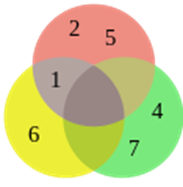
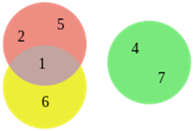

# 2. Logika

## Definice

**Logika** je věda o vyvozování (resp. logickém důsledku). Zkoumá argumenty postavené na předpokladech (tvrzeních, o nichž se předpokládá, že jsou pravdivá), které vedou k závěru. Deduktivní uvažování vyžaduje, aby závěr nevyhnutelně vyplýval z premis.

## Výroky

**Výrok** je tvrzení (myšlenka vyjádřená jazykem), které může být pravdivé nebo nepravdivé (např. „venku prší“).

**Jednoduchý výrok**: nemá žádnou další podčást, která by byla výrokem.

**Složený výrok**: obsahuje další podčásti (výroky) propojené logickými spojkami (např. konjunkce, disjunkce).

## Predikáty

**Predikát** je výraz určující vlastnost nebo vztah, který lze připsat jednomu či více subjektům.

- **Jednomístné** (např. „x je vysoký“)
- **Dvojmístné** (např. „x napadl y“)
- **Vícemístné** (např. „x leží mezi y a z“)

U predikátů se sleduje, za jakých podmínek je predikát (a tedy i výrok) pravdivý nebo nepravdivý.

## Pravidla správného usuzování

Máme sérii tvrzení $A1$, $A2$,$...$,$An$, které vedou k závěru B.

Argument je **správný**, pokud NENÍ možná situace, kdy všechna tvrzení Ai jsou pravdivá, ale závěr B by byl nepravdivý.

## Booleova algebra

Nauka o operacích s logickými konstantami 0 a 1 (pravda/nepravda) a s logickými proměnnými.

Základní logické operace:

- **Konjunkce (AND, ∧)**: pravdivá jen tehdy, jsou-li oba operandy pravdivé.
- **Disjunkce (OR, ∨)**: pravdivá, pokud je aspoň jeden operand pravdivý.
- **Negace (NOT, ¬)**: mění hodnotu z pravdy na nepravdu a naopak.

Dále platí důležité zákony jako komutativita, asociativita, distributivita, zákon identity, zákon neprotirečení a zákon vyloučeného středu.

## Základní zákony

### **Zákon komutativní**

**Pořadí operandů nemá vliv na výsledek.**

Při spojení dvou výroků operací AND (∧) nebo OR (∨) nezáleží na tom, který výrok je vlevo a který vpravo.

- Například: „A a B“ je totéž jako „B a A“, stejně tak „A nebo B“ je totéž jako „B nebo A“.

### **Zákon asociativní**

**Způsob seskupení výrazů nemá vliv na výsledek.**

Když spojujeme více než dva výroky stejnou operací (AND nebo OR), je jedno, které dvojice uzavřeme do závorek – výsledek je vždy stejný.

- Například: „(A a B) a C“ je totéž jako „A a (B a C)“, stejně tak „(A nebo B) nebo C“ je totéž jako „A nebo (B nebo C)“.

### **Zákon Distributivní**

**Operace AND se „roznásobí“ přes OR a naopak.**

Konjunkce (AND) může být rozdistribuována přes disjunkci (OR) a naopak.

- Například: „A a (B nebo C)“ lze přepsat jako „(A a B) nebo (A a C)“.

### Zákon identity

**Speciální prvky pro AND a OR.**

Existují speciální pravdivostní hodnoty, které v kombinaci s výrokem výsledek nezmění:

- AND s pravdou (1) nechává výrok nezměněný: „A a pravda“ je totéž jako „A“.
- OR s nepravdou (0) nechává výrok nezměněný: „A nebo nepravda“ je totéž jako „A“.

### Zákony negace

**Výrok a jeho negace mají předvídatelné výsledky.**

- Výrok současně pravdivý i nepravdivý (A a ne A) je vždy nepravda (výsledek je 0).
- Výrok nebo jeho negace (A nebo ne A) je vždy pravda (výsledek je 1).
  
  
  
  
  
  
  
  
  
  
  

# Vennovy diagramy

Grafické znázornění množin a vztahů mezi nimi (sjednocení, průnik, rozdíl, doplněk).

Používají se k **vizualizaci** množinových operací a logických vztahů.

# Eulerovy diagramy

Schematické prostředky pro znázornění množin a jejich vztahů.

**Rozdíl oproti Vennovým diagramům**: Eulerovy diagramy zobrazují pouze relevantní vztahy, ne nutně všechny možné (používají se hlavně k přehlednému vyjádření hierarchických vztahů).

# Tautologie, kontradikce, splnitelná formule

### Tautologie

Výroková formule pravdivá ve všech možných ohodnoceních proměnných (v tabulce vychází vždy 1).

Příklad: p∨¬p („Buď prší, nebo neprší“).

### Kontradikce

Výroková formule **nepravdivá ve všech ohodnoceních** (v tabulce samé 0).

Příklad: p∧¬p („Prší a neprší současně“).

### Splnitelná formule

Existuje aspoň jedna interpretace (ohodnocení proměnných), která ji činí pravdivou.

Není pravdivá nutně ve všech interpretacích (to by byla tautologie), ale aspoň v jedné (na rozdíl od kontradikce).

# Logický důsledek

Z výroků $A_1$, $A_2$, $\dots$, $A_n$ **logicky vyplývá** výrok B, jestliže v každém ohodnocení, kde jsou pravdivé všechny Ai, je pravdivé i B.

Klasický příklad:

- $A_1$: Všichni lidé jsou smrtelní.
- $A_2$: Sokrates je člověk.
- $B$: Sokrates je smrtelný.

# Výrokový počet

Formalizovaná teorie výroků a logických spojek.

Řeší, jak se výroky mohou kombinovat (konjunkce, disjunkce, implikace atd.) a jaké jsou jejich pravdivostní hodnoty.

# Věty a ekvivalence

**Věta** v logice je výrok, který lze ohodnotit jako pravdivý nebo nepravdivý podle hodnot proměnných.

**Ekvivalence (A⇔B)**: výroky A a B mají stejnou pravdivostní hodnotu ve všech situacích (buď oba pravdivé, nebo oba nepravdivé).

## Logické zákony

**Zákon identity**: Každé tvrzení je totožné samo se sebou $A = A$.

**Zákon neprotirečení**: Tvrzení nemůže být zároveň pravdivé a zároveň nepravdivé $¬(P∧¬P)$.

**Zákon vyloučeného středu**: Každý výrok je buď pravdivý, nebo nepravdivý $P∨¬P$.

**Zákon dvojité negace**: Dvojnásobná negace je ekvivalentní původnímu výroku $\neg \neg P \equiv P$.

# Formule

Symbolická reprezentace výroků pomocí proměnných (p, q, r...) a logických spojek.

**Jednoduché formule**: samotné proměnné (p, q...).

**Složené formule**: kombinace pomocí ∧, ∨, →, ¬ apod.

# Sekvence

Řada logických výroků (premis), z nichž každý logicky navazuje na předchozí, vedoucí k závěru.

Typická sekvence začíná několika předpoklady, pokračuje mezikroky a končí závěrem, který z předpokladů logicky plyne.

Typický příklad:

1. Všichni lidé jsou smrtelní.
2. Sokrates je člověk.
3. Závěr: Sokrates je smrtelný.

# Nepřímý důkaz

Metoda dokazování založená na předpokladu, že tvrzení neplatí. Pokud tento předpoklad vede k rozporu, plyne, že tvrzení musí být pravdivé.

Příklad: „Kdyby festival umění byl dnes, bylo by tu mnoho lidí“; pokud tu mnoho lidí není, festival není dnes.

# DNF (Disjunktivní normální forma)

- Logický vzorec ve **formě součtu součinů** – tzn. **disjunkce (nebo-li „nebo“) několika konjunkcí („a“)**.
- $(A ∧ B) ∨ (A ∧ ¬B) ∨ (¬A ∧ C)$
- **Každý člen (v závorce)** je kombinace proměnných a jejich negací, které **stačí k pravdivosti celé formule**.
- Když chceš vyjádřit, **které konkrétní kombinace vstupů způsobí, že výrok bude pravdivý**.
- Vhodné pro analýzu, kdy chceme vyjádřit, které konkrétní kombinace proměnných stačí k pravdivosti.

# KNF (Konjunktivní normální forma)

- Logický vzorec ve **formě součinu součtů** – tzn. **konjunkce („a“) několika disjunkcí („nebo“) proměnných**.
- $(A ∨ B) ∧ (¬A ∨ C) ∧ (B ∨ ¬C)$
- **Každý člen (v závorce)** je výrok, který **musí být pravdivý, aby byl pravdivý celý výraz**.
- Často používaná forma v logice, např. pro **automatizované dokazování** (SAT řešiče).
- Užitečné pro vyhodnocování, kdy výrok **musí splňovat více „nebo“ podmínek zároveň**.
  
  
  
  
# Sylogismy

- Forma deduktivního uvažování, kdy **ze dvou tvrzení (premis)** odvodíme **logický závěr**.
- **Struktura klasického sylogismu:**
    1. **Obecná (vyšší) premisa** – vztah mezi kategoriemi P a M
    2. **Konkrétní (nižší) premisa** – vztah mezi M a S
    3. **Závěr** – vyvozený vztah mezi S a P
- Příklad:
    1. Všichni lidé (S) jsou smrtelní (P).
    2. Sokrates (M) je člověk (S).
    3. Závěr: Sokrates (M) je smrtelný (P)
- Použití:
    - Základ **formální logiky**, filozofie, právního uvažování, matematických důkazů.