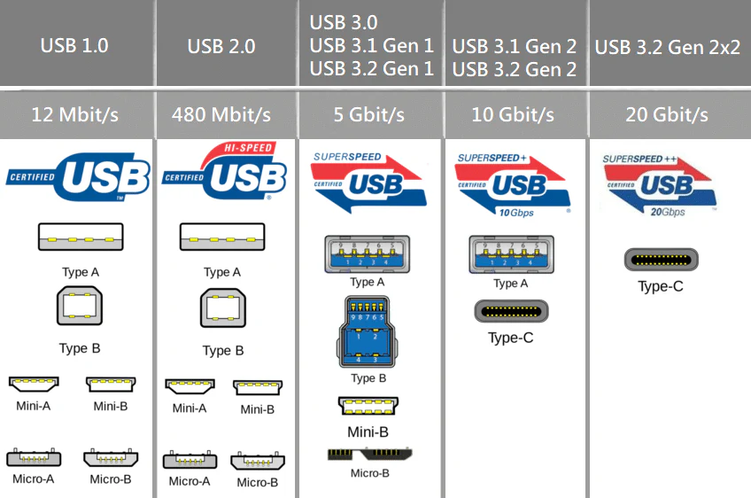

# 4. Komunikační technologie

## Historie výpočetní techniky

**Předchůdci počítačů**: V Číně (cca 2600 př. n. l.) abakus, později mechanické kalkulačky (Leonardo da Vinci, Blaise Pascal, Thomas de Colmar).

**Děrné štítky**: První širší využití kolem roku 1805 (tkací stav Jacquarda), od roku 1889 pak i jako nosiče dat pro počítací stroje.

**Charles Babbage** (kolem 1848): Návrh univerzálního mechanického počítače (Analytical Engine), stroj fyzicky nikdy zcela dokončen.

**Období 2. světové války**: Rozvoj výpočetní techniky (šifrovací stroje a např. výpočty balistických drah, elektronky, mechanická relé).

**Architektura Johna von Neumanna (1945)**: Počítačové systémy oddělené na CPU, paměť a vstupně/výstupní jednotky – základní princip dodnes.

**Fortran (IBM) 1954**:  – první vyšší programovací jazyk.

**Mooreův zákon (1964)**: Kapacita integrovaných obvodů se zhruba každých 12–18 měsíců zdvojnásobuje.

## Základní struktura a rozdělení počítačů

Počítačové systémy ukládají a zpracovávají data v binární (dvojkové) soustavě. Základní stavební kameny každého počítače jsou:

- **Procesor (CPU)**: provádí výpočty, řídí ostatní části systému, obsahuje aritmeticko-logickou jednotku (ALU) a řadič.
- **Paměť:** operační (RAM, pro krátkodobá data a běh programů), vyrovnávací (cache), dlouhodobá (HDD, SSD).
- **Sběrnice:** propojuje komponenty počítače – existují adresové, datové a řídicí sběrnice.
- **Vstupně/výstupní (I/O) zařízení**: periferní zařízení jako klávesnice, monitor, tiskárna apod.

### **Rozdělení počítačů**:

- **Sálové počítače (mainframe)** – pro náročné výpočty a obsluhu stovek terminálů.
- **Servery** – poskytují služby (databáze, web, souborové služby).
- **Osobní počítače (PC)** – stolní počítače, desktop.
- **Notebooky, tablety, chytré telefony** – mobilní zařízení.
- **Průmyslové, vestavěné (jednodeskové) počítače** – speciální účely (např. Raspberry Pi, Arduino).
  
  
  
  
  
## Hlavní hardwarové komponenty

### Základní deska (Motherboard)

Jedná se o hlavní plošný spoj, kde se propojují všechny hlavní komponenty počítače – CPU, RAM, rozšiřující karty a další periferie. Obsahuje čipset, který býval rozdělen na **Northbridge** (rychlá komunikace mezi CPU, RAM a grafickou kartou) a **Southbridge** (pomalejší periferie, disky, USB, zvuk). Dnešní architektura často slučuje vše do jediného čipsetu nebo přímo do CPU.

### Sběrnice

Soustava vodičů pro přenos dat a signálů mezi komponentami. Dělí se na adresovou (adresování paměti), datovou (přenos dat), a řídicí (signály typu čtení/zápis). Důležitá je například sběrnice PCI Express pro připojení grafických a rozšiřujících karet.

### BIOS / UEFI

**BIOS** (Basic Input/Output System) je základní firmware pro inicializaci hardwaru a zavedení operačního systému.

**UEFI** je jeho modernější varianta, umožňuje například práci s většími disky, lepší zabezpečení a uživatelské prostředí.

### Procesor (CPU)

Centrální jednotka, která vykonává strojové instrukce, zpracovává data, řídí tok informací mezi jednotlivými částmi počítače. Výkon se udává v počtu jader a taktovací frekvenci (GHz). Moderní procesory mají cache paměti pro rychlý přístup k často používaným datům.

### Operační paměť (RAM)

Krátkodobá paměť pro data, která jsou právě zpracovávána. Po vypnutí počítače se její obsah ztrácí.

### Trvalé paměti: HDD a SSD

- **HDD (Hard Disk Drive):** Mechanické disky s rotujícími plotnami, uchovávají data magneticky.
- **SSD (Solid State Drive):** Elektronická paměť (flash), rychlejší, odolnější vůči otřesům, ale vyšší cena za kapacitu a omezený počet zápisů.

### Paměťové karty, optická média

- **Paměťové karty** (SD, microSD): Používány v mobilech, fotoaparátech.
- **Optická média**: CD, DVD, Blu-ray – dnes spíše ustupují jiným technologiím.

### Zvukové karty

- Umožňují **přehrávat** a **nahrávat** zvuk. Převádějí digitální signál na analogový (pro reproduktory) a naopak. Často integrované na základní desce.

### Grafické karty

- Zpracovávají grafická data, mají vlastní GPU (Graphics Processing Unit) a paměť (VRAM).
- Zajišťují výstup na monitor, případně akceleraci 3D zobrazení.

### Monitory

- **Výstupní zařízení** zobrazující obrazová data.
- Rozlišení (počet pixelů), obnovovací frekvence (Hz) a typ panelu (LCD, LED, OLED) určují kvalitu.

### Klávesnice a myši

- **Klávesnice**: Základní textový vstup.
- **Myš**: Ukazovací zařízení (u PC) pro práci v grafickém prostředí.

### Tiskárny a skenery

- **Tiskárny**: Převádějí digitální dokument na papír (inkoustové, laserové).
- **Skenery**: Převádějí papírové předlohy do digitální podoby.

## Univerzální vstupně/výstupní porty

- **USB (Universal Serial Bus)**: Široce rozšířený standard pro připojení periferií. Různé verze (1.0, 2.0, 3.0, 3.1, 3.2).

- **USB-C**: Obratitelný konektor s podporou rychlejších přenosů a napájení (Power Delivery).
- **HDMI**: Přenos digitálního videa a zvuku do monitorů/televizí.
- **DisplayPort**: Digitální rozhraní pro monitory, alternativa HDMI s podobnou funkčností.
- **Thunderbolt**: Vysoce rychlostní rozhraní (např. TB3 používá USB-C konektor); podporuje data, video, napájení.
- **S/PDIF**: Digitální audio rozhraní (optické nebo koaxiální).

## Modemy

- Umožňují **přenos dat** po různých typech linek (telefonní, kabelová, mobilní).
- **DSL modem**: Využívá telefonní linku.
- **Kabelový modem**: Např. pro kabelovou TV síť.
- **Mobilní modem (LTE/5G)**: Bezdrátové připojení k internetu.

## Standardizace

- Proces vytváření **standardů** (norem) pro hardware i software.
- Zajišťuje **kompatibilitu a interoperabilitu** mezi různými výrobci a systémy.

## Operační systémy

- Software **zajišťující chod počítače**: spravuje hardware, souborové systémy a poskytuje rozhraní pro uživatele.
- **Příklady**: Windows, macOS, Linux, Android.

## Bezdrátová rozhraní: Bluetooth a NFC

- **Bluetooth**: Krátké vzdálenosti (klávesnice, myši, sluchátka, telefony).
- **NFC**: Velmi krátký dosah, používané např. pro bezkontaktní platby (telefony, platební karty).

## Počítačové sítě

**Počítačová síť** je soustava vzájemně propojených počítačů (případně i dalších zařízení), které spolu **sdílejí zdroje** a **vyměňují si informace**.

### Základní typy sítí

- **LAN (Local Area Network)**
    - Pokrývá menší geografickou oblast (např. domácnost, kancelář, budovu).
    - Typicky využívá ethernet nebo WiFi (u domácích routerů oboje).
    - Rychlosti v řádu až gigabitů za sekundu (Gbps).
- **WAN (Wide Area Network)**
    - Pokrývá velkou geografickou oblast (město, stát nebo i více zemí).
    - Skládá se z několika vzájemně propojených LAN.
    - Internet je největší existující WAN.

### OSI model (Open Systems Interconnection)

**OSI model** je **referenční** (teoretický) model, který rozděluje funkce sítí do sedmi vrstev. 
Každá vrstva **řeší vlastní typ složitosti**, a proto jsou **všechny nezbytné**.

### Shrnutí – proč **7 vrstev**?

| Vrstva | Řeší otázku: |
| --- | --- |
| 1. Fyzická | Jak vůbec **fyzicky přenést bity**? |
| 2. Linková | Jak **bezchybně přenést rámce** mezi dvěma zařízeními? |
| 3. Síťová | Jak **doručit data mezi sítěmi**? |
| 4. Transportní | Jak zajistit, že **celá zpráva dorazí správně**? |
| 5. Relační | Jak **udržet spojení** mezi aplikacemi? |
| 6. Prezentační | Jak data **přeložit, zabezpečit a připravit pro aplikaci**? |
| 7. Aplikační | Jak umožnit **uživatelskou komunikaci a služby**? |
1. **Fyzická vrstva (Physical)**
    - Zajišťuje fyzický přenos bitů (0 a 1) přes médium (metalický kabel, optické vlákno, bezdrátově).
    - **Proč ji máme**: Abychom měli **standardy pro fyzické spojení** – bez této vrstvy by se zařízení neměla jak „spojit“ na elektrické nebo optické úrovni.
    - **Příklad**: Určuje napětí na vodiči, tvar konektoru, modulaci signálu.
2. **Linková vrstva (Data Link)**
    - Provádí **přenos rámců** (frames) po daném fyzickém spoji mezi dvěma nebo více uzly.
    - Zajišťuje **detekci a případně opravu chyb** na úrovni rámců. Např. kontrolní součet **CRC - Cyclic Redundancy Check**
    - **Proč ji máme**: Fyzická vrstva neumí **detekovat chyby nebo kolize** – linková vrstva zavádí **lokální spolehlivost a adresaci (MAC)**.
    - **Příklad**: Protokoly Ethernet (IEEE 802.3), Wi-Fi (IEEE 802.11) (MAC adresy, přístup k médiu).
3. **Síťová vrstva (Network)**
    - Zajišťuje **směrování (routing) dat (paketů) mezi různými sítěmi** – z bodu A do bodu B napříč více sítěmi.
    - **Proč ji máme**: Linková vrstva komunikuje jen s „dosažitelnými“ sousedy – síťová vrstva řeší **přenos přes internet** a jiné rozsáhlé sítě.
    - **Příklad**: IP (Internet Protocol), např. IPv4 nebo IPv6
  
  
  
  
  
  
  
  
4. **Transportní vrstva (Transport)**
    - **Co dělá**: Řídí **spolehlivost a pořadí doručení dat** – případně rozbije velká data na segmenty a znovu je sestaví.
    - **Proč ji máme**: Síťová vrstva negarantuje, že data dorazí správně nebo v pořádku – transportní vrstva přidává **logiku pro spolehlivý přenos**.
    - **Příklady:**
        - **TCP** (Transmission Control Protocol) – spolehlivý, orientovaný na spojení.
        - **UDP** (User Datagram Protocol) – rychlejší, avšak bez garance doručení.
5. **Relační vrstva (Session)**
    - **Co dělá**: Zajišťuje **dlouhodobé spojení (relaci)** mezi dvěma aplikacemi – např. obnovení přenosu po výpadku.
    - **Proč ji máme**: Transportní vrstva zajišťuje přenos segmentů, ale **nezajistí např. přihlašování, autentizaci nebo synchronizaci stavů** – relační vrstva to řeší.
    - **Příklad**: Např. udržení připojení při videohovoru, obousměrná synchronizace.
6. **Prezentační vrstva (Presentation)**
    - **Co dělá**: Překládá data do podoby, kterou aplikace chápe – např. **konverze znakových sad**, **komprese**, **šifrování**.
    - **Proč ji máme**: Aby mohla aplikace pracovat se **srozumitelnými a bezpečnými daty**, nezávisle na tom, jak je zapsal odesílatel.
    - **Příklad**: Konverze UTF-8 ↔ ASCII, SSL/TLS šifrování.
7. **Aplikační vrstva (Application)**
    - **Co dělá**: Poskytuje rozhraní pro koncové aplikace, které uživatelé používají.
    - **Proč ji máme**: Aby existovala vrstva, která přímo **zprostředkuje přenos dat programům jako je prohlížeč, e-mail nebo FTP klient**.
    - **Příklad**: HTTP, SMTP, DNS, FTP.

> V praxi se často používá TCP/IP model, který sloučí některé vrstvy OSI do čtyř (či pěti) vrstvy, viz níže.
> 

### Ethernet

- **Kabelová technologie** pro LAN, definovaná standardem IEEE 802.3.
- Umožňuje vysokorychlostní přenos dat (100 Mb/s, 1 Gb/s, 10 Gb/s, …).
- Kabeláž nejčastěji **kroucená dvojlinka** (twisted pair, kategorie Cat5e, Cat6 apod.) nebo **optický kabel** (pro delší vzdálenosti, vyšší rychlosti).

### WiFi (Wireless Fidelity)

- **Bezdrátová technologie** dle standardů IEEE 802.11 (a, b, g, n, ac, ax...).
- Umožňuje připojení zařízení (notebooků, telefonů) k síti **bez nutnosti** kabelového propojení.
- Funguje v pásmech **2,4 GHz**, **5 GHz** (někdy i 6 GHz v novém standardu 802.11ax/„WiFi 6E“).
- Rychlost a dosah závisí na standardu, kvalitě signálu, počtu překážek.
  
  
  
## Internet

**Internet** je celosvětová síť vzájemně propojených menších sítí (LAN, WAN), která používá společný **rodinu protokolů** zvanou **TCP/IP**. Umožňuje přístup k webovým stránkám, e-mailu, souborovým serverům a řadě dalších služeb.

### Webové prohlížeče

- Software určený pro **prohlížení webových stránek**.
- Mezi nejznámější patří **Google Chrome**, **Mozilla Firefox**, **Safari**, **Microsoft Edge**.

### Základní webové standardy

- **HTML (HyperText Markup Language)**: Definuje **strukturu** webové stránky (nadpisy, odstavce, odkazy...).
- **CSS (Cascading Style Sheets)**: Řeší **vzhled a formátování** (barvy, rozložení prvků...).
- **JavaScript**: Programovací jazyk pro **interaktivitu** a dynamické chování webu.

## TCP/IP model

**TCP/IP (Transmission Control Protocol / Internet Protocol)** je v praxi nejpoužívanější protokolová sada. Často se zjednodušeně popisuje ve čtyřech vrstvách (někdy pěti):

1. **Aplikační vrstva**
    - Obsahuje protokoly jako **HTTP**, **FTP**, **SMTP**, **DNS**, **DHCP**.
    - Zhruba odpovídá vrstvám 5–7 v OSI (relační, prezentační, aplikační).
2. **Transportní vrstva**
    - **TCP** (spolehlivý přenos, řízení toku, opravuje ztracené pakety).
    - **UDP** (rychlejší, používaný pro streamování, VoIP).
3. **Internetová vrstva**
    - Zahrnuje **IP (IPv4, IPv6)**, ICMP (ping).
    - Odpovídá OSI síťové vrstvě (3).
4. **Síťové rozhraní / Linková vrstva**
    - Fyzická a linková vrstva dle OSI (1 a 2).
    - Např. **Ethernet, WiFi** (IEEE 802.3, IEEE 802.11).

### Propojování sítí

- **Směrovače (routery)**: Propojují samostatné sítě, přeposílají IP pakety na základě **směrovacích tabulek**.
- **Přepínače (switche)**: Zařízení v rámci jedné LAN, rozesílají data pouze správnému cílovému zařízení v síti.
- **Brány (gateways)**: Slouží k propojení **různých protokolů** nebo odlišných typů sítí (např. LAN s mobilní sítí).

### Architektura klient-server

- **Server**: Poskytuje služby (web, e-mail, databáze) pro **klienty**.
- **Klient**: Odesílá požadavky (např. webový prohlížeč posílá HTTP požadavky) a server je zpracuje.

### Vybrané aplikační protokoly

1. **HTTP (HyperText Transfer Protocol)**
    - Základní protokol pro přenos webových stránek.
    - Typické použití: prohlížeč (klient) → webový server.
2. **FTP (File Transfer Protocol)**
    - Protokol pro přenos souborů mezi klientem a serverem.
    - Existují různé režimy (aktivní, pasivní).
    - Dnes se často nahrazuje bezpečnější variantou SFTP (využívá SSH).
3. **DNS (Domain Name System)**
    - Překlad doménových jmen (např. „google.com“) na IP adresy (a naopak).
    - Usnadňuje uživatelům přístup k webům bez nutnosti pamatovat si číselné IP adresy.
4. **DHCP (Dynamic Host Configuration Protocol)**
    - Automaticky přiřazuje síťové údaje (IP adresu, masku sítě, bránu, DNS) klientům v síti.
    - Zjednodušuje správu adresace, zejména v lokálních sítích.
5. **VPN (Virtual Private Network)**
    - **Zabezpečené** propojení vzdálených počítačů nebo sítí přes **veřejný internet**.
    - Data jsou šifrována, což umožňuje bezpečný přenos (přístupy do firemní sítě z domova apod.).