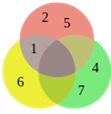
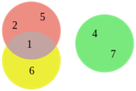
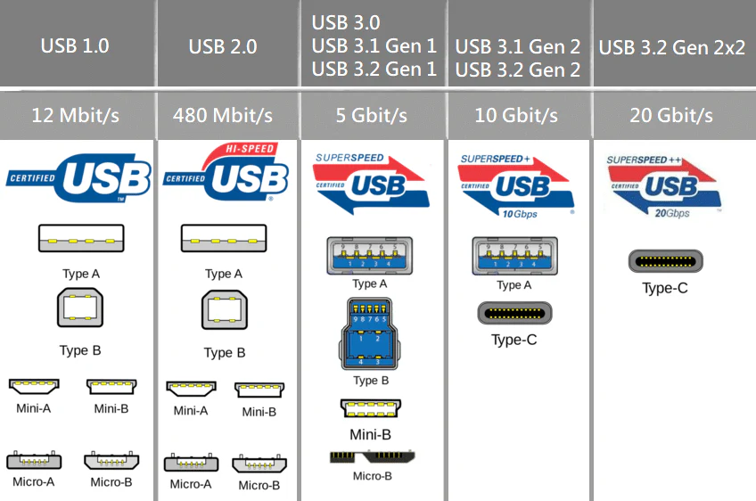

# 1. Algoritmizace a programování

## Pojem algoritmus, způsoby zápisu, metoda top-down, ladicí cyklus

**Algoritmus** je přesně definovaný postup či sada instrukcí, které slouží k vyřešení daného typu úlohy. V informatice označuje algoritmus konečnou sekvenci kroků, které lze mechanicky provést, a které vedou od zadaných vstupů k požadovanému výsledku.

Aby byl postup považován za algoritmus, musí splňovat několik základních vlastností:

- **Konečnost** – Algoritmus vždy skončí po konečném počtu kroků.
- **Determinovanost** – Každý krok je přesně a jednoznačně popsán, bez možnosti nejednoznačného výkladu.
- **Vstup a výstup** – Algoritmus pracuje s definovanými vstupy a vrací výstupy.
- **Obecnost** – Řeší celou třídu problémů, nikoliv pouze jeden konkrétní případ.
- **Efektivita** – Jednotlivé kroky jsou natolik jednoduché, že je lze provést mechanicky (ručně nebo počítačem).

**Způsoby zápisu algoritmů:**

- Slovní popis: Podobně jako kuchařský recept, krok za krokem popisuje činnost.
- Vývojový diagram: Grafické schéma postupu (bloky pro akce, větvení, cykly).
- Programovací jazyk: Implementace algoritmu ve zvoleném programovacím jazyce.

**Návrh algoritmu metodou top-down** znamená rozdělení složitého problému na menší, jednodušší podproblémy, které jsou dále rozpracovány až na úroveň konkrétních kroků. Tato metoda se často pojí s využitím rekurze.

**Ladicí (debug) cyklus programu** je proces, při kterém opakovaně spouštíme a testujeme program, vyhledáváme a odstraňujeme chyby (tzv. bugy), často za použití speciálních nástrojů (debuggerů) a výpisů stavu proměnných.
  

## Řídicí a datové struktury

**Řídicí struktury** určují pořadí provádění příkazů v programu:

- **Sekvenční struktura**: Příkazy jsou vykonávány postupně za sebou.
- **Podmíněná struktura**: Na základě podmínky může být vykonán jeden z několika bloků kódu (např. `if`, `else`, `switch`).
- **Cyklická struktura**: Umožňuje opakování části kódu do splnění určité podmínky (např. `for`, `while`, `do-while`).

**Datové struktury** jsou způsoby organizace a ukládání dat v paměti:

- **Pole (array)**: Kolekce prvků stejného typu, uložených na po sobě jdoucích místech v paměti, přístup přes index.
- **Seznam (list)**: Dynamická datová struktura umožňující růst i zkracování, typicky spojový seznam.
- **Ukazatel (pointer)**: Proměnná obsahující adresu v paměti, umožňuje dynamickou práci s pamětí.
- **Struktura (structure)**: Sdružuje více různých prvků pod jedním názvem (např. `struct` v C).

## Proměnné, identifikátory, datové typy, příkazy a operace

**Proměnná** je pojmenované místo v paměti, kde je uložená nějaká hodnota, kterou lze během běhu programu měnit.

**Identifikátor** je název proměnné, funkce nebo jiné entity v programu (např. `pocet`, `vypocetSoucet`).

**Datové typy** určují, jaký druh hodnot může proměnná obsahovat (např. `int` pro celá čísla, `float` pro desetinná čísla, `char` pro znak, `bool` pro logickou hodnotu).

**Přiřazovací příkaz** umožňuje nastavit hodnotu proměnné (`a = 5;`).

**Aritmetické operace** zahrnují sčítání, odčítání, násobení, dělení, zbytek po dělení.

**Logické operace** pracují s pravdivostními hodnotami (`AND`, `OR`, `NOT`, `==`, `!=` atd.).

## Podmíněné příkazy, větvení, cykly

**Podmíněné příkazy** jako `if`, `else`, `switch` umožňují provádět různé části kódu v závislosti na splnění podmínky.

**Větvení** je rozhodování, kterou cestou se v algoritmu pokračuje (např. podle hodnoty proměnné).

**Cykly** (`for`, `while`, `do-while`) opakují blok kódu, dokud je splněna určitá podmínka.
  
  

## Číslicová reprezentace datových typů, číselné soustavy

**Číslicová reprezentace** znamená, jak jsou hodnoty uloženy v počítači:

- **Celá čísla (integer)**: Uložena jako binární čísla v pevné šířce (např. 32 bitů).
- **Desetinná čísla (float, double)**: Uložena jako čísla s plovoucí desetinnou čárkou, určena mantisou a exponentem.
- **Řetězce (string)**: Sekvence znaků, znaky jsou reprezentovány kódem (např. ASCII, Unicode).
- **Logické hodnoty (boolean)**: Obvykle jeden bit (0 = false, 1 = true).

**Číselné soustavy**:

- **Desítková (decimální, základ 10)**: Číslice 0–9.
- **Binární (základ 2)**: Pouze 0 a 1. Klíčová pro práci počítače.
- **Osmičková (základ 8)**: Číslice 0–7, používána např. při zápisu práv v UNIXu.
- **Hexadecimální (základ 16)**: Číslice 0–9 a písmena A–F (pro 10–15), často využívaná pro zápis barev a adres.

## Rekurzivní a iterační postupy

**Rekurzivní postup** je takový, kdy funkce volá sama sebe. Rekurze se hodí pro řešení problémů, které lze rozdělit na podobné menší podproblémy (například faktoriál, Fibonacciho posloupnost, prohledávání stromů).

**Iterační postup** znamená opakování činnosti pomocí cyklu (např. výpočet faktoriálu přes `for` cyklus).

## Posuzování kvality algoritmu (časová složitost)

Kvalita algoritmu se hodnotí především podle **časové složitosti** – tj. jak rychle algoritmus zpracuje data v závislosti na jejich velikosti. Časová složitost se značí tzv. **velkým O (O-notation)**.

Základní složitosti:

- **O(1)**: Konstantní – doba běhu je nezávislá na velikosti vstupu.
- **O(log n)**: Logaritmická – roste velmi pomalu s velikostí vstupu.
- **O(n)**: Lineární – čas roste úměrně vstupu.
- **O(n log n)**: Typické pro efektivní třídící algoritmy.
- **O(n²), O(n³), …**: Kvadratická, kubická – výrazně pomalejší při větším vstupu.
- **O(2ⁿ), O(n!)**: Exponenciální, faktoriální – extrémně náročné pro větší vstupy.
  

## Strukturované a abstraktní datové typy

**Strukturované datové typy** umožňují sdružovat více hodnot:

- **Pole (array)**: Kolekce hodnot stejného typu, indexované.
- **Struktura (structure)**: Sdružení více různých typů pod jedním názvem (například záznam osoby s jménem, věkem a adresou).

**Abstraktní datové typy** jsou popsány z hlediska operací, které nad nimi lze provádět, ne konkrétní implementací:

- **Zásobník (stack)**: Princip LIFO – poslední vložený prvek je první vyjmutý (push, pop).
- **Fronta (queue)**: Princip FIFO – první vložený prvek je první vyjmutý (enqueue, dequeue).
- **Seznam (list)**: Umožňuje vkládání, mazání a procházení prvků.
- **Množina (set)**: Kolekce unikátních prvků, neřeší pořadí.
- **Strom (tree)**: Hierarchická struktura, každý uzel má rodiče a může mít potomky. Speciální případ je binární strom (každý uzel max. dva potomky).

## Princip tvorby uživatelských funkcí

Funkce umožňují rozdělit program na menší, opakovaně použitelné celky. Typický vývoj funkce zahrnuje:

1. Analýzu problému a definici cíle funkce.
2. Určení vstupů a výstupů.
3. Vytvoření hlavičky (definice jména, parametrů a návratového typu).
4. Implementaci těla funkce.
5. Testování správnosti a začlenění do programu.

## Princip práce se soubory

Práce se soubory zahrnuje základní operace:

1. **Otevření souboru** v požadovaném režimu (čtení, zápis, přidávání).
2. **Čtení nebo zápis dat** do/z souboru (po řádcích, po znacích nebo celé soubory).
3. **Uzavření souboru** pro uvolnění systémových prostředků.

Většinu těchto operací poskytují standardní knihovny jazyků (např. `open/read/write/close` v C, `with open()` v Pythonu).

## Přidělování paměti

Paměť lze přidělovat několika způsoby:

- **Staticky**: Při překladu programu, paměť je fixní (např. globální proměnné).
- **Dynamicky**: Za běhu programu na tzv. haldě (heap), typicky pomocí funkcí jako `malloc`/`free` v C nebo operátorů `new`/`delete` v C++.
- **Automaticky**: Lokální proměnné ve funkcích, které se alokují na zásobníku (stack) a po skončení funkce se automaticky uvolní.
  
  
## Základní algoritmy třídění a vyhledávání dat

**Třídicí algoritmy:**

- **Bubble sort**: Postupně porovnává sousední prvky a vyměňuje je, dokud není seznam setříděn. Jednoduchý, ale neefektivní pro velké množiny dat (O(n²)).
- **Insertion sort**: Každý prvek je vložen na správné místo mezi již setříděné prvky. Efektivní pro malé nebo téměř setříděné seznamy.
- **Selection sort**: Vyhledá nejmenší prvek a vloží ho na začátek, opakuje pro zbytek.
- **Quicksort, Mergesort, Heapsort**: Efektivnější algoritmy vhodné pro velké datové sady (obvykle O(n log n)).

**Vyhledávací algoritmy:**

- **Lineární vyhledávání**: Prochází každý prvek sekvenčně, dokud nenajde hledaný.
- **Binární vyhledávání**: Funguje na setříděných datech, v každém kroku dělí interval na poloviny, hledá v odpovídající polovině.
- **Interpolační vyhledávání**: Speciální případ binárního hledání, využívá rozložení hodnot v poli (vhodné pro rovnoměrně rozložená data).

## Základní numerické algoritmy

**Numerická derivace**:

- Přibližuje derivaci v bodě pomocí tzv. konečných diferencí, například:
    - Vpřední diference: (f(x+h) - f(x)) / h
    - Vzadní diference: (f(x) - f(x-h)) / h

**Numerická integrace**:

- **Metoda lichoběžníků**: Plocha pod křivkou je aproximována lichoběžníky.
- **Metoda obdélníků**: Interval je rozdělen na malé obdélníky, jejichž součet dává přibližnou hodnotu integrálu.

**Aproximace metodou nejmenších čtverců**:

- Slouží k aproximaci (nejčastěji lineární) vztahu mezi proměnnými tak, aby součet druhých mocnin rozdílů mezi skutečnými a vypočtenými hodnotami byl minimální. Používá se v regresi a analýze dat.

# 2. Logika

## Definice

**Logika** je věda o vyvozování (resp. logickém důsledku). Zkoumá argumenty postavené na předpokladech (tvrzeních, o nichž se předpokládá, že jsou pravdivá), které vedou k závěru. Deduktivní uvažování vyžaduje, aby závěr nevyhnutelně vyplýval z premis.

## Výroky

**Výrok** je tvrzení (myšlenka vyjádřená jazykem), které může být pravdivé nebo nepravdivé (např. „venku prší“).

**Jednoduchý výrok**: nemá žádnou další podčást, která by byla výrokem.

**Složený výrok**: obsahuje další podčásti (výroky) propojené logickými spojkami (např. konjunkce, disjunkce).

## Predikáty

**Predikát** je výraz určující vlastnost nebo vztah, který lze připsat jednomu či více subjektům.

- **Jednomístné** (např. „x je vysoký“)
- **Dvojmístné** (např. „x napadl y“)
- **Vícemístné** (např. „x leží mezi y a z“)

U predikátů se sleduje, za jakých podmínek je predikát (a tedy i výrok) pravdivý nebo nepravdivý.

## Pravidla správného usuzování

Máme sérii tvrzení $A1$, $A2$,$...$,$An$, které vedou k závěru B.

Argument je **správný**, pokud NENÍ možná situace, kdy všechna tvrzení Ai jsou pravdivá, ale závěr B by byl nepravdivý.

## Booleova algebra

Nauka o operacích s logickými konstantami 0 a 1 (pravda/nepravda) a s logickými proměnnými.

Základní logické operace:

- **Konjunkce (AND, ∧)**: pravdivá jen tehdy, jsou-li oba operandy pravdivé.
- **Disjunkce (OR, ∨)**: pravdivá, pokud je aspoň jeden operand pravdivý.
- **Negace (NOT, ¬)**: mění hodnotu z pravdy na nepravdu a naopak.

Dále platí důležité zákony jako komutativita, asociativita, distributivita, zákon identity, zákon neprotirečení a zákon vyloučeného středu.

## Základní zákony

### **Zákon komutativní**

**Pořadí operandů nemá vliv na výsledek.**

Při spojení dvou výroků operací AND (∧) nebo OR (∨) nezáleží na tom, který výrok je vlevo a který vpravo.

- Například: „A a B“ je totéž jako „B a A“, stejně tak „A nebo B“ je totéž jako „B nebo A“.

### **Zákon asociativní**

**Způsob seskupení výrazů nemá vliv na výsledek.**

Když spojujeme více než dva výroky stejnou operací (AND nebo OR), je jedno, které dvojice uzavřeme do závorek – výsledek je vždy stejný.

- Například: „(A a B) a C“ je totéž jako „A a (B a C)“, stejně tak „(A nebo B) nebo C“ je totéž jako „A nebo (B nebo C)“.

### **Zákon Distributivní**

**Operace AND se „roznásobí“ přes OR a naopak.**

Konjunkce (AND) může být rozdistribuována přes disjunkci (OR) a naopak.

- Například: „A a (B nebo C)“ lze přepsat jako „(A a B) nebo (A a C)“.

### Zákon identity

**Speciální prvky pro AND a OR.**

Existují speciální pravdivostní hodnoty, které v kombinaci s výrokem výsledek nezmění:

- AND s pravdou (1) nechává výrok nezměněný: „A a pravda“ je totéž jako „A“.
- OR s nepravdou (0) nechává výrok nezměněný: „A nebo nepravda“ je totéž jako „A“.

### Zákony negace

**Výrok a jeho negace mají předvídatelné výsledky.**

- Výrok současně pravdivý i nepravdivý (A a ne A) je vždy nepravda (výsledek je 0).
- Výrok nebo jeho negace (A nebo ne A) je vždy pravda (výsledek je 1).
  
  
  
  
  
  
  
  
  
  
  

# Vennovy diagramy

Grafické znázornění množin a vztahů mezi nimi (sjednocení, průnik, rozdíl, doplněk).

Používají se k **vizualizaci** množinových operací a logických vztahů.

# Eulerovy diagramy

Schematické prostředky pro znázornění množin a jejich vztahů.

**Rozdíl oproti Vennovým diagramům**: Eulerovy diagramy zobrazují pouze relevantní vztahy, ne nutně všechny možné (používají se hlavně k přehlednému vyjádření hierarchických vztahů).

# Tautologie, kontradikce, splnitelná formule

### Tautologie

Výroková formule pravdivá ve všech možných ohodnoceních proměnných (v tabulce vychází vždy 1).

Příklad: p∨¬p („Buď prší, nebo neprší“).

### Kontradikce

Výroková formule **nepravdivá ve všech ohodnoceních** (v tabulce samé 0).

Příklad: p∧¬p („Prší a neprší současně“).

### Splnitelná formule

Existuje aspoň jedna interpretace (ohodnocení proměnných), která ji činí pravdivou.

Není pravdivá nutně ve všech interpretacích (to by byla tautologie), ale aspoň v jedné (na rozdíl od kontradikce).

# Logický důsledek

Z výroků $A_1$, $A_2$, $\dots$, $A_n$ **logicky vyplývá** výrok B, jestliže v každém ohodnocení, kde jsou pravdivé všechny Ai, je pravdivé i B.

Klasický příklad:

- $A_1$: Všichni lidé jsou smrtelní.
- $A_2$: Sokrates je člověk.
- $B$: Sokrates je smrtelný.

# Výrokový počet

Formalizovaná teorie výroků a logických spojek.

Řeší, jak se výroky mohou kombinovat (konjunkce, disjunkce, implikace atd.) a jaké jsou jejich pravdivostní hodnoty.

# Věty a ekvivalence

**Věta** v logice je výrok, který lze ohodnotit jako pravdivý nebo nepravdivý podle hodnot proměnných.

**Ekvivalence (A⇔B)**: výroky A a B mají stejnou pravdivostní hodnotu ve všech situacích (buď oba pravdivé, nebo oba nepravdivé).

## Logické zákony

**Zákon identity**: Každé tvrzení je totožné samo se sebou $A = A$.

**Zákon neprotirečení**: Tvrzení nemůže být zároveň pravdivé a zároveň nepravdivé $¬(P∧¬P)$.

**Zákon vyloučeného středu**: Každý výrok je buď pravdivý, nebo nepravdivý $P∨¬P$.

**Zákon dvojité negace**: Dvojnásobná negace je ekvivalentní původnímu výroku $\neg \neg P \equiv P$.

# Formule

Symbolická reprezentace výroků pomocí proměnných (p, q, r...) a logických spojek.

**Jednoduché formule**: samotné proměnné (p, q...).

**Složené formule**: kombinace pomocí ∧, ∨, →, ¬ apod.

# Sekvence

Řada logických výroků (premis), z nichž každý logicky navazuje na předchozí, vedoucí k závěru.

Typická sekvence začíná několika předpoklady, pokračuje mezikroky a končí závěrem, který z předpokladů logicky plyne.

Typický příklad:

1. Všichni lidé jsou smrtelní.
2. Sokrates je člověk.
3. Závěr: Sokrates je smrtelný.

# Nepřímý důkaz

Metoda dokazování založená na předpokladu, že tvrzení neplatí. Pokud tento předpoklad vede k rozporu, plyne, že tvrzení musí být pravdivé.

Příklad: „Kdyby festival umění byl dnes, bylo by tu mnoho lidí“; pokud tu mnoho lidí není, festival není dnes.

# DNF (Disjunktivní normální forma)

- Logický vzorec ve **formě součtu součinů** – tzn. **disjunkce (nebo-li „nebo“) několika konjunkcí („a“)**.
- $(A ∧ B) ∨ (A ∧ ¬B) ∨ (¬A ∧ C)$
- **Každý člen (v závorce)** je kombinace proměnných a jejich negací, které **stačí k pravdivosti celé formule**.
- Když chceš vyjádřit, **které konkrétní kombinace vstupů způsobí, že výrok bude pravdivý**.
- Vhodné pro analýzu, kdy chceme vyjádřit, které konkrétní kombinace proměnných stačí k pravdivosti.

# KNF (Konjunktivní normální forma)

- Logický vzorec ve **formě součinu součtů** – tzn. **konjunkce („a“) několika disjunkcí („nebo“) proměnných**.
- $(A ∨ B) ∧ (¬A ∨ C) ∧ (B ∨ ¬C)$
- **Každý člen (v závorce)** je výrok, který **musí být pravdivý, aby byl pravdivý celý výraz**.
- Často používaná forma v logice, např. pro **automatizované dokazování** (SAT řešiče).
- Užitečné pro vyhodnocování, kdy výrok **musí splňovat více „nebo“ podmínek zároveň**.
  
  
  
  
# Sylogismy

- Forma deduktivního uvažování, kdy **ze dvou tvrzení (premis)** odvodíme **logický závěr**.
- **Struktura klasického sylogismu:**
    1. **Obecná (vyšší) premisa** – vztah mezi kategoriemi P a M
    2. **Konkrétní (nižší) premisa** – vztah mezi M a S
    3. **Závěr** – vyvozený vztah mezi S a P
- Příklad:
    1. Všichni lidé (S) jsou smrtelní (P).
    2. Sokrates (M) je člověk (S).
    3. Závěr: Sokrates (M) je smrtelný (P)
- Použití:
    - Základ **formální logiky**, filozofie, právního uvažování, matematických důkazů.

# 3. Data a datové struktury

## Složitost algoritmů a operací nad datovými strukturami

Složitost algoritmů popisuje, jak rychle (časová složitost) nebo jak náročně na paměť (prostorová složitost) roste výpočetní náročnost algoritmu v závislosti na velikosti vstupních dat. Obvykle se složitost značí pomocí „velkého O“ (například O(n), O(n²), O(log n)), kde n je velikost vstupu.

- **Konstantní složitost O(1):** Výpočet zabere vždy stejný čas bez ohledu na velikost vstupu (např. přístup k prvku pole podle indexu).
- **Lineární složitost O(n):** Čas narůstá přímo úměrně s velikostí vstupu (např. sekvenční hledání v poli).
- **Kvadratická složitost O(n²):** Čas roste s druhou mocninou velikosti vstupu, typické u jednoduchých třídicích algoritmů jako bubble sort.
- **Logaritmická složitost O(log n):** Typická např. pro binární vyhledávání.
- **Amortizovaná složitost** znamená průměrnou časovou složitost operace v posloupnosti více operací (například dynamická pole).

**Třída NP** zahrnuje problémy, jejichž správné řešení lze v polynomiálním čase ověřit, ale není známý algoritmus, který by je v polynomiálním čase řešil ve všech případech (např. problém obchodního cestujícího, batohový problém apod.).

**Amortizovaná časová složitost** – průměrný čas k vykonání určité operace v sekvenci operací v nejhorším případě, není to pravděpodobnost (zaručenost), pro jeho stanovení je potřeba analyzovat sekvence operací, které mohou nastat a jak často nastávají, velmi často je odvozena od algoritmů pro práci s datovými strukturami (vyhledávání ve stromové struktuře, haldě, zásobníku atd.)

Příklad:

- Implementace dynamického pole, která zdvojnásobuje velikost pole pokaždé, když dojde k jeho naplnění.
  
  
  
  
  
  
  
  
  
  
  
  
  
  
  
  
  
  

## Prohledávání grafů: do šířky a do hloubky

### Prohledávání do šířky (BFS – Breadth-First Search)

- Zvolíme startovní vrchol
- Postupně procházíme vrcholy grafu tak, že nejprve projdeme všechny sousedy startovního vrcholu, poté sousedy sousedů atd. až projdeme celý graf.
- Předchůdce jednotlivých vrcholů si postupně zaznamenáváme. Tím vytváříme strom nejkratších cest k jednotlivým vrcholům ze startovního vrcholu, tzv. kořene.
- Při algoritmickém řešení se využívá tzv. FIFO fronta, kam ukládáme následníky vrcholu, který je právě zpracováván.

**Použití:**

Najde nejkratší cestu v neohodnoceném grafu, generování stromu nejkratších cest.

**Složitost:**

O(|V| + |E|), kde V je počet vrcholů, E počet hran.

### Prohledávání do hloubky (DFS – Depth-First Search)

- Zvolíme startovní vrchol
- Postupně procházíme vrcholy grafu tak, že najdeme prvního souseda vrcholu a hned hledáme jeho prvního souseda atd. až narazíme na vrchol, který nemá dosud nenavštíveného souseda. V tom případě se vracíme zpět k předchozímu vrcholu a pokračujeme dále až projdeme celý graf.
- Procházením stromu opět vzniká strom.
- S výhodou se využívá rekurze.
- Algoritmus se využívá např. pro nalezení silných komponent souvislosti.

**Použití:**

Zjištění souvislých komponent, hledání cest, topologické řazení.

**Složitost:**

O(|V| + |E|).

## Stromy, grafy a algoritmy na kostru grafu

### Strom a kostra grafu

**Strom**

je souvislý graf bez cyklů. Každý konec stromu se nazývá list.

**Kostra grafu**

je podgraf obsahující všechny vrcholy původního grafu, který je stromem (tedy nemá cykly).
  
  
  

**Minimální kostra**

(Minimum Spanning Tree, MST) je kostra s minimálním možným součtem vah hran. Hledá se pro efektivní propojení všech bodů s minimálními náklady (např. sítě, silnice).

**Strom** – souvislý graf, který neobsahuje kružnice, koncové vrcholy se nazývají listy

**Kostra grafu** – nemusí být jednoznačná u grafů, které nejsou stromy (strom má pouze jednu), úplný graf s *n* vrcholy má 2 na *n-2* různých koster

**Minimální kostra** – optimalizační problém, jehož cílem je najít minimální (příp. maximální) kostru hranově ohodnoceného grafu, jednoznačná, pokud neexistují dvě stejně hodnocené hrany, celková cena musí být minimální:

- Chceme dopravně propojit mezi sebou několik míst, tj. vybudovat silnice tak, aby bylo možné se z libovolného místa dostat do jiného libovolného místa a přitom náklady byly minimální.
- Chceme v obci vybudovat internetové připojení ke všem domům za co nejmenší náklady, které se odvíjí od délky pokládaného kabelu.
- Máme síť silnic. Chceme zjistit, které cesty jsou z hlediska nákladů na jejich opravy největší.
- **Hladový (Kruskalův) algoritmus**
    - Uspořádáme všechny hrany do neklesající posloupnosti dle jejich váhy.
    - Postupně vytváříme množinu hran, do které přidáváme hrany z uspořádané posloupnosti hran tak, aby nevznikla kružnice.
    - Pokud nelze žádnou hranu přidat, našli jsme minimální kostru.
    - Při hledání maximální kostry uspořádáme hrany v opačném pořadí.

**Jarníkův (Primův) algoritmus**

- Vycházíme z degenerovaného stromu (strom o jednom vrcholu)
- Postupně připojujeme vrcholy s hranou o nejmenší váze, k již existujícímu stromu až vyčerpáme všechny vrcholy.
- Hrany oproti Kruskalovu algoritmu neseřazujeme, ale kostru vytvářím z libovolného vrcholu.
- Výhoda algoritmu je v tom, že nemusíme kontrolovat vznik kružnic, což je výpočetně náročné.
- Při hledání maximální kostry uspořádáme hrany v opačném pořadí.

**Borůvkův algoritmus**

- Na začátku je každý vrchol samostatnou komponentou souvislosti.
- Postupně spojujeme komponenty souvislosti do stále větších podgrafů.
- Nakonec dostaneme jedinou komponentu souvislosti, která je minimální kostrou.
- V každém kroku vybereme pro každou komponentu souvislosti hranu s co nejnižší cenou, která směřuje do jiné komponenty souvislosti a tu přidáme do kostry.
- Při hledání maximální kostry uvažujeme největší cenu.
  
  
  

**Optimální (minimální/maximální) cesta** – hledání cesty mezi dvěma vrcholy v rámci různých kritérií

- Neorientovaný sled (též jen Sled)
    - = posloupnost vrcholů a hran v, h, v, h, v, ..., h, v, jestliže každá hrana h z této posloupnosti spojuje vrcholy v a v.
- Cesta
    - = neorientovaný sled, ve kterém se žádný vrchol (a tedy ani hrana) nevyskytuje dvakrát
- **Příklady na hledání optimální cesty:**
    - Najít **nejkratší** cestu mezi dvěma městy na mapě, přičemž známe vzdálenosti mezi jednotlivými městy.
    - Najít **nejrychlejší** cestu mezi dvěma městy na mapě, přičemž známe vzdálenosti mezi jednotlivými městy.
    - Jaká bude **nejdelší** doba, za kterou zvládneme úkol (kritická cesta), pokud známe máme graf provázaných dílčích činností.
- **Dijkstrův algoritmus pro hledání minimální cesty**
    - Jednoduchý a rychlý algoritmus.
    - Existuje řada variant tohoto algoritmu.
    - Pracuje s hranově kladně ohodnoceným grafem (neohodnocený graf lze však na ohodnocený snadno převést).
- **Floydův-Warshallův algoritmus (Royův–Floydův algoritmus)** pro hledání minimální cesty
    - Jediný průchod algoritmu spočte nejkratší cestu mezi všemi dvojicemi vrcholů, tedy nejen mezi dvěma zadanými vrcholy.
    - Algoritmus je typickým příkladem dynamického programování.
    - Základní FW algoritmus vrací délky minimálních cest.
    - Modifikovaný FW algoritmus umožňuje zjistit hledané minimální cesty.
    - Algoritmus je iterační a konečný.
    - Principem algoritmu je nahrazování úseku cesty, která vede po jedné hraně, obchvatem (cestou) tvořenou dvěma hranami, pokud součet jejich ohodnocení je menší než u původní hrany.

**Binární strom** – struktura používaná k ukládání a vyhledávání dat, orientovaný graf s jedním kořenem, z něhož existuje cesta do všech vrcholů grafu, každý vrchol může mít maximálně dva potomky a jednoho předka s výjimkou kořene (nemá předka)

- Může být reprezentován dynamickými strukturami (ukazateli) – AVL stromy
- Existují různé druhy binárních stromů podle uspořádání a struktury
  
  
  
  
  
  
  
  
**Binární vyhledávací strom (BST)** – datová struktura založená na binárním stromu, s uspořádanými uzly, které umožňují rychlé vyhledávání, základní operace: MEMBER, INSERT, DELETE (v nejhorším případě je náročnost těchto operací O(n) nebo O(log n)

Vlastnosti:

- Každý uzel má nejvýše dva potomky
- Každý uzel má svůj klíč, podle hodnot klíčů jsou uzly uspořádány
- Levý podstrom uzlu obsahuje pouze klíče menší než je klíč tohoto uzlu
- Pravý podstrom uzlu obsahuje pouze klíče větší než je klíč tohoto uzlu

**AVL strom** – samovyvažovací BST, má stejné vlastnosti jako BST (navíc délka nejdelší větve levého a pravého podstromu se liší nejvýše o 1), stejné operace jako BST + vyvažování (O(log n)), při každém INSERT nebo DELETE se počítá koeficient vyváženosti všech uzlů z výšky obou podstromů, pokud je menší nebo roven 1 tak je vyvážený, vyvážení se děje pomocí rotace stromu, rotací je několik druhů

**Halda** – datová struktura, podmínka: klíč otce je větší klíč syna (max heap) nebo naopak (min heap) a strukturální podmínka na uspořádání stromu, využívá se v heapsortu, výběrový algoritmus, implementace Dijkstry (fibonacciho halda) nebo Jarník, hladové algoritmy

- **Fibonacciho halda**
    - Principiálně vychází z binomiální haldy.
    - Hlavní výhodou Fibonacciho haldy je nízká asymptotická složitost prováděných algoritmů.
    - Operace vložení, hledání minima, snížení hodnoty klíče a spojování stromů probíhají v konstantním čase, amortizovaně O(1).
    - Operace mazání a mazání minimálního prvku pracuje s časovou složitostí O(log n).
    - Oproti binomiálním haldám se liší tím, že povolujeme i jiné, než binomiální stromy ve struktuře. Spojování stromů pak provádíme jen mezi stromy stejného řádu.
    - Fibonacciho haldu tvoří skupina stromů vyhovující lokální podmínce na uspořádání haldy (Hodnota prvku je větší, než hodnota jeho otce).
    - Minimálním prvkem je vždy kořen jednoho ze stromů.
    - Vnitřní struktura Fibonacciho haldy je v porovnání s binomiální haldou daleko více flexibilní.
    - Jednotlivé stromy nemají pevně daný tvar a v extrémním případě může každý prvek haldy tvořit izolovaný strom nebo naopak všechny prvky mohou být součástí jediného stromu hloubky *N*.
  
  
  
  
  
  
  
  
  
  
  
# **Třídění a vyhledávání**

**Bubble sort $O(n^2)$**

Porovnávání dvou sousedních prvků a pokud je nižší číslo nalevo od vyššího, pak se vymění, pokračuje se s touto logikou dále, pokud jsou ve správném pořadí, nevymění se

- **Heap sort $O(n logn)$**
    
    Jedním z nejefektivnějších řadících algoritmů založených na porovnávání prvků, základem je binární halda, chová se jako prioritní fronta
    
    1. Postavme haldu nad zadaným polem.
    2. Utrhněme vrchol haldy (prvek s nejvyšší prioritou - nejvyšší nebo nejnižší prvek dle způsobu řazení).
    3. Prohoďme utržený prvek s posledním prvkem haldy.
    4. Zmenšeme haldu o 1 (prvky řazené dle priority na konci pole jsou již seřazené).
    5. Opravme haldu tak, aby splňovala požadované vlastnosti (přestaly platit v momentě prohození prvků).
    6. Dokud má halda prvky **GOTO: 2**.
    7. Pole je seřazené v opačném pořadí, než je priorita prvků.

**Quick sort $O(n^2)$** – velmi rychlý nestabilní řadící algoritmus

Zvolme v zadaném poli libovolný prvek a říkejme mu *pivot*. Nyní můžeme pole přeházet tak, aby na jedné straně byly prvky větší než pivot, na druhé menší než pivot a pivot samotný byl umístěn přesně mezi těmito částmi. Tento postup můžeme zopakovat pro obě rozdělené části (bez pivota, ten je již umístěn na správném místě). Proceduru opakujeme tak dlouho, dokud nenarazíme na všechny triviálně řešitelné podproblémy (pole velikosti 1). V tento okamžik je celé pole seřazeno od nejvyššího prvku.

**Merge sort O(n logn)** – typ rozděl a panuj

1. Rozdělí neseřazenou množinu dat na dvě podmnožiny o přibližně stejné velikosti.
2. Seřadí obě podmnožiny.
3. Spojí seřazené podmnožiny do jedné seřazené množiny.

**Hledání k-tého prvku** –

Rozděl posloupnost délky n na n/5 pětic (poslední může být neúplná).

1. V každé pětici najdi její medián.
2. Rekurzivně najdi medián ze získané množiny n/5 mediánů.
3. Použij medián mediánů jako pivot k rozdělení vstupní posloupnosti.
4. Pokud medián mediánů není hledaným prvkem, tak rekurzivně hledej v množině

prvků menších, než je on nebo v množině prvků větších, než je on.
  
  
  
  
  
  
  
  
  
  
## Hašování

**Hašování** je technika, která pomocí hašovací funkce převádí hodnotu (klíč) na index v tabulce (pole). Hašovací tabulka umožňuje rychlé vkládání, mazání i hledání průměrně v čase O(1), při správném rozložení a zamezení kolizí. Důležitá je kvalita hašovací funkce (MD5, SHA apod.), která zaručuje rovnoměrné rozložení klíčů.

## Kódování

Kódování znamená převod dat do jiné, často standardizované podoby, např. převod znaků do kódování ASCII nebo UTF-8.

Cílem je jednoznačná a bezpečná reprezentace dat.

## Komprese

Komprese zmenšuje velikost dat.

- **Bezztrátová komprese** (např. Huffmanovo kódování) zachovává původní data přesně, lze je obnovit do původní podoby.
- **Ztrátová komprese** (např. JPEG, MP3) některá data nenávratně odstraní pro větší úsporu místa.

## Šifrování

Šifrování chrání data před neautorizovaným přístupem.

### Symetrická šifra

Při **symetrickém šifrování** se pro šifrování i dešifrování používá stejný tajný klíč (například algoritmy AES nebo DES). Hlavní výhodou je rychlost, nevýhodou potřeba bezpečně sdílet klíč.

### Asymetrická šifra (RSA)

**Asymetrické šifrování** využívá dvojici klíčů: veřejný klíč (pro šifrování) a soukromý klíč (pro dešifrování). Nejznámější algoritmus je **RSA**. Veřejný klíč lze bezpečně sdílet, soukromý zůstává skrytý. Výpočetně náročnější, často se používá v kombinaci se symetrickými šiframi (například pro výměnu klíčů).

# 4. Komunikační technologie

## Historie výpočetní techniky

**Předchůdci počítačů**: V Číně (cca 2600 př. n. l.) abakus, později mechanické kalkulačky (Leonardo da Vinci, Blaise Pascal, Thomas de Colmar).

**Děrné štítky**: První širší využití kolem roku 1805 (tkací stav Jacquarda), od roku 1889 pak i jako nosiče dat pro počítací stroje.

**Charles Babbage** (kolem 1848): Návrh univerzálního mechanického počítače (Analytical Engine), stroj fyzicky nikdy zcela dokončen.

**Období 2. světové války**: Rozvoj výpočetní techniky (šifrovací stroje a např. výpočty balistických drah, elektronky, mechanická relé).

**Architektura Johna von Neumanna (1945)**: Počítačové systémy oddělené na CPU, paměť a vstupně/výstupní jednotky – základní princip dodnes.

**Fortran (IBM) 1954**:  – první vyšší programovací jazyk.

**Mooreův zákon (1964)**: Kapacita integrovaných obvodů se zhruba každých 12–18 měsíců zdvojnásobuje.

## Základní struktura a rozdělení počítačů

Počítačové systémy ukládají a zpracovávají data v binární (dvojkové) soustavě. Základní stavební kameny každého počítače jsou:

- **Procesor (CPU)**: provádí výpočty, řídí ostatní části systému, obsahuje aritmeticko-logickou jednotku (ALU) a řadič.
- **Paměť:** operační (RAM, pro krátkodobá data a běh programů), vyrovnávací (cache), dlouhodobá (HDD, SSD).
- **Sběrnice:** propojuje komponenty počítače – existují adresové, datové a řídicí sběrnice.
- **Vstupně/výstupní (I/O) zařízení**: periferní zařízení jako klávesnice, monitor, tiskárna apod.

### **Rozdělení počítačů**:

- **Sálové počítače (mainframe)** – pro náročné výpočty a obsluhu stovek terminálů.
- **Servery** – poskytují služby (databáze, web, souborové služby).
- **Osobní počítače (PC)** – stolní počítače, desktop.
- **Notebooky, tablety, chytré telefony** – mobilní zařízení.
- **Průmyslové, vestavěné (jednodeskové) počítače** – speciální účely (např. Raspberry Pi, Arduino).
  
  
  
  
  
## Hlavní hardwarové komponenty

### Základní deska (Motherboard)

Jedná se o hlavní plošný spoj, kde se propojují všechny hlavní komponenty počítače – CPU, RAM, rozšiřující karty a další periferie. Obsahuje čipset, který býval rozdělen na **Northbridge** (rychlá komunikace mezi CPU, RAM a grafickou kartou) a **Southbridge** (pomalejší periferie, disky, USB, zvuk). Dnešní architektura často slučuje vše do jediného čipsetu nebo přímo do CPU.

### Sběrnice

Soustava vodičů pro přenos dat a signálů mezi komponentami. Dělí se na adresovou (adresování paměti), datovou (přenos dat), a řídicí (signály typu čtení/zápis). Důležitá je například sběrnice PCI Express pro připojení grafických a rozšiřujících karet.

### BIOS / UEFI

**BIOS** (Basic Input/Output System) je základní firmware pro inicializaci hardwaru a zavedení operačního systému.

**UEFI** je jeho modernější varianta, umožňuje například práci s většími disky, lepší zabezpečení a uživatelské prostředí.

### Procesor (CPU)

Centrální jednotka, která vykonává strojové instrukce, zpracovává data, řídí tok informací mezi jednotlivými částmi počítače. Výkon se udává v počtu jader a taktovací frekvenci (GHz). Moderní procesory mají cache paměti pro rychlý přístup k často používaným datům.

### Operační paměť (RAM)

Krátkodobá paměť pro data, která jsou právě zpracovávána. Po vypnutí počítače se její obsah ztrácí.

### Trvalé paměti: HDD a SSD

- **HDD (Hard Disk Drive):** Mechanické disky s rotujícími plotnami, uchovávají data magneticky.
- **SSD (Solid State Drive):** Elektronická paměť (flash), rychlejší, odolnější vůči otřesům, ale vyšší cena za kapacitu a omezený počet zápisů.

### Paměťové karty, optická média

- **Paměťové karty** (SD, microSD): Používány v mobilech, fotoaparátech.
- **Optická média**: CD, DVD, Blu-ray – dnes spíše ustupují jiným technologiím.

### Zvukové karty

- Umožňují **přehrávat** a **nahrávat** zvuk. Převádějí digitální signál na analogový (pro reproduktory) a naopak. Často integrované na základní desce.

### Grafické karty

- Zpracovávají grafická data, mají vlastní GPU (Graphics Processing Unit) a paměť (VRAM).
- Zajišťují výstup na monitor, případně akceleraci 3D zobrazení.

### Monitory

- **Výstupní zařízení** zobrazující obrazová data.
- Rozlišení (počet pixelů), obnovovací frekvence (Hz) a typ panelu (LCD, LED, OLED) určují kvalitu.

### Klávesnice a myši

- **Klávesnice**: Základní textový vstup.
- **Myš**: Ukazovací zařízení (u PC) pro práci v grafickém prostředí.

### Tiskárny a skenery

- **Tiskárny**: Převádějí digitální dokument na papír (inkoustové, laserové).
- **Skenery**: Převádějí papírové předlohy do digitální podoby.

## Univerzální vstupně/výstupní porty

- **USB (Universal Serial Bus)**: Široce rozšířený standard pro připojení periferií. Různé verze (1.0, 2.0, 3.0, 3.1, 3.2).

- **USB-C**: Obratitelný konektor s podporou rychlejších přenosů a napájení (Power Delivery).
- **HDMI**: Přenos digitálního videa a zvuku do monitorů/televizí.
- **DisplayPort**: Digitální rozhraní pro monitory, alternativa HDMI s podobnou funkčností.
- **Thunderbolt**: Vysoce rychlostní rozhraní (např. TB3 používá USB-C konektor); podporuje data, video, napájení.
- **S/PDIF**: Digitální audio rozhraní (optické nebo koaxiální).

## Modemy

- Umožňují **přenos dat** po různých typech linek (telefonní, kabelová, mobilní).
- **DSL modem**: Využívá telefonní linku.
- **Kabelový modem**: Např. pro kabelovou TV síť.
- **Mobilní modem (LTE/5G)**: Bezdrátové připojení k internetu.

## Standardizace

- Proces vytváření **standardů** (norem) pro hardware i software.
- Zajišťuje **kompatibilitu a interoperabilitu** mezi různými výrobci a systémy.

## Operační systémy

- Software **zajišťující chod počítače**: spravuje hardware, souborové systémy a poskytuje rozhraní pro uživatele.
- **Příklady**: Windows, macOS, Linux, Android.

## Bezdrátová rozhraní: Bluetooth a NFC

- **Bluetooth**: Krátké vzdálenosti (klávesnice, myši, sluchátka, telefony).
- **NFC**: Velmi krátký dosah, používané např. pro bezkontaktní platby (telefony, platební karty).

## Počítačové sítě

**Počítačová síť** je soustava vzájemně propojených počítačů (případně i dalších zařízení), které spolu **sdílejí zdroje** a **vyměňují si informace**.

### Základní typy sítí

- **LAN (Local Area Network)**
    - Pokrývá menší geografickou oblast (např. domácnost, kancelář, budovu).
    - Typicky využívá ethernet nebo WiFi (u domácích routerů oboje).
    - Rychlosti v řádu až gigabitů za sekundu (Gbps).
- **WAN (Wide Area Network)**
    - Pokrývá velkou geografickou oblast (město, stát nebo i více zemí).
    - Skládá se z několika vzájemně propojených LAN.
    - Internet je největší existující WAN.

### OSI model (Open Systems Interconnection)

**OSI model** je **referenční** (teoretický) model, který rozděluje funkce sítí do sedmi vrstev. 
Každá vrstva **řeší vlastní typ složitosti**, a proto jsou **všechny nezbytné**.

### Shrnutí – proč **7 vrstev**?

| Vrstva | Řeší otázku: |
| --- | --- |
| 1. Fyzická | Jak vůbec **fyzicky přenést bity**? |
| 2. Linková | Jak **bezchybně přenést rámce** mezi dvěma zařízeními? |
| 3. Síťová | Jak **doručit data mezi sítěmi**? |
| 4. Transportní | Jak zajistit, že **celá zpráva dorazí správně**? |
| 5. Relační | Jak **udržet spojení** mezi aplikacemi? |
| 6. Prezentační | Jak data **přeložit, zabezpečit a připravit pro aplikaci**? |
| 7. Aplikační | Jak umožnit **uživatelskou komunikaci a služby**? |
1. **Fyzická vrstva (Physical)**
    - Zajišťuje fyzický přenos bitů (0 a 1) přes médium (metalický kabel, optické vlákno, bezdrátově).
    - **Proč ji máme**: Abychom měli **standardy pro fyzické spojení** – bez této vrstvy by se zařízení neměla jak „spojit“ na elektrické nebo optické úrovni.
    - **Příklad**: Určuje napětí na vodiči, tvar konektoru, modulaci signálu.
2. **Linková vrstva (Data Link)**
    - Provádí **přenos rámců** (frames) po daném fyzickém spoji mezi dvěma nebo více uzly.
    - Zajišťuje **detekci a případně opravu chyb** na úrovni rámců. Např. kontrolní součet **CRC - Cyclic Redundancy Check**
    - **Proč ji máme**: Fyzická vrstva neumí **detekovat chyby nebo kolize** – linková vrstva zavádí **lokální spolehlivost a adresaci (MAC)**.
    - **Příklad**: Protokoly Ethernet (IEEE 802.3), Wi-Fi (IEEE 802.11) (MAC adresy, přístup k médiu).
3. **Síťová vrstva (Network)**
    - Zajišťuje **směrování (routing) dat (paketů) mezi různými sítěmi** – z bodu A do bodu B napříč více sítěmi.
    - **Proč ji máme**: Linková vrstva komunikuje jen s „dosažitelnými“ sousedy – síťová vrstva řeší **přenos přes internet** a jiné rozsáhlé sítě.
    - **Příklad**: IP (Internet Protocol), např. IPv4 nebo IPv6
  
  
  
  
  
  
  
  
4. **Transportní vrstva (Transport)**
    - **Co dělá**: Řídí **spolehlivost a pořadí doručení dat** – případně rozbije velká data na segmenty a znovu je sestaví.
    - **Proč ji máme**: Síťová vrstva negarantuje, že data dorazí správně nebo v pořádku – transportní vrstva přidává **logiku pro spolehlivý přenos**.
    - **Příklady:**
        - **TCP** (Transmission Control Protocol) – spolehlivý, orientovaný na spojení.
        - **UDP** (User Datagram Protocol) – rychlejší, avšak bez garance doručení.
5. **Relační vrstva (Session)**
    - **Co dělá**: Zajišťuje **dlouhodobé spojení (relaci)** mezi dvěma aplikacemi – např. obnovení přenosu po výpadku.
    - **Proč ji máme**: Transportní vrstva zajišťuje přenos segmentů, ale **nezajistí např. přihlašování, autentizaci nebo synchronizaci stavů** – relační vrstva to řeší.
    - **Příklad**: Např. udržení připojení při videohovoru, obousměrná synchronizace.
6. **Prezentační vrstva (Presentation)**
    - **Co dělá**: Překládá data do podoby, kterou aplikace chápe – např. **konverze znakových sad**, **komprese**, **šifrování**.
    - **Proč ji máme**: Aby mohla aplikace pracovat se **srozumitelnými a bezpečnými daty**, nezávisle na tom, jak je zapsal odesílatel.
    - **Příklad**: Konverze UTF-8 ↔ ASCII, SSL/TLS šifrování.
7. **Aplikační vrstva (Application)**
    - **Co dělá**: Poskytuje rozhraní pro koncové aplikace, které uživatelé používají.
    - **Proč ji máme**: Aby existovala vrstva, která přímo **zprostředkuje přenos dat programům jako je prohlížeč, e-mail nebo FTP klient**.
    - **Příklad**: HTTP, SMTP, DNS, FTP.

> V praxi se často používá TCP/IP model, který sloučí některé vrstvy OSI do čtyř (či pěti) vrstvy, viz níže.
> 

### Ethernet

- **Kabelová technologie** pro LAN, definovaná standardem IEEE 802.3.
- Umožňuje vysokorychlostní přenos dat (100 Mb/s, 1 Gb/s, 10 Gb/s, …).
- Kabeláž nejčastěji **kroucená dvojlinka** (twisted pair, kategorie Cat5e, Cat6 apod.) nebo **optický kabel** (pro delší vzdálenosti, vyšší rychlosti).

### WiFi (Wireless Fidelity)

- **Bezdrátová technologie** dle standardů IEEE 802.11 (a, b, g, n, ac, ax...).
- Umožňuje připojení zařízení (notebooků, telefonů) k síti **bez nutnosti** kabelového propojení.
- Funguje v pásmech **2,4 GHz**, **5 GHz** (někdy i 6 GHz v novém standardu 802.11ax/„WiFi 6E“).
- Rychlost a dosah závisí na standardu, kvalitě signálu, počtu překážek.
  
  
  
## Internet

**Internet** je celosvětová síť vzájemně propojených menších sítí (LAN, WAN), která používá společný **rodinu protokolů** zvanou **TCP/IP**. Umožňuje přístup k webovým stránkám, e-mailu, souborovým serverům a řadě dalších služeb.

### Webové prohlížeče

- Software určený pro **prohlížení webových stránek**.
- Mezi nejznámější patří **Google Chrome**, **Mozilla Firefox**, **Safari**, **Microsoft Edge**.

### Základní webové standardy

- **HTML (HyperText Markup Language)**: Definuje **strukturu** webové stránky (nadpisy, odstavce, odkazy...).
- **CSS (Cascading Style Sheets)**: Řeší **vzhled a formátování** (barvy, rozložení prvků...).
- **JavaScript**: Programovací jazyk pro **interaktivitu** a dynamické chování webu.

## TCP/IP model

**TCP/IP (Transmission Control Protocol / Internet Protocol)** je v praxi nejpoužívanější protokolová sada. Často se zjednodušeně popisuje ve čtyřech vrstvách (někdy pěti):

1. **Aplikační vrstva**
    - Obsahuje protokoly jako **HTTP**, **FTP**, **SMTP**, **DNS**, **DHCP**.
    - Zhruba odpovídá vrstvám 5–7 v OSI (relační, prezentační, aplikační).
2. **Transportní vrstva**
    - **TCP** (spolehlivý přenos, řízení toku, opravuje ztracené pakety).
    - **UDP** (rychlejší, používaný pro streamování, VoIP).
3. **Internetová vrstva**
    - Zahrnuje **IP (IPv4, IPv6)**, ICMP (ping).
    - Odpovídá OSI síťové vrstvě (3).
4. **Síťové rozhraní / Linková vrstva**
    - Fyzická a linková vrstva dle OSI (1 a 2).
    - Např. **Ethernet, WiFi** (IEEE 802.3, IEEE 802.11).

### Propojování sítí

- **Směrovače (routery)**: Propojují samostatné sítě, přeposílají IP pakety na základě **směrovacích tabulek**.
- **Přepínače (switche)**: Zařízení v rámci jedné LAN, rozesílají data pouze správnému cílovému zařízení v síti.
- **Brány (gateways)**: Slouží k propojení **různých protokolů** nebo odlišných typů sítí (např. LAN s mobilní sítí).

### Architektura klient-server

- **Server**: Poskytuje služby (web, e-mail, databáze) pro **klienty**.
- **Klient**: Odesílá požadavky (např. webový prohlížeč posílá HTTP požadavky) a server je zpracuje.

### Vybrané aplikační protokoly

1. **HTTP (HyperText Transfer Protocol)**
    - Základní protokol pro přenos webových stránek.
    - Typické použití: prohlížeč (klient) → webový server.
2. **FTP (File Transfer Protocol)**
    - Protokol pro přenos souborů mezi klientem a serverem.
    - Existují různé režimy (aktivní, pasivní).
    - Dnes se často nahrazuje bezpečnější variantou SFTP (využívá SSH).
3. **DNS (Domain Name System)**
    - Překlad doménových jmen (např. „google.com“) na IP adresy (a naopak).
    - Usnadňuje uživatelům přístup k webům bez nutnosti pamatovat si číselné IP adresy.
4. **DHCP (Dynamic Host Configuration Protocol)**
    - Automaticky přiřazuje síťové údaje (IP adresu, masku sítě, bránu, DNS) klientům v síti.
    - Zjednodušuje správu adresace, zejména v lokálních sítích.
5. **VPN (Virtual Private Network)**
    - **Zabezpečené** propojení vzdálených počítačů nebo sítí přes **veřejný internet**.
    - Data jsou šifrována, což umožňuje bezpečný přenos (přístupy do firemní sítě z domova apod.).

# 5. Operační systémy

## Metody měření zastoupení OS na trhu

- **Analytické odhady** (Gartner, IDC): Vyhodnocují data o prodejích, tržní statistiky a uživatelské průzkumy.
- **Reporty výrobců** (Microsoft, Apple, výrobci Android zařízení): Údaje o prodejích a instalované bázi.
- **Statistiky přístupu na web** (StatCounter, NetMarketShare): Zaznamenávají, jaké OS používají návštěvníci webových stránek.

## Nejpoužívanější OS

### Desktopové OS

**Windows** (nejčastěji Windows 10, 11)

**macOS** (pro počítače Apple)

**Linux** (různé distribuce, oblíbený pro servery i náročné uživatele)

### Mobilní OS

**Android** (nejrozšířenější pro telefony a tablety od různých výrobců)

**iOS** (pro zařízení Apple)

### Servery

**Linux** (dominuje v oblasti serverů, web hosting, databáze)

**Windows Server** (firemní prostředí s ekosystémem Microsoft)

**Unix** (AIX, HP-UX, Solaris)

### Embedded a real-time OS

**Specializované systémy** pro jednoúčelová zařízení (routery, IoT, průmyslové stroje).

Např. **FreeRTOS**, **VxWorks** apod.
  
  
  
  
  
  
  
  
  
  
  
  
  
## Definice OS a jeho cíle

**Operační systém (OS)** je systémový software, který spravuje hardwarové a softwarové prostředky počítače. Vytváří **abstrakci** pro aplikační programy (API) a **interface** pro uživatele.

**Cíle**:

- Umožňuje uživatelům komunikovat s počítačem prostřednictvím grafického uživatelského rozhraní (GUI) nebo rozhraní příkazového řádku (CLI).
- Přiděluje a spravuje hardwarové zdroje jako jsou procesor, paměť, úložná zařízení a vstupně-výstupní zařízení tak, aby se využívaly efektivně.
- Chrání systém před neoprávněným přístupem a zabezpečuje, aby chyby v jednom programu neovlivnily celý systém.
- Zjednodušuje vývoj softwaru tím, že poskytuje standardizované rozhraní na přístup k hardwaru.

## Komponenty počítačového systému

**Hardware**: CPU, paměť (RAM, HDD, SSD), I/O zařízení (klávesnice, myš, monitor).

**Operační systém (OS)**: Spravuje hardware, poskytuje služby.

**Aplikační programy**: Textové editory, prohlížeče, databáze atd.

**Uživatelé**: Lidé nebo systémy interagující s počítačem.

## Základní funkce OS

**Ovládání počítače**: Spouštění programů, zadávání vstupů, získávání výstupů.

**Abstrakce hardwaru**: Tvorba aplikačních rozhraní (API) pro ovládání zařízení a funkcí.

**Správa prostředků**: Přidělování a uvolňování paměti, CPU času, I/O.

**Zabezpečení systému**: Ochrana proti neoprávněnému přístupu, izolace procesů.

## Základní části OS

**Jádro (Kernel)**: Nejnižší úroveň OS, přistupuje přímo k hardwaru a řídí vše podstatné (správa paměti, procesů, ovladače).

**Systémové služby**: Vyšší úroveň než jádro (např. správa souborů, ověřování uživatelů).

**Pomocné nástroje**: Správce úloh, nástroje pro zálohování, aktualizace, diagnostiku atd.

## Typy OS

- **Single-tasking**: Spouští pouze jednu úlohu (např. starší DOS).
- **Multitasking**: Více procesů (Windows, Linux).
- **Single-user**: Jen jeden uživatel současně (dříve např. DOS).
- **Multi-user**: Více uživatelů sdílí systém (Unix).
- **Distribuované**: OS pro skupinu propojených počítačů (správa síťových zdrojů).
- **Embedded**: Specifické zařízení (routery, IoT).

## Evoluce OS

1. **Dávkové (Batch) systémy**: Zpracování úloh v dávkách (bez interakce uživatele).
2. **Multiprogramové systémy**: Paralelní spuštění více programů sdílením času CPU.
3. **Sdílení času (Time-Sharing)**: Interaktivní režim, více uživatelů připojených přes terminály.
4. **Desktopové a mobilní systémy**: OS pro osobní počítače, notebooky, smartphony.
5. **Cloud a virtualizace, kontejnery**: Trendy v moderním IT (flexibilní využití zdrojů).

## OS pro mainframe

- Typicky **IBM - z/OS**.
- Vysoká **spolehlivost, bezpečnost, škálovatelnost**.
- Používá se ve velkých organizacích (banky, vlády).

## Dávkové (batch) OS

- Zpracovávají velké úlohy bez interaktivního vstupu.
- **Výhody**: Efektivní využití CPU.
- **Nevýhody**: Žádná okamžitá interakce s uživatelem.

## Multiprogramové OS

- Současné vykonávání více programů sdílením času CPU.
- Vylepšuje využití zdrojů, protože CPU není nečinné při čekání na I/O.

## OS se sdílením procesorového času (Time-Sharing)

- Více uživatelů pracuje interaktivně na jednom počítači.
- **Unix** a některé verze **Windows NT** byly navrženy pro tento model.

## Desktopové OS

- Určené pro **osobní počítače a pracovní stanice**.
- Typicky **Windows, macOS, různé Linux distribuce**.
- Zaměření na uživatelské rozhraní a širokou škálu aplikací.

## Jádro OS a jeho funkce

- Zajišťuje základní systémové funkce:
    1. Správa paměti (alokace, paging, segmentace).
    2. Plánování procesů (který proces poběží, kdy se přepne).
    3. Správa I/O (disky, síť, tiskárny).
    4. Komunikace mezi procesy (IPC).
  
  
  
  

## Architektury jádra

Architektura jádra určuje, jak jsou základní komponenty operačního systému organizovány a jak spolu komunikují. Jádro je nejdůležitější část operačního systému: zajišťuje správu paměti, procesů, souborů, ovladačů zařízení a komunikaci s hardwarem.

Rozlišujeme tři hlavní typy architektury jádra:

### 1. Monolitické jádro

- **Charakteristika:**
    
    Všechny základní služby OS (správa paměti, procesů, souborový systém, ovladače) běží **společně ve stejném adresovém prostoru jádra**.
    
- **Výhody:**
    - **Vysoký výkon** – přímé volání funkcí bez nutnosti přepínání kontextu mezi procesy.
    - Všechny služby jsou vzájemně rychle dostupné.
- **Nevýhody:**
    - **Nižší stabilita a bezpečnost** – chyba v jednom modulu (např. ovladači) může shodit celý systém.
    - Změny nebo aktualizace modulů často vyžadují restart systému.
- **Typické použití:**
    - Používá se například v operačním systému **Linux** (většina distribucí), starší verze Unixu.

### 2. Mikrojádro

- Do jádra je zahrnuto **jen minimum funkcí** – nejčastěji správa paměti, plánování procesů a komunikace mezi procesy (IPC).
    
    Ostatní služby (např. ovladače zařízení, souborové systémy) jsou přesunuty do **uživatelského prostoru** a běží jako samostatné procesy.
    
- **Výhody:**
    - **Vyšší stabilita a bezpečnost** – pád nebo chyba služby v uživatelském prostoru neohrozí celé jádro.
    - Snadnější aktualizace a modularita, menší jádro je jednodušší na testování a správu.
- **Nevýhody:**
    - **Nižší výkon** – nutnost častého přepínání mezi jádrem a uživatelskými procesy (vyšší režie při komunikaci).
- **Typické použití:**
    - Mikrojádra se používají například v systémech **MINIX**, QNX, nebo některé verze macOS (XNU má mikrojádrové jádro Mach).

### 3. Hybridní jádro

- **Charakteristika:**
    
    Kombinuje vlastnosti **monolitického i mikrojádra** – některé služby běží v jádře, jiné v uživatelském prostoru.
    
    Snaží se spojit **výkon** monolitického jádra s **modularitou a bezpečností** mikrojádra.
    
- **Výhody:**
    - Může nabídnout **vyšší výkon** než čisté mikrojádro a zároveň větší stabilitu/modularitu než čistě monolitické jádro.
- **Nevýhody:**
    - Pokud není dobře navržené, může nést nevýhody obou přístupů – např. složitost nebo vyšší riziko chyb.
- **Typické použití:**
    - Používá jej například **Windows NT** (a tedy i všechny moderní Windows), nebo macOS (kombinuje Mach mikrojádro a BSD subsystém).

## Kritická chyba jádra operačního systému

Kritická chyba jádra (kernel panic v Linuxu, BSOD ve Windows) je situace, kdy selže jádro OS. Způsobuje pád systému a vyžaduje obvykle restart. Nejčastějšími příčinami jsou chyby ovladačů, poškození paměti nebo hardwaru.

## Proces v OS

- **Proces**: Instanci běžícího programu se svým vlastním adresním prostorem.
- Má **programový kód**, data a **stav** (registr, program counter).

## Stavy procesů a jejich přechody

Proces během svého života přechází mezi několika stavy:

- Nový (new): vytváří se.
- Připravený (ready): čeká na přidělení CPU.
- Běžící (running): právě vykonává instrukce na CPU.
- Čekající (waiting): čeká na I/O nebo událost.
- Ukončený (terminated): proces skončil a jeho prostředky jsou uvolněny.

## Vlákno vs. proces

- **Proces**: Má vlastní adresní prostor, prostředky (files, paměť).
- **Vlákno**: „Lehčí“ jednotka; vlákna se dělí o paměť procesu.
- Rychlejší **přepínání kontextu** u vláken než mezi procesy.

## Přepínání kontextu

- Uložení stavu (registrů, PC, paměťových map) aktuálního procesu a načtení stavu jiného procesu/vlákna.
- Umožňuje **multitasking** a sdílení CPU.

## Multitasking

- Schopnost operačního systému provozovat více úloh současně. Rozlišujeme:
- **Preemptivní multitasking**: OS může proces kdykoli přerušit (Windows, Linux).
- **Kooperativní multitasking**: Proces předává řízení sám (starší macOS).

## Plánování procesu

- **Algoritmy**: FCFS, SJF, Round Robin, prioritní plánování.
- Určuje **pořadí** a **alokaci CPU** pro procesy (kdo poběží jako první, jak dlouho).

## Přerušení (interrupt)

- Signál pro CPU, že nastala nějaká událost (I/O, timer, software).
- **Hardwarová přerušení**: např. klávesnice, síťová karta.
- **Softwarová přerušení**: system call, výjimky.

## Privilegovaný režim

- Režim pro **jádro OS** s neomezeným přístupem k hardwaru.
- Aplikace běží v **uživatelském režimu**, aby neohrozily chod systému.

## **Paralelní vs. distribuované OS**

- **Paralelní** – více procesorů sdílí jednu paměť (SMP).
- **Distribuovaný** – více počítačů propojených sítí, sdílení zdrojů.

## **Multiprocessing**

- Více procesorů nebo jader vykonává úlohy současně.
- **Symetrický (SMP)** – všechny CPU rovnocenné.
- **Asymetrický (AMP)** – hlavní CPU řídí ostatní.

## **Multicore procesory a hyperthreading**

- **Multicore** – více jader v jednom fyzickém CPU, každý může běžet paralelně.
- **Hyperthreading** (Intel) – každé jádro zpracovává více vláken najednou.

## **Základní operace Task Manageru v OS Windows**

- Monitorování výkonu (CPU, RAM, disk, síť).
- Správa procesů (ukončení, změna priority).
- Zobrazení a správa služeb (services).

## **Služby (Windows Service)**

- Programy běžící na pozadí (např. DHCP Client, Windows Update).
- Mohou se spouštět automaticky po startu systému nebo manuálně.

## Kybernetická bezpečnost a mechanismy zabezpečení OS

Kybernetická bezpečnost zahrnuje ochranu OS proti útokům, virům, malwaru.

Základními mechanismy jsou:

- Antivir, firewall, řízení uživatelských účtů.
- Pravidelné aktualizace a záplaty.
- Dodržování bezpečnostních zásad (hesla, šifrování).

## **Trusted Platform Module (TPM)**

- Kryptografický čip pro bezpečné uložení klíčů.
- Podpora šifrování disku (BitLocker), bezpečného bootování.

## **Implementace bezpečnostních mechanismů v OS Windows**

- Windows Hello (biometrika, PIN).
- BitLocker (šifrování disku).
- Windows Defender Firewall (síťová ochrana).
- Windows Defender (antivirus).
- Event Log (audit přihlášení a událostí).

## **Virtualizace hardware a OS**

- Spouštění více virtuálních strojů na jednom fyzickém serveru.
- Efektivní využití zdrojů, snadná správa, izolace jednotlivých VM.
- Hypervizor (Type 1 nebo Type 2) řídí virtuální stroje.

## **Hypervizor**

- **Typ 1** – běží přímo na hardwaru (např. Hyper-V, VMware ESXi).
- **Typ 2** – běží nad hostitelským OS (VirtualBox, VMware Workstation).

## **Nested virtualizace**

- Možnost spustit virtuální stroj uvnitř dalšího virtuálního stroje.
- Důležité pro testování a komplexní vývojové prostředí.

## **Virtualizační komponenty v OS Windows**

- **Hyper-V** – nativní hypervizor, dostupný ve vyšších edicích Windows.
- **Windows Subsystem for Linux (WSL)** – umožňuje spouštění aplikací Linuxu.
- **Windows Sandbox** – bezpečné izolované prostředí pro testování.
  
  
  
  
  
## **Windows Subsystem for Linux**

- Umožňuje provozovat linuxové distribuce na Windows.
- Překládá linuxové volání jádra do prostředí Windows, není to plná virtuální mašina.

## **Nejrozšířenější virtualizační platformy pro OS**

- Hyper-V (Microsoft)
- VirtualBox (Oracle)
- VMware (Workstation, ESXi)
- KVM (Linux)

## **Windows Sandbox**

- Lehká virtualizace pro otestování nedůvěryhodných aplikací.
- Při zavření se prostředí resetuje do původního stavu.

## **Modernizace monolitických aplikací**

- Přechod k mikroslužbám pro lepší škálovatelnost a flexibilitu.
- DevOps přístupy (CI/CD), rychlejší nasazování verzí.

## **Kontejnery**

- Odlehčená virtualizace na úrovni operačního systému.
- Docker, Kubernetes – nejznámější platformy.
- Rychlé nasazení, izolace, snadné přesouvání aplikací.

## **Typy perzistentních úložišť**

- Souborové systémy (lokální disky).
- Blokové úložiště (SAN).
- Objektové úložiště (Amazon S3).

## **Souborový systém**

- Způsob organizace a ukládání dat na disku.
- Podpora žurnálování, šifrování, přístupových práv, verzování.

## **Uspořádání dat na HDD a SSD**

- HDD – magnetické plotny, sekvenční čtení/zápis, pomalejší vyhledávání.
- SSD – paměť NAND flash, žádné pohyblivé části, rychlý náhodný přístup.

## SAN vs. NAS

- **SAN (Storage Area Network)** je vysokorychlostní síť spojující bloková úložiště se servery, vhodná pro velké podnikové aplikace.
- **NAS (Network Attached Storage)** je zařízení poskytující sdílený přístup k souborům přes síť, vhodné pro domácnosti a menší firmy.

## FAT, exFAT, NTFS, ReFS, EXT a Apple souborové systémy

- **FAT**: Jednoduchý FS, omezená velikost, vhodný pro starší média.
- **exFAT**: Vylepšený FAT, podporuje větší soubory, populární u flash disků.
- **NTFS**: Pokročilý FS pro Windows s podporou šifrování, žurnálování, přístupových práv.
- **ReFS**: Odolný proti chybám, pro servery a velká datová úložiště.
- **EXT2/EXT3**: Linuxové FS, EXT3 s žurnálováním.
- **Apple**: HFS+ (starší), APFS (moderní, podpora šifrování, snímků).

## Fragmentace souborového systému

Fragmentace znamená rozdělení souborů do více nesouvislých částí, což zpomaluje čtení na HDD. Defragmentace je proces, který uspořádá soubory do souvislých bloků.

## Atributy souborů v OS Windows vs. oprávnění souborů v POSIX

- **Windows**: Atributy jako Read-only, Hidden, System, plus Access Control List (ACL) pro detailní nastavení práv.
- **POSIX**: Práva na čtení, zápis a spuštění pro uživatele, skupinu a ostatní, spravovaná pomocí příkazů chmod a chown.

## Access Control List (ACL)

ACL je seznam přesně definovaných oprávnění pro soubor nebo adresář, umožňuje granularitu přístupových práv pro konkrétní uživatele nebo skupiny, využíván jak v systémech Windows, tak v POSIX.

## Správa uživatelských účtů v OS Windows

Správa uživatelů zahrnuje vytváření, mazání účtů, správu hesel a oprávnění. Nástroje jako User Account Control (UAC) zvyšují bezpečnost omezením práv běžných uživatelů, Microsoft Management Console (MMC) umožňuje pokročilou správu účtů a skupin.

# 6. Telemedicína a virtuální realita

## **Architektura telemedicínského dohledového systému**

Telemedicínský dohledový systém je komplexní technologická platforma umožňující dálkové monitorování zdravotního stavu pacientů v reálném čase. Architektura tohoto systému je tvořena několika klíčovými vrstvami a komponentami, které vzájemně spolupracují:

- **Senzory a monitorovací zařízení** představují první úroveň – měří důležité zdravotní parametry jako EKG, krevní tlak, tělesnou teplotu, hladinu glukózy nebo saturaci kyslíkem. Tato zařízení jsou často miniaturizovaná a navržená pro dlouhodobé použití na těle pacienta.
- **Komunikační infrastruktura** je zajišťována bezdrátovými technologiemi (WiFi, Bluetooth, GSM/3G/4G/LTE, případně satelitní přenos), které slouží k přenosu dat ze senzorů do centrálních systémů. U kritických aplikací (například v armádě) je kladen důraz na spolehlivost a zabezpečení přenosu.
- **Servery a cloudové služby** uchovávají, analyzují a zálohují veškerá sesbíraná data. Tyto systémy jsou schopny škálovat podle počtu připojených pacientů a poskytovat data v reálném čase lékařům či dozorujícím institucím. V současnosti se často využívají zabezpečené cloudové platformy.
- **Aplikační software** tvoří uživatelské rozhraní pro lékaře i pacienty. Zajišťuje vizualizaci naměřených hodnot, generování upozornění na abnormální hodnoty, vzdálené konzultace a správu celého systému.

Výsledkem této architektury je možnost efektivního, spolehlivého a bezpečného monitorování pacientů mimo nemocnici, s cílem zlepšit prevenci, diagnostiku a včasnou reakci na zdravotní komplikace.

## **Aplikační varianty a moduly dohledového systému pro různé cílové skupiny**

Telemedicínské systémy dohledu lze konfigurovat podle specifických potřeb různých uživatelských skupin:

- **Chronicky nemocní pacienti** (například osoby s kardiovaskulárními onemocněními nebo diabetici) využívají systémy umožňující kontinuální nebo pravidelné sledování zdravotního stavu, což pomáhá včas detekovat zhoršení stavu a umožňuje lékařům provádět preventivní zásahy bez nutnosti častých návštěv ordinace.
- **Starší osoby** mohou využívat mobilní asistenční systémy, které kromě monitoringu zdravotního stavu nabízejí i funkce pro zvýšení bezpečnosti – například panikové tlačítko, sledování polohy nebo detekci pádů.
- **Vojenský personál a integrovaný záchranný systém (IZS)** využívá speciální varianty monitorovacích jednotek určených pro extrémní podmínky, kde je prioritou odolnost zařízení, spolehlivá komunikace a možnost rychlé reakce na zdravotní incidenty.

Každá varianta systému může obsahovat specifické moduly – například správu uživatelských účtů, automatizované notifikace, nástroje pro vzdálenou konzultaci, rozhraní pro sdílení dat s rodinnými příslušníky či dalšími odborníky.

## **Vojenské osobní monitorovací jednotky dohledového systému a komunikační infrastruktura**

Vojenské osobní monitorovací systémy představují zvláštní kategorii telemedicínských zařízení, určenou pro sledování zdravotního stavu vojáků v poli a v náročných podmínkách. Hlavními komponentami těchto jednotek jsou:

- **Odolné senzory** sledující základní životní funkce (tep, tělesná teplota, hydratace, okysličení krve apod.).
- **Komunikační zařízení** pracující na vojenských frekvencích nebo využívající satelitní technologie, což zajišťuje spolehlivý a bezpečný přenos dat i v místech s omezenou běžnou infrastrukturou.
- **GPS a lokalizační technologie** pro přesné určení polohy vojáka, což je klíčové při koordinaci záchranných operací nebo evakuaci zraněných.
- **Robustní napájení** a odolnost vůči extrémním podmínkám prostředí (teplota, vlhkost, prach).

Takové systémy často umožňují centrální monitorování celých skupin vojáků, automatické varování v případě kritických zdravotních událostí a propojení s dalšími velitelskými či zdravotnickými systémy.

## **Domácí mobilní monitorovací jednotky pro personal health systémy**

Domácí mobilní monitorovací jednotky představují jednodušší, ale uživatelsky přívětivé řešení určené pro běžné pacienty, kteří potřebují sledovat svůj zdravotní stav z pohodlí domova. Tyto jednotky mohou obsahovat:

- **Senzory pro základní zdravotní parametry** jako měření krevního tlaku, glykemie, saturace kyslíkem, EKG nebo teploty.
- **Mobilní aplikace** zajišťující sběr, správu a bezpečný přenos dat do centrálního systému nebo přímo k ošetřujícímu lékaři. Součástí mohou být i funkce pro připomenutí užívání léků nebo vedení zdravotního deníku.
- **Automatické upozornění** (notifikace) při detekci abnormálních hodnot – například vysoký krevní tlak, příliš nízká saturace kyslíkem nebo nepravidelný srdeční rytmus. Notifikace mohou být zasílány pacientovi, rodině nebo lékaři.
- **Možnost vzdálené konzultace** přes videohovor, případně propojení s dalšími službami (například eRecept).

Cílem těchto systémů je zvýšit bezpečnost a kvalitu života pacientů, umožnit včasnou intervenci a snížit potřebu fyzických návštěv u lékaře.

## **Lokalizační a identifikační systémy pro telemedicínský dohledový systém (RFID, GPS, GSM triangulace)**

Lokalizační a identifikační systémy jsou klíčové pro bezpečnost, efektivitu a správu pacientů v rámci telemedicínských dohledových systémů. Mezi základní technologie patří:

- **RFID (Radio Frequency Identification)** slouží k jednoznačné identifikaci a sledování pacientů v nemocničních zařízeních – umožňuje například sledování pohybu pacientů, zařízení nebo zdravotnického materiálu v reálném čase.
- **GPS (Global Positioning System)** umožňuje velmi přesné určení polohy osob v terénu, využívá se v domácí péči (monitorování osob s demencí, sledování polohy vojenského personálu) i v nouzových situacích.
- **GSM triangulace** je metoda určování polohy pomocí vzdáleností k základnovým stanicím mobilních sítí. Používá se v případech, kde není GPS signál dostupný, například uvnitř budov nebo v hustě zastavěných oblastech.

Tyto technologie zvyšují bezpečnost pacientů, umožňují rychlou reakci v krizových situacích a podporují efektivní správu zařízení a personálu.

## **Rozšířená a virtuální realita v lékařství ve výuce, tréninku i diagnostické a terapeutické oblasti**

**Virtuální realita (VR)** a **rozšířená realita (AR)** patří k nejprogresivnějším technologiím současné medicíny a nacházejí uplatnění v několika oblastech:

- **Výuka a trénink**: VR a AR umožňují realistické simulace klinických situací a chirurgických zákroků, čímž umožňují studentům medicíny i zkušeným lékařům opakovaně trénovat složité postupy bez rizika pro pacienta. Simulace včetně haptické zpětné vazby zvyšují kvalitu a efektivitu výuky.
- **Diagnostika**: 3D vizualizace anatomických struktur umožňuje lékařům lépe porozumět komplexním vztahům mezi orgány a patologickými strukturami. Stereoskopické obrazy, vytvářené buď speciálními kamerami, nebo počítačovým 3D modelováním, usnadňují přesnější diagnostiku i plánování léčby.
- **Terapie a rehabilitace**: VR je využívána například v neurorehabilitaci, kde umožňuje pacientům bezpečně trénovat pohyby v řízeném prostředí. AR může pomáhat chirurgům během operací zobrazením důležitých informací přímo do jejich zorného pole, aniž by museli odvracet pozornost od pacienta.

Výhodou těchto technologií je nejen možnost opakovaného tréninku a vyšší bezpečnost, ale také zvýšená angažovanost uživatelů, lepší motivace k léčbě a rozvoj nových metod výuky i terapie.

# 7. Základy softwarového inženýrství

## Počítačový systém v softwarovém inženýrství

Počítačový systém v softwarovém inženýrství zahrnuje vzájemnou souhru hardwaru a softwaru, která umožňuje řešit konkrétní úlohy nebo poskytovat služby. Hardwarová architektura představuje fyzické komponenty, jako jsou procesory, operační paměť, datová úložiště a periferie, jejichž vlastnosti ovlivňují výkon a možnosti systému. Softwarová architektura pak definuje, jak jsou softwarové komponenty navrženy, organizovány a jak mezi sebou komunikují. Klíčovou roli zde hraje **operační systém (OS)**, jenž je základní vrstvou softwaru, která spravuje systémové zdroje, řídí běh programů, správu paměti i komunikaci s hardwarem. OS umožňuje efektivní běh více aplikací, zajišťuje správu vstupně-výstupních operací i bezpečnost systému.

## Nástroje pro vývoj software a jeho životní cyklus

Vývoj moderního softwaru je podporován širokou škálou nástrojů, které pokrývají celý životní cyklus – od plánování a návrhu přes implementaci a testování až po nasazení a údržbu. 

Pro správu projektu a spolupráci se často používá například **Jira** (sledování úkolů a backlogu). 

Správa verzí je řešena nástroji jako **Git** (distribuovaný systém umožňující lokální práci a snadné větvení) nebo SVN (centrální model). 

Vývoj samotný probíhá v integrovaných vývojových prostředích (IDE) jako Visual Studio Code nebo IntelliJ IDEA. 

Testování zajišťují nástroje jako Selenium (automatizace webových testů), **JUnit** či pytest (jednotkové testy). Automatizaci buildů, testování a nasazení podporují CI/CD nástroje jako GitLab CI/CD nebo Jenkins. 

**Kontejnerizace** (např. Docker) usnadňuje přenositelnost aplikací mezi různými prostředími. 

**Dokumentace** je často generována automaticky nástroji jako Swagger (API dokumentace) nebo Sphinx (dokumentace ke kódu).

### Git vs. SVN

Git je distribuovaný systém – každý vývojář má plnou kopii repozitáře a může pracovat offline, změny pak slučuje do centrálního repozitáře. To umožňuje rychlé větvení, experimentování a efektivní spolupráci. SVN (Subversion) je centrální systém – veškeré změny probíhají přímo vůči centrálnímu serveru, což usnadňuje správu, ale omezuje práci offline a dělá větvení méně pružným.

## Síťové webové technologie, webové technologie a databázové systémy

Moderní webové a síťové technologie umožňují vývoj aplikací a služeb, které běží na internetu a komunikují mezi sebou i s uživateli. **Protokoly jako HTTP/HTTPS** (pro přenos webových stránek) a **WebSocket** (pro real-time komunikaci) jsou základem webového prostředí.

**Front-end technologie**:

- **HTML** (struktura obsahu webu),
- **CSS** (vzhled a styl),
- **JavaScript** (interaktivita a dynamika na straně klienta, např. pomocí frameworku React).
    
    **Back-end technologie**:
    
- **PHP** (tradiční serverový jazyk, dnes spíše na ústupu),
- **Node.js** (moderní JS runtime na serveru, často ve spojení s Express),
- **Python (Django)**, **Java**, **.NET** (další běžné backend platformy).

Databáze ukládají data webových aplikací. **Relační databáze** (MySQL, PostgreSQL) využívají tabulky a SQL jazyk, **NoSQL databáze** (MongoDB) umožňují flexibilnější ukládání dat, například ve formě dokumentů (JSON/BSON).

**API** (Application Programming Interface) umožňuje komunikaci mezi aplikacemi. REST je architektonický styl využívající standardní HTTP metody (GET, POST, PUT, DELETE), GraphQL je moderní dotazovací jazyk s jedním endpointem.

**Cloudové služby** (AWS, Azure, GCP) umožňují provoz aplikací na vzdálené infrastruktuře a zajišťují škálovatelnost i vysokou dostupnost. Webové API jsou rozhraní, která umožňují komunikaci a integraci mezi různými systémy přes síť.

## Softwarový proces

Softwarový proces je systematický přístup k vývoji softwaru – od plánování, návrhu, implementace až po testování a údržbu. Existuje několik modelů:

- **Vodopádový model**: Klasický sekvenční přístup – každá fáze začíná až po dokončení předchozí (požadavky → návrh → implementace → test → nasazení → údržba). Je vhodný pro projekty se stabilními požadavky, nevýhodou je malá flexibilita pro změny v průběhu vývoje.
- **Agilní model**: Flexibilnější iterativní přístup (např. Scrum, Kanban), který umožňuje rychlé reakce na změny požadavků, pravidelné dodávky funkčních verzí a zapojení zákazníka do procesu. Pracuje se v krátkých cyklech (sprintech), důraz je na spolupráci a častou zpětnou vazbu.
- **Inkrementální model**: Software se vyvíjí postupně, po částech (inkrementech) – každá nová verze přináší další funkcionalitu.

Volba procesu závisí na velikosti a povaze projektu, požadavcích zákazníka i zkušenostech týmu.

## Role ve vývoji software

Vývoj softwaru je týmová práce a každý člen má svou specifickou roli:

- **Projektový manažer** – plánuje, organizuje, hlídá rozpočet, termíny a kvalitu.
- **Analytik** – zpracovává a specifikuje požadavky, zajišťuje komunikaci se zadavatelem.
- **Architekt** – navrhuje technické řešení, strukturu systému a jeho komponent.
- **Vývojář** – implementuje požadavky, píše a udržuje kód.
- **Tester** – ověřuje správnost a spolehlivost softwaru (jednotkové, integrační, systémové testy).
- **UI/UX designer** – navrhuje vzhled a použitelnost aplikace.
- **DevOps engineer** – zajišťuje plynulý provoz, nasazení, monitorování a automatizaci.
- **Scrum master** (v agilních týmech) – dohlíží na správné dodržování agilní metodiky a pomáhá týmu odstraňovat překážky.

## Vodopádový proces

Vodopádový (sekvenční) model je historicky jeden z prvních softwarových procesů, kde vývoj probíhá ve striktně definovaných fázích:

1. **Požadavky** – analýza a specifikace všech funkcí a vlastností systému.
2. **Návrh** – návrh systémové architektury, datových struktur a rozhraní.
3. **Implementace** – samotné programování podle návrhu.
4. **Testování** – hledání a odstraňování chyb, ověřování funkčnosti.
5. **Nasazení** – předání systému uživatelům, nasazení do provozu.
6. **Údržba** – opravy chyb, aktualizace, rozšiřování.

Charakteristické je jednosměrné plynutí procesu, kdy se k předchozím fázím již zpravidla nevrací (minimální zpětná vazba).

## RUP (Rational Unified Process)

RUP je iterativní a inkrementální rámec pro vývoj softwaru, který dělí projekt do čtyř hlavních fází:

1. **Inception (počátek)** – stanovení cílů, rozsahu a základní ekonomické analýzy projektu.
2. **Elaboration (rozpracování)** – detailní analýza požadavků, architektury, odhalení rizik, plánování.
3. **Construction (realizace)** – samotný vývoj a testování systému v opakovaných iteracích.
4. **Transition (přechod)** – nasazení, migrace, školení uživatelů a podpora provozu.

RUP je silně **use-case driven** (tj. funkce a scénáře užití jsou středobodem návrhu) a podporuje důraz na kvalitu a rizikové řízení. Definuje jasné role, aktivity a artefakty v průběhu celého vývoje.
  
  
  
  
  
## UML (Unified Modeling Language)

UML je standardní vizuální jazyk pro modelování a dokumentaci softwarových systémů, který umožňuje vývojářům a analytikům efektivně komunikovat strukturu, chování i architekturu aplikace. UML zahrnuje několik typů diagramů:

- **Use Case Diagramy** – popisují scénáře použití systému (co má systém dělat, jak jej uživatelé využívají).
- **Class Diagramy** – znázorňují strukturu tříd, atributy, metody a vztahy.
- **Sequence Diagramy** – ukazují průběh komunikace mezi objekty v čase.
- **Activity Diagramy** – modelují tok činností a procesů.
- **State Machine Diagramy** – popisují stavy objektů a přechody mezi nimi.
- **Component a Deployment Diagramy** – zobrazují rozložení systémových komponent a jejich nasazení v infrastruktuře.

UML podporuje i pokročilé notace, například stereotypy a tagged values, které umožňují přizpůsobení modelů specifickým potřebám projektu.

## Agilní metodiky vývoje softwaru

Agilní vývoj je filozofie i sada metodik, které kladou důraz na flexibilitu, iterativní rozvoj, časté dodávky a spolupráci v týmu i se zákazníkem.

**Scrum** - pracuje v krátkých iteracích (sprintech), má jasně definované role (Product Owner, Scrum Master, tým), pravidelné schůzky (Daily Scrum, Sprint Planning, Review, Retrospektiva) a transparentní správu úkolů v backlogu.

**Kanban** - využívá vizuální správu pracovního toku na Kanban tabuli, omezuje množství rozpracované práce (WIP) a zaměřuje se na plynulost a rychlost dodávky. Agilní přístupy umožňují rychle reagovat na změny požadavků, zvyšují motivaci týmu a zlepšují komunikaci s klientem, což je v dnešním dynamickém světě softwaru velmi cenné.

# 8. Informační systémy ve zdravotnictví

## Informační systémy (IS) – definice, dělení, životní cyklus, údržba

Informační systém (IS) je komplexní soubor propojených technických, softwarových, datových, procesních a lidských komponent, jehož hlavním účelem je efektivní shromažďování, uchovávání, zpracování a distribuce informací. Ve zdravotnictví je jeho rolí podpora péče o pacienta, administrativy, řízení provozu i reportingu.

**Životní cyklus vývoje IS** zahrnuje tyto hlavní fáze:

1. **Analýza** – identifikace potřeb uživatelů a procesů, sběr požadavků, tvorba specifikací a modelů (např. datové modely, diagramy procesů).
2. **Návrh** – návrh architektury, datové struktury, databáze i uživatelského rozhraní, volba technologií.
3. **Implementace** – samotné programování a sestavení systému.
4. **Testování** – ověřování funkčnosti, bezpečnosti a výkonu, odstraňování chyb.
5. **Nasazení** – instalace a spuštění v reálném prostředí.
6. **Údržba** – průběžné opravy, aktualizace a optimalizace.

Druhy údržby softwaru jsou:

- **Opravná** – řeší chyby vzniklé během provozu.
- **Adaptivní** – přizpůsobení systému novým požadavkům nebo změnám prostředí.
- **Zlepšující** – rozšiřování a zvyšování efektivity systému.
- **Preventivní** – úpravy předcházející možným budoucím problémům.

## Servery, komunikace klient–server, architektura klienta

**Servery** jsou specializované počítače poskytující služby jiným systémům (klientům) v síti. Typy serverů:

- **Webový server** (hostování webových aplikací),
- **Databázový server** (řízení přístupu k datům, např. MySQL, Oracle),
- **Aplikační server** (běh podnikových aplikací),
- **Souborový server** (sdílení souborů, např. NAS),
- **Poštovní server** (správa e-mailů, např. Exchange).

**Komunikace klient–server** může mít dvě základní architektury:

- **Tenký klient** – většina zpracování probíhá na serveru, klient zajišťuje pouze zobrazování a základní interakci (např. webové rozhraní).
- **Tlustý klient** – větší část zpracování (aplikace, logika) běží přímo na klientském zařízení (např. desktopová aplikace).

## Nemocniční informační systém (NIS) a jeho komponenty

**Nemocniční informační systém (NIS)** je komplexní softwarové řešení sloužící k řízení klinických, administrativních a logistických procesů v nemocnici. Mezi hlavní komponenty patří:

- **Klinický informační systém (CIS)** – evidence zdravotních záznamů, léčby, objednávek apod.
- **Laboratorní informační systém (LIS)** – řízení laboratorních vyšetření, výsledků, fakturace.
- **Radiologický informační systém (RIS)** – správa radiologických vyšetření, popis snímků, integrace s PACS.
- **PACS (Picture Archiving and Communication System)** – ukládání, archivace a sdílení obrazové dokumentace (RTG, CT, MRI…).
- **DICOM (Digital Imaging and Communications in Medicine)** – mezinárodní standard pro přenos, ukládání a správu obrazových dat v medicíně.

## Propojení zdravotnických prostředků, datové formáty a registry

**Připojení zdravotnických zařízení do NIS** se realizuje pomocí standardizovaných protokolů a formátů, zajišťujících interoperabilitu a správný přenos údajů:

- **HL7 (Health Level Seven)** – standard pro výměnu klinických a administrativních dat mezi různými systémy.
- **DICOM** – standardizovaný formát pro přenos lékařských obrazových dat.
- **DaSta** – český datový standard pro výměnu zdravotních údajů.

**Národní zdravotní registry** jsou centrální databáze shromažďující specifické údaje o pacientech a zdravotních službách (např. onkologický registr, registr hospitalizací). Slouží k monitoringu, výzkumu i správě veřejného zdraví.

## Systémy klasifikace diagnóz a nomenklatury

- **MKN-10 (ICD-10)** je mezinárodní klasifikace nemocí, používaná pro evidenci diagnóz, sledování statistik a úhrady pojišťovnami.
- **SNOMED CT** je rozsáhlá lékařská nomenklatura, která poskytuje přesné a podrobné kódování lékařských pojmů, diagnóz, procedur a léků.

## Datové standardy ve zdravotnictví

Datové standardy jsou zásadní pro výměnu informací mezi různými systémy, zařízeními a organizacemi:

- **DaSta** – český standard pro výměnu zdravotních údajů.
- **HL7** – mezinárodní standard pro klinická a administrativní data.
- **DICOM** – standard pro medicínská obrazová data.
- **PACS/ePACS** – systémy pro archivaci, správu a distribuci lékařských snímků.

Tyto standardy zajišťují, že různá zařízení a aplikace mohou spolupracovat a sdílet informace bez ztráty obsahu nebo významu.

## Zdravotnická dokumentace – legislativa, bezpečnost a správa

Správa zdravotnické dokumentace je přísně regulována zákonem, s důrazem na ochranu osobních údajů a zachování důvěrnosti i integrity záznamů.

- **Role uživatelů:** Přístupová práva jsou striktně nastavena podle pracovních rolí (lékař, sestra, administrativní pracovník).
- **Zabezpečení:** Ochrana proti neoprávněnému přístupu (GDPR), audity, šifrování, zálohování.

## Elektronické zdravotní záznamy (EHR, EMR, EPR)

- **EHR (Electronic Health Record):** Komplexní elektronický záznam o pacientovi, sdílený napříč zdravotnickými institucemi.
- **EMR (Electronic Medical Record):** Elektronický záznam vedený v rámci jednoho zdravotnického zařízení.
- **EPR (Electronic Patient Record):** Obecnější termín označující elektronickou zdravotnickou dokumentaci.

Tyto systémy zvyšují kvalitu péče, usnadňují sdílení informací a podporují efektivitu.

## eHealth v ČR – elektronizace zdravotnictví

**eHealth** označuje digitalizaci procesů ve zdravotnictví, zahrnuje projekty jako:

- **eRecept** – elektronická správa lékařských předpisů.
- **eNeschopenka** – elektronické potvrzení pracovní neschopnosti.

eHealth podporuje sdílení informací, snižuje administrativní zátěž a zvyšuje bezpečnost i komfort pro pacienty.

## Databáze ve zdravotnictví, správa a zabezpečení dat

**Databázové systémy** ve zdravotnictví umožňují efektivní správu, vyhledávání a aktualizaci údajů. Používají různé datové modely (relační, objektové, NoSQL).

**Integritní omezení** (primární a cizí klíče, doménová omezení) zajišťují správnost a konzistenci dat.

**Normalizace** dat minimalizuje redundanci a zvyšuje efektivitu správy.

**Transakční zpracování** (ACID vlastnosti) garantuje, že operace s databází jsou atomické, konzistentní, izolované a trvalé.
  
  
  
  
  
## Zotavení z chyb IS

Zotavení z chyb a havárií v IS zahrnuje:

- **Pravidelné zálohování** dat i systémových konfigurací.
- **Transakční logy** umožňují obnovu do konzistentního stavu (rollback/redo).
- **Failover/replikace** zajišťují vysokou dostupnost i při výpadku části infrastruktury.

## Požadavky na bezpečnost IT

Bezpečnost informačních systémů je založena na:

- **Důvěrnosti** (data jsou přístupná pouze oprávněným osobám),
- **Integritě** (ochrana proti neoprávněné změně dat),
- **Dostupnosti** (systém je funkční, když je potřeba),
- **Autentizaci, autorizaci a auditu** (ověření identity, řízení přístupových práv, sledování přístupů a změn).

## Kryptografické mechanismy: digitální podpis, certifikát, hashovací funkce

- **Digitální podpis** zaručuje, že dokument nebyl změněn a potvrzuje identitu autora.
- **Certifikát** je elektronický doklad totožnosti, vydávaný certifikační autoritou.
- **Hashovací funkce** (např. SHA-256) zajišťují detekci neautorizovaných změn dat.

## Identifikace a autentizace – hesla, biometrika, kryptografie, čipové karty

Ověřování uživatelů může být založeno na:

- **Heslech** – základní, ale zranitelná metoda (doporučuje se silná hesla, pravidelná změna).
- **Biometrice** – využití otisku prstu, rozpoznání obličeje, duhovky.
- **Čipových kartách** a hardwarových tokenech – fyzické ověřovací prostředky.
- **Kryptografii** – šifrované komunikace, dvoufaktorová autentizace.

Útoky na hesla zahrnují phishing, brute-force, dictionary attacks a keyloggery.

## Principy antivirových programů

Antivirové programy chrání systém před malwarem pomocí:

- **Skenování souborů** na přítomnost známých virů a škodlivého kódu
- **Heuristické analýzy** (detekce neznámých hrozeb podle chování)
- **Pravidelných aktualizací** virových databází
- **Zálohování dat** pro případ obnovy po útoku.

# 9. Databázové systémy

## Databáze a Systém řízení báze dat (SŘBD)

**Databáze** je organizovaný soubor informací, který je uložen na disku a umožňuje efektivní vyhledávání, ukládání a správu dat pomocí počítače. Typicky se jedná o data v tabulkách, kde jsou záznamy (řádky) a atributy (sloupce). Databáze je navržena tak, aby data nebyla zbytečně opakovaná a aby byla spolehlivě chráněná proti výpadkům nebo ztrátě.

**Systém řízení báze dat (SŘBD, anglicky DBMS)** je software, který umožňuje manipulaci s databází – zajišťuje ukládání, vyhledávání, změny, zálohování a další správu dat. Mezi běžně používané SŘBD patří například MySQL, Oracle, MS SQL Server, PostgreSQL.

**Databázový systém (DBS)** je souhrnný pojem zahrnující jak samotná data (databázi), tak software pro jejich řízení (SŘBD).

## Životní cyklus vývoje databázového systému

1. **Plánování:** Určují se cíle systému, shromažďují se požadavky a tvoří se plán projektu.
2. **Analýza požadavků:** Detailně se analyzují potřeby uživatelů a požadavky na data a jejich zpracování.
3. **Návrh (design):** Tvoří se konceptuální a logické modely dat (například ER diagramy), volí se vhodné SŘBD, provádí se normalizace struktur.
4. **Implementace:** Návrh se převádí do konkrétní podoby v databázi – vytvářejí se schémata tabulek, nastavují indexy a zabezpečení.
5. **Testování:** Ověřuje se funkčnost, správnost a výkon databázového systému.
6. **Nasazení:** Systém je uveden do provozu a začíná sloužit uživatelům.
7. **Údržba:** Pravidelně se provádí zálohování, aktualizace a optimalizace databáze.

## Relační datový model

Relační datový model je nejrozšířenější způsob uchovávání dat, kde jsou data organizována v **relačních tabulkách**. Každá tabulka představuje určitý typ objektu (entitu), její řádky jsou konkrétní instance těchto objektů a sloupce představují jejich vlastnosti (atributy).

#### Základní pojmy:

**Entitní typ:** Skupina objektů se stejnými atributy, např. „Student“.
**Entita:** Konkrétní objekt, například student Jan Novák.
**Vztahová množina:** Kolekce vztahů mezi entitními typy, např. „Zapsán v kurzu“.
**Vztah:** Jednotlivé spojení mezi entitami, například „Jan Novák je zapsán v Matematice“.
**Atribut:** Vlastnost entity, např. „Jméno“, „Věk“.
**Kardinalita:** Určuje počet instancí ve vztahu (např. 1:N, N:M).
**Primární klíč:** Atribut či kombinace, který jednoznačně identifikuje každý záznam v tabulce.
**Cizí klíč:** Atribut, který odkazuje na primární klíč v jiné tabulce a vytváří vazby mezi tabulkami.

## Konceptuální a logický model

**Konceptuální model** je abstraktní model dat, který zobrazuje entity, jejich vlastnosti a vztahy mezi nimi, nezávisle na konkrétní databázové technologii. Nejčastěji se zapisuje formou ER diagramů. Slouží k pochopení obchodních požadavků a datových struktur v nejširším smyslu.

**Logický model** je přesnější návrh databáze pro konkrétní datový model (například relační). Určuje tabulky, sloupce, klíče a datové typy, stále ale není závislý na konkrétní fyzické implementaci. Logický model je mostem mezi konceptuálním modelem a konečnou realizací databáze.

## Normalizace, závislosti a normální formy

**Normalizace** je proces rozdělení tabulek a úpravy jejich struktury za účelem odstranění redundantních dat a minimalizace anomálií při vkládání, mazání a aktualizaci dat. Výsledkem jsou čistší, efektivnější a snáze spravovatelné databázové struktury.

**Funkční závislost** znamená, že hodnota jednoho atributu (nebo více) jednoznačně určuje hodnotu jiného atributu.

- **Jednoduchá závislost (X → Y):** Každá hodnota X určuje právě jednu hodnotu Y.
- **Parciální závislost:** Atribut závisí jen na části složeného klíče.
- **Tranzitivní závislost:** Pokud X → Y a Y → Z, pak X → Z.

**Normální formy:**

- **První normální forma (1NF):** Všechny hodnoty v tabulce jsou atomické, neobsahují opakující se skupiny.
- **Druhá normální forma (2NF):** Je v 1NF a žádný neklíčový atribut není závislý jen na části složeného klíče.
- **Třetí normální forma (3NF):** Je ve 2NF a žádný neklíčový atribut není tranzitivně závislý na primárním klíči.
- **Čtvrtá (4NF) a pátá (5NF) normální forma:** Řeší složitější typy závislostí, například multihodnotové nebo join závislosti.

**Význam normalizace**: Zajišťuje správnost, integritu a konzistenci dat v databázi a zjednodušuje údržbu struktury i obsahu databáze.

## Integritní omezení

Integritní omezení jsou pravidla, která zabezpečují správnost a konzistenci dat v databázi:

- **Entitní integrita:** Každý záznam musí mít jednoznačný a neprázdný (NOT NULL) primární klíč.
- **Referenční integrita:** Cizí klíč musí vždy odkazovat na existující hodnotu v cílové tabulce nebo být prázdný.
- **Doménová integrita:** Atributy musí obsahovat pouze hodnoty odpovídající definovanému datovému typu a rozsahu.
- Dále mohou být nastavena **unikátní omezení**, **NOT NULL** nebo **CHECK** podmínky na úrovni sloupců.

## Vztah objektů a relačních tabulek

Objektově orientované programování pracuje s objekty, zatímco relační databáze s tabulkami. Proces převodu datových struktur mezi těmito světy zajišťují **ORM nástroje (Object-Relational Mapping)**, například Hibernate, Entity Framework nebo SQLAlchemy. Tyto nástroje automaticky mapují třídy a jejich vlastnosti na tabulky a sloupce v databázi, včetně vazeb mezi entitami.

## Jazyk SQL

**SQL (Structured Query Language)** je standardizovaný jazyk pro práci s relačními databázemi. Obsahuje příkazy pro:

- **Definici dat (DDL):** CREATE TABLE, ALTER TABLE, DROP TABLE
- **Manipulaci s daty (DML):** SELECT, INSERT, UPDATE, DELETE
- **Kontrolu přístupu (DCL):** GRANT, REVOKE
- **Transakční řízení (TCL):** COMMIT, ROLLBACK, SAVEPOINT

Díky SQL lze databáze nejen vytvářet a měnit, ale také efektivně dotazovat a analyzovat uložená data.

## Transakce, ACID vlastnosti a uzamykací protokoly

**Transakce** je logická jednotka práce, která obsahuje jeden nebo více SQL příkazů provedených jako jeden celek – buď se všechny změny provedou, nebo se žádná neprovede.

**Stavy transakce:**

1. **Aktivní:** Transakce právě probíhá.
2. **Částečně potvrzená:** Příkazy provedeny, ale výsledek není uložen na disk.
3. **Potvrzená (committed):** Změny jsou trvale zapsány a viditelné ostatním.
4. **Selhala:** Při provádění nastala chyba.
5. **Zrušená (rolled back):** Změny jsou vráceny zpět do původního stavu.

**ACID vlastnosti** zajišťují spolehlivost transakcí:

- **Atomicita:** Transakce je nedělitelná, provede se celá, nebo vůbec.
- **Konzistence:** Transakce převádí databázi z jednoho konzistentního stavu do jiného.
- **Izolace:** Probíhající transakce se navzájem neovlivňují, systém používá zámky (locks).
- **Trvalost:** Po potvrzení transakce jsou změny trvale uloženy i při výpadku systému.

**Uzamykací protokoly** zabraňují konfliktům při souběžných operacích:

- **Zámky na úrovni řádku:** Umožňují vysokou souběžnost, ale jsou náročné na správu.
- **Zámky na úrovni tabulky:** Omezují souběžnost, ale jsou jednodušší.
- **Zámky na úrovni databáze:** Zcela blokují souběh, používají se výjimečně.
  
  
  
  
  
## Paralelní zpracování

V moderních databázích často běží více transakcí současně, což zvyšuje výkon systému. Je ale nutné zajistit, aby nedocházelo k chybám z důvodu konfliktů – k tomu slouží právě uzamykací protokoly a řízení izolace transakcí.

## NoSQL databáze

**NoSQL databáze** jsou navrženy pro specifické případy, kdy klasický relační model není vhodný (například pro velmi velké, rychle rostoucí nebo nestrukturované datové sady).

**Typy NoSQL databází:**

- **Dokumentové databáze:** Ukládají data ve formě dokumentů (JSON, BSON), např. MongoDB.
- **Sloupcové databáze:** Ukládají data po sloupcích, vhodné pro analýzy velkých dat (např. Apache Cassandra).
- **Klíč-hodnota databáze:** Jednoduché páry klíč-hodnota, extrémně rychlý přístup k datům (např. Redis).
- **Grafové databáze:** Ukládají data ve formě uzlů a hran, ideální pro složité síťové vztahy (např. Neo4j).

NoSQL systémy nabízejí vyšší škálovatelnost, flexibilitu schématu a efektivní práci s nestrukturovanými daty, což je často klíčové například v oblasti Big Data nebo IoT.

# 10. Asistivní technologie a robotika v lékařství

## Kinematika – základní pojmy a stavba robotických mechanismů

**Kinematická dvojice** je základní stavební jednotka mechanického systému – dvě tělesa jsou spojena tak, že mezi nimi může docházet k přesně definovanému relativnímu pohybu. Dělí se na:

- **Rotační dvojici** (kloub): umožňuje vzájemnou rotaci (např. loket).
- **Translační dvojici**: umožňuje vzájemný lineární pohyb (např. posuvné vedení).

**Kinematický řetězec** je uspořádání několika kinematických dvojic za sebou:

- **Otevřený kinematický řetězec** má nespojené konce (např. lidská paže).
- **Uzavřený kinematický řetězec** má konce spojené (např. nůžkový zvedák).

**Stupně volnosti** (Degrees of Freedom, DOF) vyjadřují, kolik nezávislých pohybů může systém vykonávat – například volná částice v prostoru má 3 DOF (pohyby podle x, y, z).

**Strukturní schéma** zobrazuje, jak jsou komponenty propojeny, zatímco **kinematické schéma** upřesňuje typy kinematických dvojic a počet stupňů volnosti celého mechanismu.

## Kinematika robotů v homogenní souřadné soustavě

Kinematika robotů popisuje pohyb robotů (změny polohy a orientace) bez ohledu na působící síly.

Pro popis pohybu v prostoru se používají **homogenní transformace** a **transformační matice**.

- **Homogenní transformační matice** (4×4) umožňuje reprezentovat současně rotaci i translaci v 3D prostoru a velmi snadno skládat více dílčích transformací do výsledného pohybu.
- Základní pohyby robota jsou rotace kolem os x, y, z a posuvy podél těchto os.
- **Poloha bodu** je pak reprezentována homogenním vektorem (včetně „projektivní“ souřadnice pro snadné operace).

**Rychlostní kinematika** využívá **jakobiánovou matici** (Jacobian), která převádí rychlosti v kloubech na rychlost koncového efektoru (pracovní části robota). Analogicky lze pomocí derivace Jakobiánu získat i zrychlení bodu.
  
  
  
  
  
  
  
## Přímá a inverzní kinematika, matice pohybu

- **Přímá kinematika**: Na základě zadaných kloubových parametrů (úhlů, posuvů) vypočítá polohu a orientaci koncového efektoru robota pomocí sekvenčního násobení transformačních matic.
- **Inverzní kinematika**: Naopak určuje potřebné hodnoty kloubových parametrů, aby koncový efektor dosáhl požadované polohy/orientace.
    
    Řešení je často iterativní, protože rovnice jsou nelineární. Pro řešení se používají např. Newtonovy metody nebo pseudo-inverze Jakobiánu.
    

**Matice inverzního pohybu** slouží k převodu souřadnic z koncového efektoru zpět do základního rámce, nebo obecně pro „zpětnou transformaci“ při skládání pohybů.

Poloha, rychlost a zrychlení koncového bodu vůči rámu a ostatním tělesům se určují právě transformacemi a aplikací Jakobiánu a jeho derivací. Správné určení těchto hodnot je zásadní pro řízení pohybu i interakci robota s prostředím.

## Výpočet Jakobiánu a jeho využití

**Jakobián** je matice, která vyjadřuje vztah mezi rychlostmi v kloubech robota a rychlostí koncového efektoru v prostoru. Má translační a rotační část (podle typu kloubu).

Při řešení inverzní kinematiky (nalezení kloubových úhlů pro dosažení požadované polohy) hraje klíčovou roli – umožňuje dopočítávat malé změny v úhlech podle aktuální chyby v poloze efektoru.

## Dynamika otevřených kinematických řetězců

Dynamika zkoumá síly a momenty působící na jednotlivé části robotického mechanismu v pohybu.

Pro přesné modelování je třeba znát **rozložení hmotnosti** a setrvačné vlastnosti každého článku (členu řetězce).

**Potenciální energie** je dána polohou článků vůči gravitačnímu poli, **kinetická energie** rychlostí a rotačním pohybem článků.

**Lagrangeovy rovnice II. druhu** umožňují odvodit pohybové rovnice systému ze znalosti jeho energie (potenciální i kinetické), aniž by bylo nutné explicitně počítat všechny síly a momenty v kloubech.

Výsledkem jsou dynamické rovnice v maticovém tvaru:

**D(q)·q¨ + C(q, q˙)·q˙ + G(q) = τ**,

kde:

- D(q) je matice momentů setrvačnosti,
- C(q, q˙) je matice odstředivých a Coriolisových sil,
- G(q) je matice gravitačních sil,
- τ je vektor kloubových momentů (akčních zásahů),
- q jsou vektory kloubových úhlů (nebo posuvů).

## Paradigmata silového řízení otevřených řetězců, Matlab simulace

**Silové řízení** znamená, že robot aktivně kontroluje sílu nebo moment působící na okolní prostředí, což je klíčové např. při manipulaci s křehkými předměty.

**Impedanční řízení** – robot reaguje „pružně“ na kontakt, umožňuje změnit trajektorii, když narazí na překážku, čímž snižuje riziko poškození.

**Admitanční řízení** – robot aktivně upravuje svou polohu podle vnější síly (například víko krabice je zavíráno s definovanou silou).

Tyto strategie lze ověřovat v simulačním prostředí **Matlab/Simulink** – simuluje se model robota, navrhují a ladí se řídicí algoritmy, analyzují se výsledky.

## Využití senzorů a aktuátorů v rozhraní člověk-stroj

Robotické systémy využívají **senzory** (například snímače síly, momentu, polohy, tlaku) k získávání zpětné vazby o stavu robota i okolí.

**Aktuátory** (motory, hydraulika, pneumatika) provádějí pohyb na základě pokynů řídicího systému.

### Předzpracování a využití signálů

Signály z uživatelských zařízení je potřeba:

- **Filtrování signálu** – odstranění šumu a artefaktů pro zvýšení spolehlivosti detekce vstupů.
- **Normalizace** – převedení hodnot do vhodného rozsahu pro další zpracování.

Tyto principy se používají například pro:

- Řízení pohybu invalidního vozíku (joystick, detekce síly, hlasové pokyny)
- Ovládání polohovatelného lůžka (snímače, ovladače, bezpečnostní prvky)
- Ovládání počítačové myši bez použití rukou (kamerové nebo EEG snímače)
- Ovládání externí robotické ruky (např. pomocí pohybových snímačů na jiných částech těla)
  
  
  
  
  
  
  
  
  
  
  
  
  
  
  
  
## Využití embedded systémů

**Embedded systémy** jsou malé, specializované počítače navržené k plnění jednoho nebo omezeného okruhu úkolů.

Používají se pro:

- Zpracování senzorických dat
- Real-time řízení robotických mechanismů
- Implementaci ovládacích algoritmů
- Spolehlivý provoz v prostředí s omezenými zdroji

Programování a algoritmizace embedded systémů je často silně optimalizovaná na rychlost, odezvu a energetickou nenáročnost.

## Alternativní komunikační systémy pro hendikepované

Cílem je umožnit komunikaci a ovládání zařízení osobám s omezenou schopností pohybu nebo řeči.

Příklady technologií:

- **Text-to-speech** – převod psaného textu na mluvenou řeč (např. komunikátory pro osoby bez hlasu).
- **Brain-computer interface (BCI)** – rozhraní snímající mozkovou aktivitu (EEG), která je převedena na ovládací signály pro počítače, invalidní vozíky nebo jiné pomůcky.
- Ovládání pohybu zařízení pomocí zbytkových pohybů, pohybu očí, dechu nebo jiných bio-signálů.

Alternativní komunikační a asistenční systémy významně zvyšují kvalitu života hendikepovaných osob tím, že rozšiřují jejich možnosti samostatného ovládání prostředí a komunikace s okolím.

# 11. Umělá inteligence a expertní systémy

## Stav, stavový prostor a prohledávání stavového prostoru

**Stav** v kontextu umělé inteligence reprezentuje aktuální konfiguraci systému, obvykle jako vektor hodnot, které popisují určitou situaci nebo systém v daném čase. 

**Stavový prostor** je množina všech možných stavů, do kterých se může systém dostat v rámci řešení určitého problému. V mnoha úlohách AI je cílem najít cestu (tj. posloupnost akcí) z počátečního stavu do jednoho z cílových stavů.

### Prohledávání stavového prostoru

Pro řešení problémů ve stavovém prostoru se využívají algoritmy prohledávání, které lze rozdělit na **neinformované** (slepé) a **informované** (heuristické) metody podle toho, zda využívají nějaké znalosti o cíli nebo prostředí.

### Neinformované metody

**Prohledávání do šířky (BFS)**: Tento algoritmus prozkoumává nejprve všechny možné přechody ze současného stavu (vrstvy), než se posune hlouběji. Zajišťuje nalezení nejkratší cesty (s minimálním počtem kroků), ale je náročný na paměť.

**Prohledávání do hloubky (DFS)**: Postupuje vždy co nejdále v aktuální větvi, teprve po jejím vyčerpání se vrací zpět a zkouší jiné větve. Výhodou je nízká paměťová náročnost, nevýhodou riziko uvíznutí v nekonečné větvi.

### Informované metody

**Gradientní algoritmy (hill climbing, gradient descent):** Využívají znalosti o tvaru cílové funkce, vždy postupují ve směru největšího zlepšení (gradientu). Jsou užitečné při optimalizaci, například při učení neuronových sítí.

**Metoda větví a mezí (Branch and Bound):** Kombinuje systematické rozdělování problému na menší části (větve) a používá mezí (hranice), aby eliminovala cesty, které nemohou vést k optimálnímu řešení.

**A* algoritmus:** Heuristický algoritmus, který hledá optimální cestu podle hodnotící funkce f(n) = g(n) + h(n), kde g(n) je aktuální cena cesty a h(n) je heuristický odhad nákladů do cíle. Najde optimální řešení, pokud je heuristika „admisibilní“ (nepřeceňuje skutečné náklady).
  
  
  
## Strojové učení: základní pojmy, příznakové a strukturální metody, regrese, klasifikace, shlukování

Strojové učení je disciplína, která umožňuje počítačům učit se ze zkušenosti (dat) bez explicitního naprogramování pravidel. Základní rozdělení metod je podle typu vstupních dat a cíle úlohy.

### Příznakové a strukturální metody

**Příznakové metody** pracují s daty, která lze vyjádřit jako vektory příznaků (číselné hodnoty, kategorie) – typické například pro tabulková data.

**Strukturální metody** využívají komplexnější struktury dat, jako jsou grafy, stromy, sekvence či texty, a pracují i s vnitřními vztahy v těchto datech.

### Regrese

**Regrese** je úloha, při které předpovídáme spojitou číselnou hodnotu na základě vstupních dat. Nejznámější je **lineární regrese**, která předpokládá lineární vztah mezi vstupy a výstupy. Cílem je najít takovou funkci, která co nejlépe vystihuje závislost mezi proměnnými.

### Klasifikace

**Klasifikace** rozděluje objekty do diskrétních tříd na základě jejich příznaků. Hlavní metody:

- **k-NN (k nejbližších sousedů):** Objekt je zařazen do třídy, která je nejčastější mezi jeho k nejbližšími sousedy v trénovací množině.
- **Rozhodovací stromy:** Stromová struktura, kde vnitřní uzly reprezentují podmínky na hodnotu příznaků, větve možné hodnoty a listy konečné třídy. Výhodou je přehlednost, rychlost a odolnost k chybějícím hodnotám.
- **Naivní Bayesovský klasifikátor:** Pravděpodobnostní model, který předpokládá nezávislost příznaků a pomocí Bayesovy věty přiřazuje pravděpodobnost třídám.

### Učení bez učitele (shlukování, clustering)

Učení bez učitele nevyužívá předem známé třídy. **Shlukování (clustering)** sdružuje objekty do skupin (shluků) podle jejich vzájemné podobnosti. Například **k-means** rozděluje data do k skupin tak, aby vzdálenost mezi body a středem skupiny byla minimální.
  
  
  
  
  
  
  
  
  
  
  
  
## Neuronové sítě: model neuronu, vícevrstvý perceptron (MLP)

**Neuronové sítě** jsou matematické modely inspirované fungováním biologických mozků, skládající se ze vzájemně propojených umělých neuronů.

### Matematický model neuronu

Umělý neuron přijímá několik vstupů x₁, x₂, …, každý vynásobí vahou w₁, w₂, …, výsledný součet sečte s biasem b a aplikuje aktivační funkci f. Výstup neuronu je:

y = f(Σ(wᵢ·xᵢ) + b)

Typické aktivační funkce:

- **Sigmoid:** f(x) = 1 / (1 + e^(-x))
- **ReLU:** f(x) = max(0, x)

### Vícevrstvý perceptron (MLP)

**MLP** je síť s minimálně jednou skrytou vrstvou neuronů mezi vstupní a výstupní vrstvou. Každý neuron v jedné vrstvě je propojen se všemi neurony ve vrstvě následující (plně propojená síť). MLP lze použít jak pro klasifikaci, tak pro regresi a učí se pomocí algoritmu **backpropagation** – zpětného šíření chyby, který postupně upravuje váhy, aby minimalizoval chybu na trénovacích datech.

## Expertní systémy: složky, báze znalostí, báze pravidel, inferenční mechanismus

**Expertní systémy** jsou programy, které napodobují rozhodování odborníka v určité oblasti pomocí znalostní báze a inferenčního mechanismu. Cílem je řešit úlohy, které by jinak vyžadovaly zkušeného specialistu (diagnóza, plánování, interpretace apod.).

### Složky expertního systému

**Báze znalostí:** Obsahuje fakta, pravidla a heuristiky potřebné k rozhodování.

**Fakta:** Objektivní informace o problému.

**Pravidla:** IF-THEN podmínky (například "Pokud má pacient teplotu > 37,5 °C, pak má horečku").

**Heuristiky:** Zkušenostní postupy a rady, které nejsou přesně formalizované.

**Báze pravidel:** Formálně zapsaná rozhodovací pravidla; podmnožina báze znalostí.

**Inferenční mechanismus:** "Mozek" systému, který na základě faktů a pravidel vyvozuje závěry (dopředné/zpětné řetězení, řešení konfliktů mezi pravidly).

**Vysvětlovací modul:** Umožňuje uživateli zjistit, jak a proč systém k závěru došel.

**Komunikační modul:** Rozhraní pro komunikaci s uživatelem.

## Tvorba expertního systému a získávání znalostí od experta

Tvorba expertního systému je komplexní proces zahrnující:

1. **Analýzu problému:** Identifikace oblasti a typů úloh, pro které má být systém navržen.
2. **Specifikaci systému:** Definice požadavků, architektury a použitých technologií.
3. **Získávání znalostí:** Klíčová fáze, kdy znalostní inženýr sbírá znalosti od expertů pomocí rozhovorů, introspekce, pozorování, simulací nebo strukturovaných metod (například třídění karet, Repertory Grid, Matrix Analysis).
4. **Vývoj báze znalostí:** Získané znalosti se převádějí do formálního zápisu, často ve formě IF-THEN pravidel.
5. **Implementaci systému:** Kódování pravidel a logiky, vývoj uživatelského rozhraní.
6. **Testování a ladění:** Ověřování správnosti a efektivity systému, úpravy na základě zpětné vazby.
7. **Údržbu a aktualizaci:** Průběžná aktualizace báze znalostí podle nových poznatků.

Kvalita a úspěšnost expertního systému do značné míry závisí na efektivním získání a formalizaci znalostí od lidského experta.

# 12. Bezpečnost přenosu a zpracování dat

## **Bezpečnost**(útoky, hrozba, riziko, aktiva, zranitelná místa, bezpečnostní funkce, bezp. mechanismy)

**Bezpečnost** v IT znamená chránit systémy a data před neoprávněným přístupem, zneužitím, přerušením provozu, pozměněním nebo zničením.

Základními pojmy jsou:

- **Útoky** jsou cílené akce, které mají narušit bezpečnost systému – například hackerské útoky, malware nebo DoS/DDoS útoky.
- **Hrozba** představuje potenciální příčinu incidentu, která může ohrozit systém (například zranitelnost v aplikaci, phishingová kampaň, fyzický útok).
- **Riziko** je pravděpodobnost, že hrozba využije zranitelnost a způsobí škodu. Správa rizik znamená tato rizika identifikovat, hodnotit a snižovat.
- **Aktiva** jsou všechny hodnotné prvky – data, software, hardware, sítě, know-how.
- **Zranitelnost** je slabé místo systému, které může být zneužito (například nezáplatovaný systém, slabá hesla, otevřené porty).
- **Bezpečnostní funkce** jsou obecné principy ochrany (šifrování, autentizace, kontrola přístupu).
- **Bezpečnostní mechanismy** jsou konkrétní technická a procesní opatření, např. firewall, IDS/IPS, antivirové programy.

## **Základní požadavky na bezpečnost**

Aby byl systém skutečně bezpečný, musí být zajištěny tyto hlavní principy:

- **Důvěrnost (confidentiality)**: Data musí být dostupná pouze těm, kdo mají oprávnění (ochrana před únikem informací).
- **Integrita (integrity)**: Zajištění, že data nejsou neautorizovaně změněna (ochrana před modifikací).
- **Dostupnost (availability)**: Systémy i data musí být k dispozici v případě potřeby (ochrana před výpadkem služeb).
- **Autentičnost (authenticity)**: Ověření identity uživatele nebo systému, tedy zajištění, že komunikace či data pocházejí skutečně od deklarovaného zdroje.
- **Neodmítnutelnost (non-repudiation)**: Zajištění, že autor nemůže popřít, že vykonal určitou akci (např. podepsal dokument).
  
  
  
  
  
## Nejčastější chyby a problémy, typy útoků

Typické chyby, které ohrožují bezpečnost, zahrnují používání slabých hesel, chybějící aktualizace, špatnou konfiguraci bezpečnosti a nedostatečné vzdělávání zaměstnanců.

**Mezi nejčastější typy útoků patří:**

- **Phishing** – podvodné získávání citlivých údajů (např. přes e-mail nebo falešné weby).
- **Malware** – škodlivý software, který narušuje nebo poškozuje systémy (viry, trojské koně, ransomware, spyware).
- **DoS/DDoS** – útoky na dostupnost, cílem je zahltit systém a vyřadit službu z provozu.
- **SQL Injection** – zneužití špatně ošetřených databázových dotazů k provedení škodlivých příkazů.
- **XSS (Cross-Site Scripting)** – vkládání škodlivých skriptů do webových stránek.

## **Současná největší rizika**

V současnosti mezi hlavní hrozby patří:

- **Ransomware** – šifrování dat a požadování výkupného.
- **Phishing** – cílené podvody zaměřené na zcizení údajů.
- **Vnitřní hrozby** – útoky nebo chyby zaměstnanců s přístupem do systému.
- **Problémy s bezpečností cloudu** – například špatně zabezpečené úložiště nebo nedostatečné rozdělení odpovědnosti mezi poskytovatelem a uživatelem.

## **Řízení přístupu (identifikace, autentizace)**

Správné řízení přístupu je klíčové pro omezení rizika zneužití systému.

- **Identifikace**: Určení identity uživatele (např. zadáním uživatelského jména).
- **Autentizace**: Ověření, že uživatel je skutečně tím, za koho se vydává (např. heslo, biometrika).

## **Hlavní možnosti autentizace**

- **Hesla** – běžná, ale zranitelná metoda, proto doporučena vícefaktorová autentizace.
- **Biometrické údaje** – otisk prstu, rozpoznání obličeje nebo hlasu.
- **Čipové karty** – fyzický nosič s uloženými autentizačními údaji.
- **Digitální certifikáty** – kryptografické ověření identity.

## **Škodlivý software (malware) a ochrana**

**Malware** je zastřešující pojem pro škodlivé programy, které mohou systém poškodit, špehovat nebo šifrovat data. Typy malwaru:

- **Viry** – šíří se vkládáním do souborů.
- **Trojské koně** – tváří se jako legitimní program, ale obsahují škodlivý kód.
- **Spyware** – sleduje aktivitu uživatele.
- **Ransomware** – zašifruje data a požaduje výkupné.

**Ochrana** spočívá v použití antivirů, pravidelných aktualizacích systémů, správné konfiguraci a průběžném vzdělávání uživatelů.

## Základy použití kryptografie: šifrování, digitální podpis

- **Šifrování** – převod čitelných dat na nečitelný formát, k přečtení je potřeba klíč.
- **Digitální podpis** – ověřuje původ dat a jejich integritu; typicky používá asymetrickou kryptografii, kde soukromý klíč slouží k vytvoření podpisu a veřejný klíč k ověření.

### **RSA**

- Asymetrický šifrovací algoritmus, který na šifrování a dešifrování používá dvojici klíčů.

## Certifikáty, certifikační autority, CRL, PKI

- **Certifikát** – elektronický dokument ověřující totožnost uživatele či serveru.
- **Certifikační autorita (CA)** – důvěryhodná organizace, která certifikáty vydává.
- **CRL (Certificate Revocation List)** – seznam neplatných/zneplatněných certifikátů.
- **PKI (Public Key Infrastructure)** – infrastruktura pro správu, vydávání a ověřování certifikátů a veřejných klíčů.

## Časové razítko a elektronická značka

- **Časové razítko** je elektronický údaj, který dokládá přesný čas vytvoření nebo změny elektronického dokumentu.
- **Elektronická značka** potvrzuje původ a pravost elektronického dokumentu, často používaná při automatizovaném podepisování organizací.

## Nebezpečí síťového připojení a možnosti ochrany

Připojení k síti přináší riziko **odposlechu komunikace,** **neoprávněného přístupu** a **šíření malwaru**.

**Možnosti ochrany** zahrnují:

- Používání šifrované komunikace (např. VPN, SSL/TLS)
- Firewally a IDS/IPS pro kontrolu síťového provozu
- Pravidelná aktualizace a bezpečné konfigurace systémů

## Bezpečnost webových stránek a bezpečné protokoly

Webové aplikace jsou často terčem útoků – **phishing**, **XSS**, **malware**.

K ochraně se používají bezpečné protokoly, jako je **HTTPS** (přenos dat šifrovaný pomocí **SSL/TLS**). Základem je správná konfigurace webových serverů, pravidelná kontrola zranitelností a školení uživatelů.
  
  
  
  
  
  
## Ochrana, mazání, ukládání a zálohování dat

**Ochrana dat** zahrnuje šifrování, kontrolu přístupu a zálohování.

**Mazání dat** se provádí:

- Jednoduchým odstraněním (lze obnovit)
- Bezpečným přepisem (trvale odstraněno)
- Skartací (fyzické zničení média)

**Zálohování** může být:

- Úplné – kompletní kopie dat
- Diferenciální – kopie změněných dat od poslední úplné zálohy
- Přírůstkové – kopie změn od poslední zálohy jakéhokoliv typu

**Vhodná média**: externí disky, NAS, cloud;

**Nevhodná média**: diskety, CD/DVD (nízká kapacita a životnost).

## Archivování a řízené zničení médií

**Archivace** znamená dlouhodobé uchování dat, která se již aktivně nepoužívají, ale mohou být v budoucnu potřeba.

**Řízené zničení médií** zajišťuje trvalé a nezvratné odstranění citlivých dat – např. demagnetizace, skartace nebo spalování nosičů.

## Budování bezpečnosti v organizaci: ochrana IS, etapy a normy

Bezpečnostní strategie organizace zahrnuje kombinaci technických opatření (firewall, IDS/IPS, antivir), školení, bezpečnostních zásad a pravidelných auditů.

### Hlavní etapy budování bezpečnosti:

1. **Analýza rizik** – identifikace a vyhodnocení rizik
2. **Návrh bezpečnostní politiky** – tvorba pravidel a odpovědností
3. **Implementace** – zavedení technických a organizačních opatření
4. **Testování** – ověření účinnosti opatření
5. **Monitorování a audit** – průběžné sledování a pravidelné kontroly

## Analýza rizik

Analýza rizik je proces, který zahrnuje identifikaci hrozeb, zranitelností a stanovení pravděpodobnosti a dopadu. Následně se navrhují opatření ke snížení rizik na přijatelnou úroveň.
  
  
  
  
  
  
  
## Bezpečnostní politika

Bezpečnostní politika je klíčový dokument organizace, který definuje pravidla, odpovědnosti, procesy a postupy pro zajištění ochrany informací. Stanovuje například práva přístupu, pravidla pro šifrování a postupy při incidentu.

## Havarijní plán a základní postup

Havarijní plán obsahuje opatření a scénáře pro obnovení provozu po havárii nebo incidentu. Zahrnuje identifikaci kritických aktiv, kontaktní informace, postupy obnovy, ochranu před ztrátou dat a pravidelné testování plánů.

## Systém řízení bezpečnosti informací (ISMS), normy a ISO

**ISMS (Information Security Management System)** je systém řízení informační bezpečnosti podle standardů ISO (například ISO/IEC 27001).

Normy **ISO** stanovují požadavky a doporučené postupy pro zavádění, provoz, monitorování a zlepšování bezpečnosti informací v organizacích.

